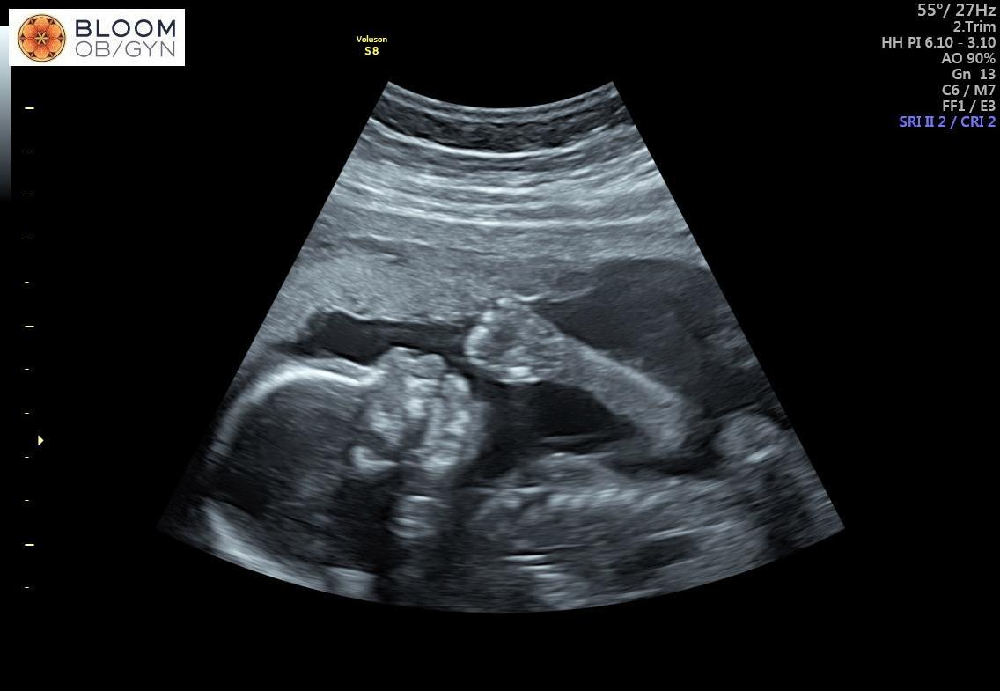

# Welcome to Text-as-Data!

## Outline

::: nonincremental
-   Motivation for Computational Linguistics

    -   Digital information age

    -   Principles of Computational Linguistics.

    -   What this course is not.

    -   Examples of models and applications for this course

-   Introductions

-   Class Logistics ( + 10 min for you to read through the syllabus)

-   Q&A

-   Introduction to R/RStudio
:::

# Motivation

## 

::: fragment
For many years, social scientists have used text in their empirical analysis:

-   Close reading of documents.

-   Qualitative Analysis of interviews

-   Hand-Coded content analysis
:::

::: fragment
**In the past 20 years, we have been going through a technological revolution:**

-   Consolidation of digital storage vs analogical

-   Internet: Production of textual information increased

-   The capacity to store, access and share this large volume of data also increased.

-   At the same time, the cost of accessing large computing power reduced... think about your laptops...

-   And even powerful computational models (that do not fit in your laptop) became easily accessible.
:::

# Examples of Textual Data

## Official Documents: Congressional Speeches, Bills, Press Releases, Transcripts, from all over the world!!

```{r  echo=FALSE, out.width = "70%", fig.align="center"}
knitr::include_graphics("https://www.brookings.edu/wp-content/uploads/2018/11/RTS10VM4.jpg") 
```

## Social Media

```{r  echo=FALSE, out.width = "80%", fig.align="center"}
 
```

## The internet: News, Comments, Blogs, etc...

```{r  echo=FALSE, out.width = "80%", fig.align="center"}
knitr::include_graphics("https://miro.medium.com/v2/resize:fit:1400/1*t2u_0FHoQSpBK8i7j1NOBg.png") 
```

## Genarative AI

```{r  echo=FALSE, out.width = "80%", fig.align="center"}
knitr::include_graphics("https://diplo-media.s3.eu-central-1.amazonaws.com/2025/03/openai-chatgpt-surge-deepseek.jpg") 
```

## What is Text-as-Data?

-   [TaD]{.red}: focuses on using text as a form of data to make [inferences]{.red} about the world around us, such as human behavior

-   This class covers:

    -   Computational methods to process and analyze text at scale ([Data Science/NLP Tools]{.red})

    -   Many applications showing how we can use text to answer social science problems and test social science theories. ([Applied Social Science]{.red})

    -   Bridge the gap between cutting-edge NLP and meaningful, interpretable research

# Do I need an entire course for this? Aren't my stats/DS classed enough?

##  {background-image="https://media0.giphy.com/media/v1.Y2lkPTc5MGI3NjExODJhdmI1dzNrb2k5c2cybnJ0ZjNhdzF1ZWU2YXRobnN1bXloNnV1eSZlcD12MV9pbnRlcm5hbF9naWZfYnlfaWQmY3Q9Zw/eKrgVyZ7zLvJrgZNZn/giphy.gif"}

## Challenges I: Text is an unstructure data source

```{r}
knitr::include_graphics("https://socialsciencedatalab.mzes.uni-mannheim.de/article/advancing-text-mining/figures/dfm.png")
```

## Challenge II: Text is High Dimensional

From [Gentzkow et al 2017](https://web.stanford.edu/~gentzkow/research/text-as-data.pdf):

-   sample of documents, each $n_L$ words long, drawn from vocabulary of $n_V$ words.

-   The unique representation of each document has dimension $n_{V}^{n_L}$ .

    -   e.g., a sample of 30-word ($n_L$) Twitter messages using only the one thousand most common words in the English language
    -   Unique Representation: 1000\^30 (1000 \* 1000 \* ..... \* 1000)
    -   As a simplified matrix: $M^{1000}_{30}$
    -   And this matrix will be really sparse!

-   Most of what you learned in statistics so far does not equip you to deal with large and sparse data

## Challenge III: Working in the Latent Space

::: fragment
When working with text, we aim to make an inferences about a [latent variable]{.red}

-   [Latent variable]{.red}: we cannot observe directly but try to identify with statistical and theoretical assumptions.

-   Examples: ideology, sentiment, political stance, propensity of someone to turnout

-   Quite different than asking direct questions via surveys or using macro economic variables...
:::

::: fragment
In text, we only observe the words. Much harder to identify the latent concepts.
:::

## Overview of TAD Methods

-   [**Descriptive inference:**]{.red} how to convert text to matrices, vector space model, bag-of-words, dissimilarity measures, diversity, complexity, style.

-   [**Supervised techniques:**]{.red} dictionaries, classication, scaling, machine learning approaches.

-   [**Unsupervised techniques:**]{.red} clustering, topic models, embeddings.

-   [**Generative AI:**]{.red} Word embeddings and Large Language Models.

    -   Generative AI will actually be pretty much half of this course!

## Some cool TaD applications

-   [Measure text-reuse across thousands of bills from U.S. state legislatures](https://onlinelibrary.wiley.com/doi/abs/10.1111/psj.12257)

-   [Estimate levels of toxicity of comments from stremming chats platforms during political debates](https://journalqd.org/article/view/2573)

-   [Measure how out-group negative makes things go viral on social media](https://www.pnas.org/doi/abs/10.1073/pnas.2024292118?url_ver=Z39.88-2003&rfr_id=ori%3Arid%3Acrossref.org&rfr_dat=cr_pub%3Dpubmed)

-   Estimate ideological positions using [who a user follows on Twitter](https://www.cambridge.org/core/journals/political-analysis/article/birds-of-the-same-feather-tweet-together-bayesian-ideal-point-estimation-using-twitter-data/91E37205F69AEA32EF27F12563DC2A0A), [what a user share on social media](https://journals.sagepub.com/doi/abs/10.1177/19401612211057068), [political manifestos](https://www.cambridge.org/core/journals/political-analysis/article/abs/word-embeddings-for-the-analysis-of-ideological-placement-in-parliamentary-corpora/017F0CEA9B3DB6E1B94AC36A509A8A7B), or [just asking ChatGPT to pair-wise compare politicians](https://arxiv.org/abs/2303.12057)

-   [Use Generative AI to create synthetic data, even survey responses](https://www.cambridge.org/core/journals/political-analysis/article/out-of-one-many-using-language-models-to-simulate-human-samples/035D7C8A55B237942FB6DBAD7CAA4E49)

## What this class in not about it...

-   Data acquisition: [no scrapping in class]{.red}. Assume you have learned already.

    -   I can share code for those who haven't.

-   Regular expressions and basic text manipulation.

-   [CS Stuff]{.red}: machine translation, OCR, POS, entity recognition.

    -   Most NLP/CS will focus on developing new algorithms, information retrievel and purely better measurements.
    -   in a productive dialogue with NLP, we will focus on using text for social science research
        -   theoretically driven discovery and measurement
        -   integration with social science problems + tabular data.

# Again: Welcome to Text-as-Data!!

# Introductions

## 

:::::: nonincremental
::: fragment
**Professor Tiago Ventura (he/him)**

-   Assistant Professor at McCourt School.
-   Political Science Ph.D.
-   Postdoc at Center for Social Media and Politics - NYU.
-   Researcher at Twitter.
:::

::: fragment
**My Research: Effects of technology in politics + applications of computational models to social science:**

-   Global Social Media Deactivation.
-   Effects of WhatsApp Usage on Elections in the Global South.
-   Developing a data donation pipeline for WhatsApp data.
-   Measuring Humanness vs AI-Generated Content on Social Media.
-   Using LLMs to augment web-browsing data with synthetic data
:::

::: fragment
**Outside of work, I enjoy [watching soccer, reading sci-fi and running]{.red}**
:::
::::::

## Your turn!

:::::: columns
::: {.column width="40%"}
```{r  echo=FALSE, out.width = "100%", fig.align="center"}
knitr::include_graphics("https://media.giphy.com/media/eKDp7xvUdbCrC/giphy.gif") 
```
:::

:::: {.column width="60%"}
::: nonincremental
-   Name & pronouns

-   Why are you taking this course?

-   Your experience (if any) working with text

-   Your favorite place in DC (restaurant, park, bar, brewery, bakery, you call it!)
:::
::::
::::::

# Let's take a break!

## Read the syllabus!

```{r}
library(countdown)
countdown(minutes = 10, seconds = 0, 
          left = 0, right = 0,
          top=0,
          padding = "100px",
          margin = "10%",
          font_size = "6em")
```

# Class Logistics

## Weekly Schedule {style="font-size: .8em;"}

| Week | Date | Topic |
|----------------|----------------|---------------------------------------|
| 1 | Sept 2 | Introductions and Course Overview |
| 2 | Sept 8 | From Text to Matrices: Representing Text as Data |
| 3 | Sept 15 | Text Similarity, Text Re-use, and Complexity |
| 4 | Sept 22 | Supervised Learning I: Dictionary Methods and Out-of-Box Classifiers |
| 5 | Sept 29 | Supervised Learning II: Training Your Own Classifiers |
| 6 | Oct 6 | Unsupervised Learning: Topic Models |
| 7 | Oct 20 | Using Text to Measure Ideology – Scaling |
| 8 | Oct 27 | Representation Learning & Introduction to Deep Learning |
| 9 | Nov 3 | Word Embeddings: What They Are and How to Estimate |
| 10 | Nov 10 | Word Embeddings: Social Science Applications |
| 11 | Nov 17 | Replication Class: Students’ Presentation |
| 12 | Nov 24 | Transformers |
| 13 | Dec 1 | Large Language Models: Prompting, Chatbots, and Applications (Guest: Dr. Christopher Barrie, NYU) |
| 14 | Dec 8 | Final Projects: Students’ Presentation |

## Between Replication and Transformers... I might have some updates...

::: fragment
```{r  echo=FALSE, out.width = "100%", fig.align="center"}
 
```
:::

## Class Requirements

-   [**Math:**]{.red} Basic knowledge of calculus, probability, densities, distributions, statistical tests, hypothesis testing, the linear model, maximum likelihood and generalized linear models will help you in class.

-   [**Programming:**]{.red} Functional knowledge of R - main programming language of the course. Some Python at the end.

    -   R is excellent for text analysis, and for some social science applications, better than Python

    -   Free, and massive online community writing packages and extending modeling capabilities.

    -   We will divide our learning between using `tidytext` and `quanteda` for text analysis.

    -   [Download RStudio IDE]{.red}!

-   **Python**: we will do some, but later in the course!

## How to do well in the class?

I designed this course as [PhD style seminar]{.red}:

-   On your pragrams, you learn a lot of DS/Stats techniques

-   You haven't dig deep enough in a particular field. [That's what electives are for!]{.red}

-   [**Heavy on readings**]{.red} - Lot's of applied and technical readings.

-   [Do the readings before class]{.red}

-   Substantive readings are [especially important]{.red}, because they'll help you understand what an interesting question looks like -- [in social science/public policy]{.red}.

-   Plan ahead -- [particularly for the replication exercise]{.red}

-   If you have a dataset you want work with, please bring it to class!

## What our classes will look like.

This is a one meeting per week class. You should expect:

-   Between [1h-1.5h]{.red} of lecture based on this week topics + readings

-   [Your participation in the lecture is expected]{.red} I will ask your insights about the readings.

-   Break (10min)

-   Coding.

    -   Mix of [you]{.red} working through some code I prepared.
    -   And I [live-coding]{.red} for you.

## Logistics {.center}

-   **Communication**: via slack. Join the [channel!](https://join.slack.com/t/ppol68012024/shared_invite/zt-2a4ofec2d-KH8YDtoiJ3gHRWTNhuBPcQ)

-   **All materials**: hosted on the class website: <https://tiagoventura.github.io/PPOL_6801/>

-   **Syllabus**: also on the website.

-   **My Office Hours**: Every Tuesday from 3 to 4pm. Just stop by!

-   **Canvas**: Only for communication! Materials will be hosted in the website!

## Evalutation

| **Assignment**           | **Percentage of Grade** |
|--------------------------|:-----------------------:|
| Participation/Attendance |           10%           |
| Problem Sets             |           30%           |
| Replication Exercises    |           20%           |
| Final Project            |           40%           |

## Participation

-   Active involvement during class sessions, fostering a dynamic learning environment.

-   Contributions made to your group's ultimate project.

-   Assisting classmates with slack questions, sharing interesting materials on slack, asking question, and anything that provides healthy contributions to the course.

## Problem Sets

| Assignment | Date Assigned |           Date Due            |
|:----------:|:-------------:|:-----------------------------:|
|   No. 1    |    Week 4     | Before EOD of Week 5's class  |
|   No. 2    |    Week 7     | Before EOD of Week 8's class  |
|   No. 3    |    Week 10    | Before EOD of Week 11's class |

-   You will have a week to complete your assignments

-   individual assignment

-   distributed through GitHub

## Replication Exercise

[Opportunity to learn how science is made!]{.red}

Work in randomly assigned pairs I will post on Slack.

-   **Step 1**: finding a paper to replicate (from the syllabus)

    -   By the end of the week 3, you should select an article from the syllabus to be replicated by your team.

    -   Inform the class on slack

    -   "first come, first served"

-   **Step 2**: Acquiring the Data

    -   if you fail to get the data, pick another article.

-   **Step 3**: Presentation (week 11)

-   **Step 4**: Replication Repository on Github

## Final Project

| **Requirement**  | **Due**           | **Length**    | **Percentage** |
|------------------|-------------------|---------------|----------------|
| Project Proposal | EOD Friday Week 8 | 2 pages       | 5%             |
| Presentation     | Week 14           | 10-15 minutes | 10%            |
| Project Report   | Wednesday Week 15 | 10 pages      | 25%            |

The final project is composed of three parts:

-   a 2 page project proposal: (which should be discussed and approved by me)
-   an in-class presentation,
-   A 10-page project report.

## GenAI

::: nonincremental
You are allowed to use GenAI as you would use google in this class. This means:

-   Do not copy the responses from chatgpt -- a lot of them are wrong or will just not run on your computer

-   Use chatgpt as a auxiliary source.

-   If your entire homework comes straight from chatgpt, I will consider it plagiarism.

-   If you use any GenAi Model, I ask you to mention on your code how it worked for you.
:::

# Questions?

# R 101
