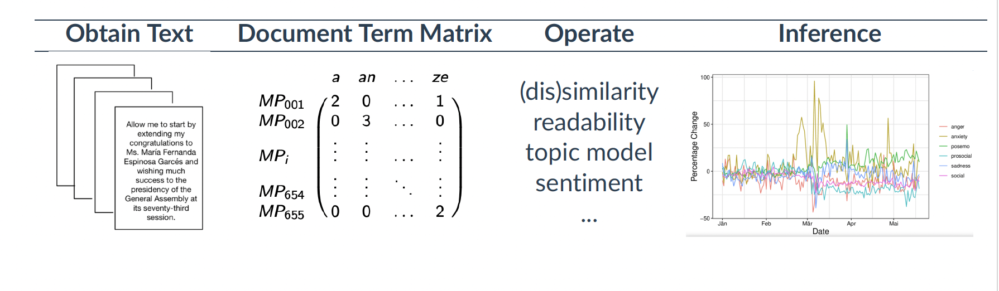
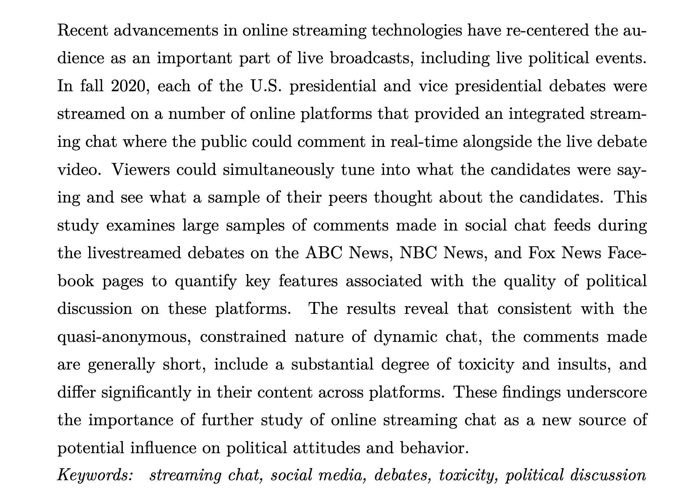
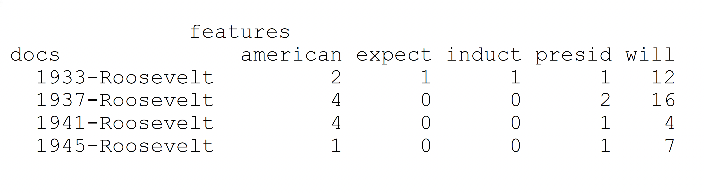
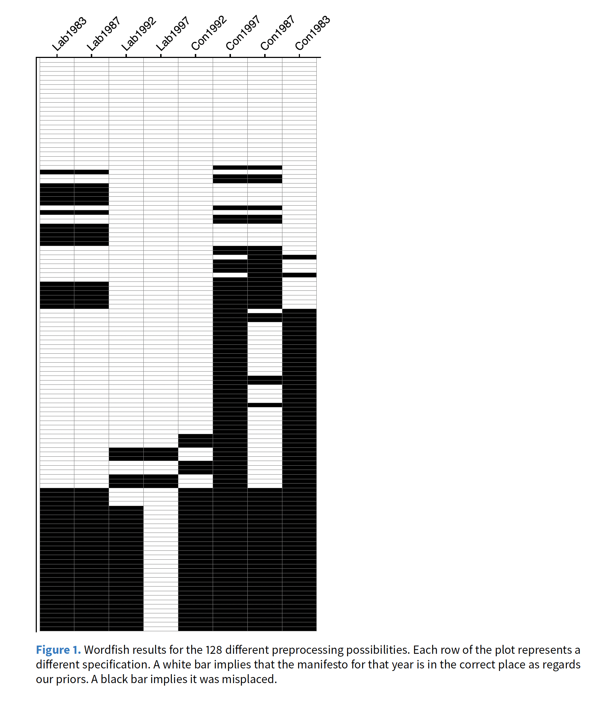
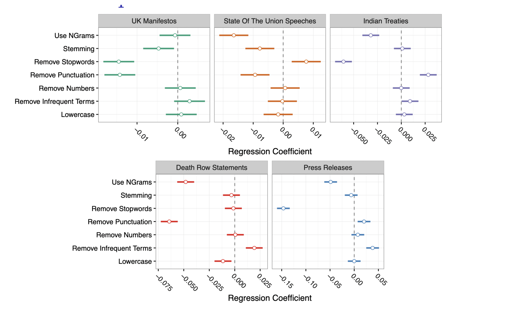
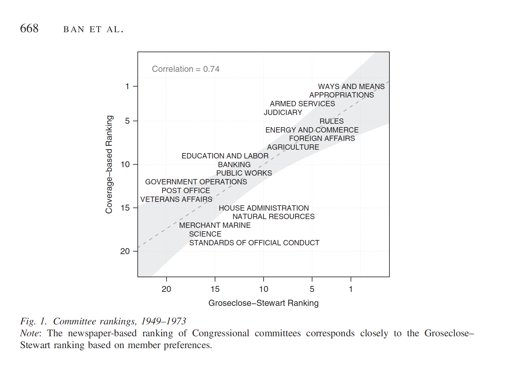
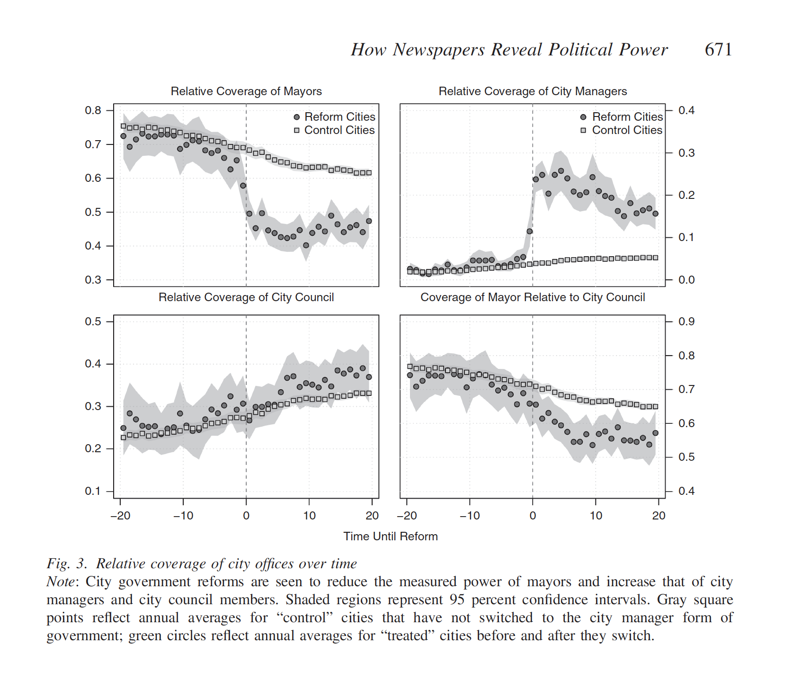

## Outline

::: nonincremental
-   Challenges of working with text
-   Defining a corpus and selecting documents
-   Unit of analysis
-   Reducing complexity (Denny & Spirling's article)
-   Bag-of-Word, Vector model representation and Document-Feature Matrix
-   Application (Ban et. al.'s paper)
:::

```{=html}
<!-- ## Text Analysis Workflow

[**Acquire textual data:**]{.red}

-   Existing corpora; scraped data; digitized text

::: fragment
[**Map Documents to a numerical representation *M***]{.red}

-   Bag-of-words (sparse vectors)
-   Embeddings (dense vectors)
-   Reduce noise, capture signal
:::

::: fragment
[**Map *M* to predicted values** $V^{*}$ of unknown outcomes V]{.red}

-   Descriptive Analysis
-   Classify documents into unknown categories \~ unsupervised/discovery
-   Classify documents into known categories \~ supervised learning
-   Scale documents on latent dimension:
:::

::: fragment
[**Use** $V^{*}$ in subsequent analysis with other data sources]{.red}

-   This is where social science happens!
::: 
-->
```

## TAD: Challenges

::::: nonincremental
-   **Challenge I**: Text is High-Dimensional

    -   Survey: Matrix of 3k row and 400 columns

    -   A sample of Tweets: easily 1M rows + 1k column

::: fragment
-   **Challenge II:** Text is an unstructured data source

    -   How to convert a piece a paper with words to numbers my statistical model understands?
:::

::: fragment
-   **Challenges III:** Outcomes live in the Latent Space

    -   There is no direct question in text-as-data
:::
:::::

## Learning goals for today

-   **Challenge I:** Cover techniques to reduce complexity from text data using a set of pre-processing steps

-   **Challenge II:** How to represent text as numbers using the vector space model

-   **Challenge III:** Starting next week we will deal more with inference and modeling latent parameters

    -   But today we will see how just counting words can give us some inferential power.

## Principles of Text Analysis (GMB Textbook)

-   [**Principle 1:**]{.red} Social science theories and substantive knowledge are essential for research design

-   [**Principle 2:**]{.red} Text analysis does not replace humans---it augments them.

-   [**Principle 3:**]{.red} Building, refining, and testing social science theories requires iteration and accumulation

-   [**Principle 4:**]{.red} Text analysis methods distill generalizations from language. (all models are wrong!)

-   [**Principle 5:**]{.red} The best method depends on the task.

## Different Methods for Different Goals

:::: nonincremental
::: fragment
**Supervised**: Pursuing a known goal

-   Human labels a subset of documents
-   Algorithm labels the rest
-   Highest effort before running the model
:::
::::

:::: nonincremental
::: fragment
**Unsupervised:** Learning a goal

-   Algorithm discovers patterns in the text
-   Human interprets the results
-   Higher effort after running the model
:::
::::

## Principles of Text Analysis (GMB Textbook)

::: nonincremental

-   [**Principle 1:**]{.red} Social science theories and substantive knowledge are essential for research design

-   [**Principle 2:**]{.red} Text analysis does not replace humans---it augments them.

-   [**Principle 3:**]{.red} Building, refining, and testing social science theories requires iteration and accumulation

-   [**Principle 4:**]{.red} Text analysis methods distill generalizations from language. (all models are wrong!)

-   [**Principle 5:**]{.red} The best method depends on the task.

-   [**Principle 6:**]{.red} Validate, Validate, Validate...

:::

## Overview of the Process

```{r fig.align="center"}

```

# How do we start analyzing text

## 1. Corpus and selecting documents

-   A *corpus* is (typically) a large set of texts or documents which we wish to analyze.

    -   [if you can read them in an small amount of time, you should just do it, not TAD]{.midgray}

-   A corpus consists of a subset of documents, sampled due to time, resources, or legal limits

    -   Even with the ‘universe’ of documents, consider that it came from a larger, unseen superpopulation

## 

-   When selecting a corpus, consider:

    -   [Population of interest]{.red}: does the corpus allow us to make inferences about our population of interest?

    -   [Quantity of interest]{.red}: can we measure what we plan to?

    -   [Sampling Bias]{.red}: ommited variables between being in the sample and your outcomes

-  [Custommade data]{.red}: Most often we use these documents because they were available to us.  In these cases, the three questions above are even more important.

## Ventura et. al., Streaming Chats, 2021

```{r fig.align="center"}

```

:::aside
Link: [https://journalqd.org/article/view/2573/1820](https://journalqd.org/article/view/2573/1820)
:::
## Exercise: Key components

-   RQ: Measure quality of comments on streaming chat platforms during political debates

    -   **Population of interest:**

    -   **Quantity of interest:**

    -   **Source of bias:**

## 2. Unit of Analysis

After selecting your documents and converting them to a computer-friendly format, we must decide our [unit of analysis]{.red}

-   entire document? sentence? paragraph? a larger group of documents?

::: fragment
[Three things]{.red} to consider in making this decision:

-   Features of your data

-   Your research question

-   Iterative model

    -   switching through different units of analysis has a low cost
    -   allows you to look at the data from a different angle

:::

## 3. Reducing complexity

Language is extraordinarily [complex]{.red}, and involves great [subtlety and nuanced interpretation]{.red}.

-   We simplify documents so that we can analyze/compare them:
    -   makes the modeling problem much more tractable.
    -   complexity makes not much difference in topic identification or simple prediction tasks (sentiment analysis, for example)
-   the degree to which one simplifies is dependent on the particular task at hand.
    -   Denny and Spirling (2019) \~ check sensitivity.

## Reducing complexity: all steps

-   [Tokenization]{.red}: What does constitute a feature?

-   [Remove \`superfulous' material]{.red}: HTML tags, punctuation, numbers, lower case and stop words

-   [Map words to equivalence forms]{.red}: stemming and lemmatization

-   [Discard less useful features for your task at hand]{.red}: functional words, highly frequent or rare words

-   [Discard word order]{.red}: Bag-of-Words Assumption

## Final outcome: Document Feature Matrix

Document Term Matrix = cornerstone in computational text analysis

-   Matrix where rows = documents; columns = terms (words or tokens)
-   Each cell contains the frequency or weight of a term within a document

::: fragment

```{r echo=FALSE, out.width = "80%", fig.align="center"}
 
```

:::


## Tokenization

-   **Def:** break documents in meaningful units of analysis

-  [Tokens]{.red} are often words. 

-  A simple **tokenizer** uses white space marks to split documents in tokens.

-   Tokenizer may vary **across tasks**

    -   Twiter specific tokenizer \~ keep hashtags, for example.

-   May also vary [across languages]{.red}, in which white space is not a good marker to split text into tokens

-   Certain tokens, even in english, make more sense together than separate ("White House", "United States"). These are called collocations

## Stop Words

-   There are certain words that serve as [linguistic connectors (\`function words')]{.red} which we can remove.

    -   ( *the, it, if, a, for, from, at, on, in, be* )

-   Add noise to the document. [Discard them]{.red}, focus on signal, meaningful words.

-   Most TAD packages have a pre-selected list of stopwords. You can add more given you substantive knowledge (more about this later)

-   Usually not important for unsupervised and mostly supervised tasks, but might matter for authorship detection.

    -   Federalist Papers, example. Stop words give away writing styles.

## Equivalence mapping

#### Reduce dimensionality even further!

-   Different forms of words ([family, families, familial]{.midgray}), or words which are similar in concept ([bureaucratic, bureaucrat, bureaucratization]{.midgray}) that refer to same basic token/concept.

-   use algorithms to map these variation to a equivalent form:

    -   stemming: chop the end of the words: *family, families, familiar* \~ *famili*
    -   lemmatization: condition on part of speech
        -   better (adj) \~ good
        -   leaves (noun) \~ leaf
        -   leaves (verb) \~ leave

-   All **TAD/NLP packages** offer easy applications for these algorithms.

## Other steps: functional words, highly frequent or rare words

Some other commons steps, which are highly dependent on your contextual knowledge, are:

-   [discard functional words]{.red}: for example, when working with congressional speeches, remove `representative, congress, session, etc...`

-   [remove highly frequent words]{.red}: words that appear in all documents carry very little meaning for most supervised and unsupervised tasks \~ no clustering and not discrimination.

-   [remove rare frequent words]{.red}: same logic as above, no signal. Commong practice, words appear less 5% fo documents.

## 4. Bag-of-Words Assumption

Now we have [pre-processed]{.red} our data. So we can simplify it even further:

-   [Bag-of-Words Assumption:]{.red} the order in which words appear does not matter.

    -   Ignore order

    -   [But]{.red} keep multiplicity, we still consider frequency of words

## 

### How could this possible work

-   **it might not:** you need validation

-   **central tendency in text:** some words are enough to topic detection, classification, measures of similarity, and distance, for example.

-   **humans in the loop:** expertise knowledge help you figure it out subtle relationships between words and outcomes

## Can we preserve the word order? (another pre-processing decision)

### Yes

-   We might retaining word order using n-grams.

    -   [White House, Bill Gates, State Department, Middle East]{.midgray}

-   we think some important subtlety of expression is lost: negation perhaps - *I want coffee, not tea* might be interpreted very differently without word order.

-   can use \[n-grams\], which are (sometimes contiguous) sequences of two (bigrams) or three (trigrams) tokens.

-   This makes computations considerably more complex. We can pick some n-grams to keep but not all (see Pointwise Mutual Information, more later in the semester)

## Complete Example

::: {.callout-note icon="false"}
## Text

*We use a new dataset containing nearly 50 million historical newspaper pages from 2,700 local US newspapers over the years 1877--1977. We define and discuss a measure of power we develop based on observed word frequencies, and we validate it through a series of analyses. Overall, we find that the relative coverage of political actors and of political offices is a strong indicator of political power for the cases we study*
:::

:::: fragment
::: {.callout-note icon="false"}
## After pre-processing

*use new dataset contain near 50 million historical newspaper pag 2700 local u newspaper year 18771977 define discus measure power develop bas observ word frequenc validate ser analys overall find relat coverage political actor political offic strong indicator political power cas study*
:::
::::

## Non-English Texts in Computational Analysis

-   Nothing about methods that is inherently “English” but there are assumptions about how words “work”

    -   Chinese: no spaces between words (Stanford word segmenter for Chinese; see Chang et al, 2008 or work by Jennifer Pan, Margaret Roberts, Hannah Waight)
    -   Arabic and Hebrew: Right-to-left text
    -   German: compound words
    -   Cyrillic Scripts: variations in encoding

-   Open science and GitHub repositories are our friend!

## Denny & Spirling, 2018

:::fragment
[**Starting point**]{.red}: No rigorous way to compare results across different pre-processing steps. Adapting recommendations from supervised learning tasks.
:::

::: fragment
**Example of the issue:**

-   Four sets of UK election manifestos

-   Run Wordfish to assess positions of parties from their manifestos

-   Different preprocessing choices → Substantially different conclusions
:::

## 

```{r fig.align="center",out.width="20cm", out.height="20cm"}

```

## preText: A New Method for Assessing Sensitivity

In your words, describe their solution to the pre-processing issue.

:::: notes
::: fragment
-   Calculate distance of every document under no pre-processing

-   Calculate distance of every document under M_i pre-processing

-   Each specification will have a largest (k) pair-mover.

- V_M_1 = rank order of the top k moves in M1 across all other M pre-processing.

$$ v_{M1} = \bigl( 2M_{2},\, 14M_{3},\, 2M_{4},\, 3M_{5},\, \ldots,\, 15M_{127} \bigr)$$

-   Repeat for every k largest mover and average across $v_{Mi}^k$

$$\text{preText score}_{i} \;=\; \frac{2\,v_{M_i}^{(k)}}{n(n-1)}$$
:::

::::

## Results
::: nonincremental

::: columns
::: {.column width="30%"}

**Interpretation**

- Lower score r ~ Typical changes
- Higher score r ~ Atypical changes


**Implementation**

- R package `preText`

:::

::: {.column width="70%"}

```{r fig.align="center",out.width="20cm", out.height="20cm"}

```

:::
:::
:::


# Vector Space Model: Convert Text to Numbers

## 

To represent documents as numbers, we will use the [vector space model representation]{.red}:

-   A document $D_i$ is represented as a collection of features $W$ (words, tokens, n-grams..)

-   Each feature $w_i$ can be place in a real line, then a document $D_i$ is a point in a $W$ dimensional space

::: fragment
Imagine the sentence below: *"If that is a joke, I love it. If not, can't wait to unpack that with you later."*

-   **Sorted Vocabulary** =(a, can't, i, if, is, it, joke, later, love, not, that, to, unpack, wait, with, you")

-   **Feature Representation** = (1, 1, 1, 2, 1, 1, 1, 1, 1, 1, 2, 1, 1, 1, 1, 1)

-   Features will typically be the n-gram (mostly unigram) [frequencies]{.red} of the tokens in the document, or some [function]{.red} of those frequencies
:::

## 

Each document is now a vector (vector space model)!!

-   stacking these vectors will give you our workhorse representation for text: [**Document Feature Matrix**]{.red}

-   linear algebra teach us how to work with vectors: magnitude, direction, projection, distance, similarity... all work in many dimensions.

::: fragment
### DFM

```{r echo=FALSE, out.width = "80%", fig.align="center"}
 
```
:::

## Visualizing Vector Space Model

::: {.callout-note icon="false"}
## Documents

Document 1 = "yes yes yes no no no"

Document 2 = "yes yes yes yes yes yes"
:::

```{r echo=FALSE, fig.align="center",fig.width=8}
# Load necessary libraries
pacman::p_load(ggplot, tidyverse)

# Define a simple vocabulary of two words

# Sample texts using only words from the vocabulary
document1 <- c("yes", "yes", "yes", "no", "no", "no")
document2 <- c("no", "no", "no", "no", "no", "no")

# Convert the documents to a dataframe to a data frame for ggplot
df <- tibble(document1, document2) %>% 
       pivot_longer(cols=contains("document"), names_to = "document", values_to = "word") %>%
       group_by(document, word) %>%
       count() %>%
       pivot_wider(names_from=word, values_from=n, values_fill = 0)

# Plot the documents in 2D space using ggplot
ggplot(df, aes(x = no, y = yes, label = document)) +
  geom_label(nudge_y =.5) +
  geom_segment(aes(x = 0, y = 0, xend = 3, yend = 3), 
               arrow = arrow(), 
               size=1, color="navy") +
  geom_segment(aes(x = 0, y = 0, xend = 6, yend = 0),  
               arrow = arrow(), 
               size=1, color="navy") +
  xlim(0, 7) +
  xlab("Frequency of 'yes'") +
  ylab("Frequency of 'no'") +
  ggtitle("Vector Representation of Texts") +
  theme_minimal()
```

## Visualizing Vector Space Model

```{r echo=FALSE, fig.align="center",fig.width=8}

# Plot the documents in 2D space using ggplot
ggplot(df, aes(x = no, y = yes, label = document)) +
  geom_point(size=2) +
  geom_segment(aes(x = 0, y = 0, xend = 3, yend = 3), 
               arrow = arrow(), 
               size=1, color="navy", alpha=.2) +
  geom_segment(aes(x = 0, y = 0, xend = 6, yend = 0),  
               arrow = arrow(), 
               size=1, color="navy", alpha=.3) +
 geom_segment(aes(x = 3, y = 3, xend = 6, yend = 0),  
               linetype=2, 
               size=1, color="tomato", alpha=1) +
annotate(geom="label", x=5, y=1, label="Distance",
              color="black")  +
  xlim(0, 7) +
  xlab("Frequency of 'yes'") +
  ylab("Frequency of 'no'") +
  ggtitle("Vector Representation of Texts") +
  theme_minimal()
```

````{=html}
<!-- ## Quick Exercise

What is the vector representation of this sentence? Give me the vocabulary and the feature representation. Remove any punctuation.

<br> <br>

*"That's just what translation is, I think. That's all speaking is. Listening to the other and trying to see past your own biases to glimpse what they're trying to say."*

## If you are curious ...

```{r fig.align="center",fig.width=12}
knitr::include_graphics("https://m.media-amazon.com/images/I/A1lv97-jJoL._SL1500_.jpg")
```
-->
````

# Application

## Ban et. al. 2019, How Newspapers Reveal Political Power.

::: nonincremental

**Abstract:** *Political science is in large part the study of power, but power itself is difficult to measure. We argue that we can use newspaper coverage—in particular, the relative amount of space devoted to particular subjects in newspapers—to measure the relative power of an important set of political actors and offices.*

**Inference just by counting words**

$$
\text{Relative Power of A} \;=\; 
\frac{\# \text{ of Newspaper Mentions of A}}
     {\# \text{ of Newspaper Mentions of A} + \# \text{ of Newspaper Mentions of B}}
$$
:::

## Validation
```{r fig.width=12, fig.align="center"}

```


## Results
```{r fig.width=12, fig.align="center"}

```

## Things you like about this paper...

# Coding!
