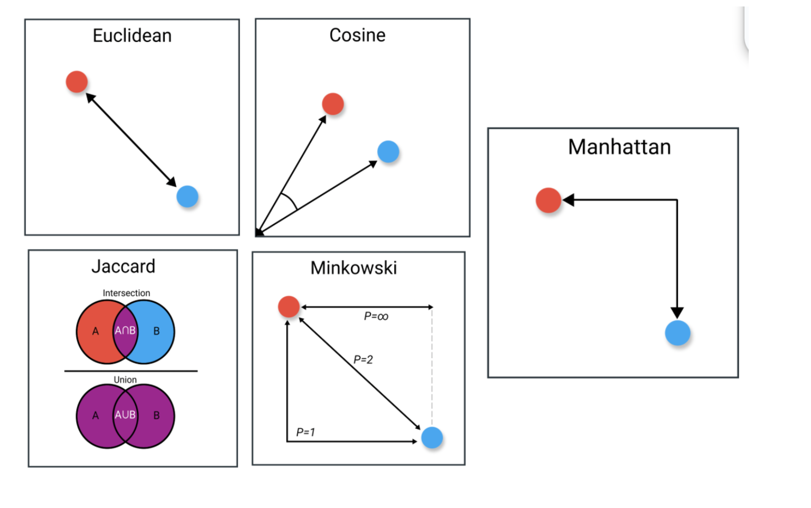
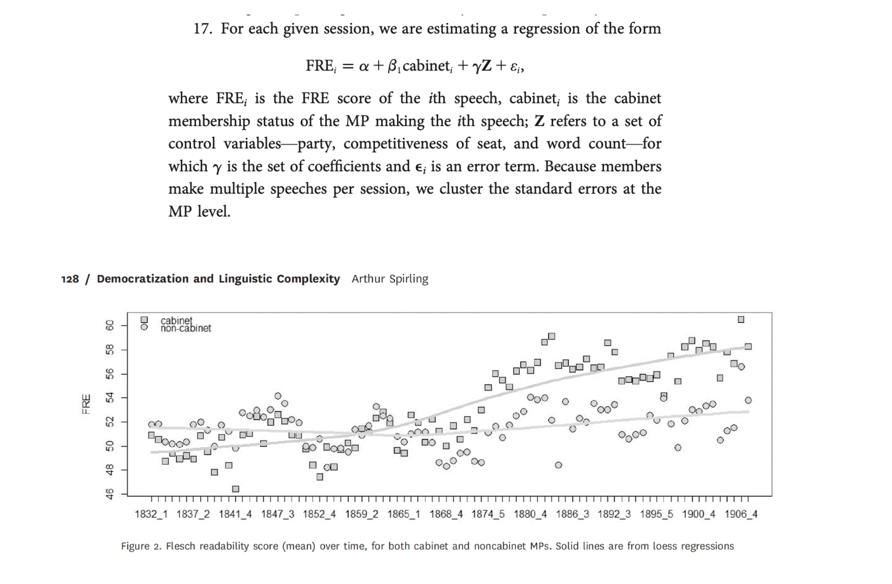
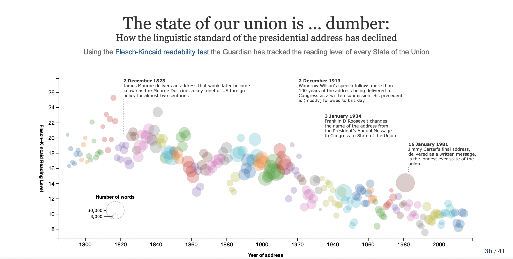
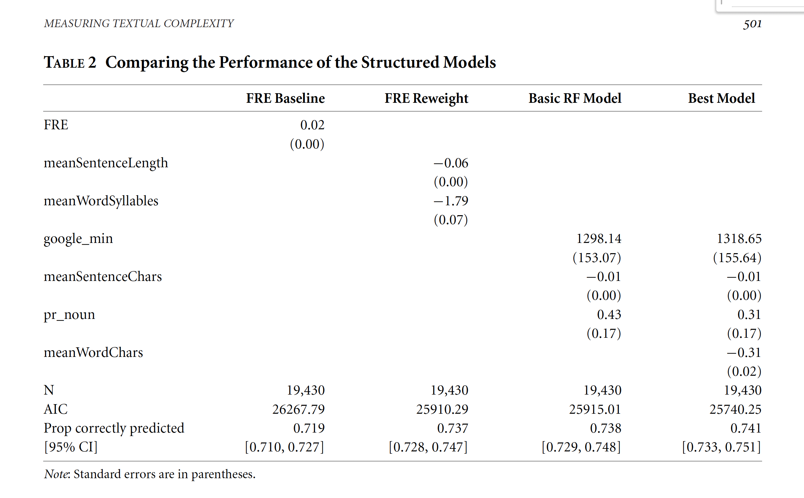
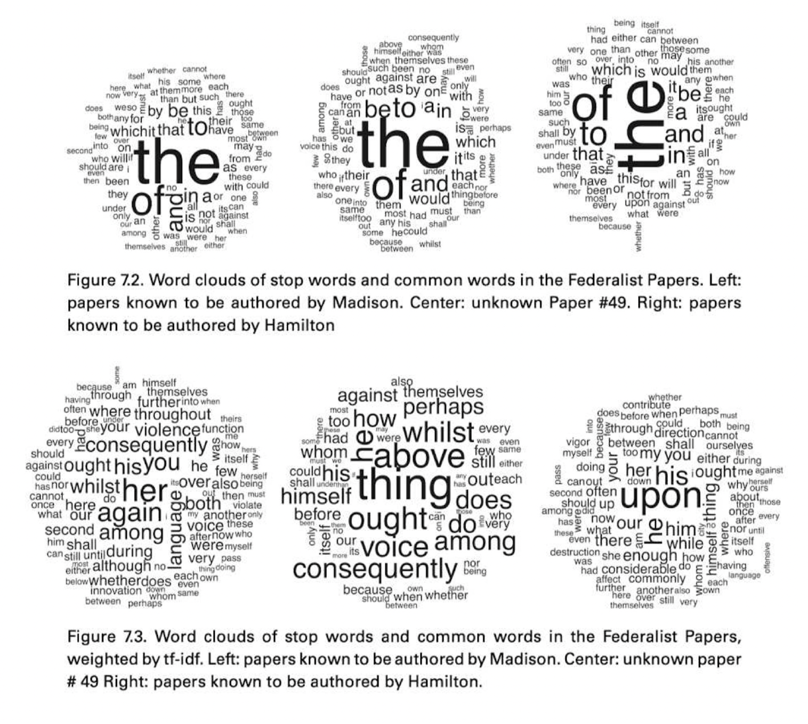

# Coding: Pre-processing + text representation

## Housekeeping

::: nonincremental
You have your pairs for the replication exercise.

[Next steps]{.red}:

-   Select the paper you wish to replicate (until lecture day next week)

-   Post on Slack

-   Talk to me if you have any issues
:::

## Where are we?

[Last week:]{.red}

-   Pre-processing text + bag of words \~\> reduces greatly text complexity (dimensions)

-   Text representation using vectors of numbers \~\> document feature matrix (text to numbers)

-   Example of counting words to make inference

## Plans for today

We will start thinking about latent outcomes from text. Our first approach will focus on [descriptive inference]{.red} based on documents:

-   Comparing documents

-   Using similarity to measure text-reuse

    -   Quick linear algebra review

-   Evaluating complexity in text

-   Weighting (TF-iDF)

## Recall: Vector space model

To represent documents as numbers, we use the [vector space model representation]{.red}:

::: incremental
-   A document $D_i$ is represented as a collection of features $W$ (words, tokens, n-grams, etc...)

-   Each feature $w_i$ can be placed in a real line

-   A document $D_i$ is a point in a $\mathbb{R}^W$

    -   Each document is now a [vector]{.red},
    -   Each entry represents the [frequency of a particular token or feature]{.red}.
    -   Stacking those vectors on top of each other gives the [document feature matrix (DFM)]{.red}.
:::

## Document-Feature Matrix: fundamental unit of TAD

```{r echo=FALSE, out.width = "100%", fig.align="center"}
knitr::include_graphics("week2_figs/DTM.png") 
```

::: aside
Source: [Arthur Spirling TAD Class](https://github.com/ArthurSpirling/text-as-data-class-spring2021)
:::

## In a two dimensional space

::: {.callout-note icon="false"}
## Documents, W=2

Document 1 = "yes yes yes no no no"

Document 2 = "yes yes yes yes yes yes"
:::

```{r echo=FALSE, fig.align="center",fig.width=8}
# Load necessary libraries
pacman::p_load(ggplot, tidyverse)

# Define a simple vocabulary of two words

# Sample texts using only words from the vocabulary
document1 <- c("yes", "yes", "yes", "no", "no", "no")
document2 <- c("no", "no", "no", "no", "no", "no")

# Convert the documents to a dataframe to a data frame for ggplot
df <- tibble(document1, document2) %>% 
       pivot_longer(cols=contains("document"), names_to = "document", values_to = "word") %>%
       group_by(document, word) %>%
       count() %>%
       pivot_wider(names_from=word, values_from=n, values_fill = 0)

# Plot the documents in 2D space using ggplot
ggplot(df, aes(x = no, y = yes, label = document)) +
  geom_label(nudge_y =.5) +
  geom_segment(aes(x = 0, y = 0, xend = 3, yend = 3), 
               arrow = arrow(), 
               size=1, color="navy") +
  geom_segment(aes(x = 0, y = 0, xend = 6, yend = 0),  
               arrow = arrow(), 
               size=1, color="navy") +
  xlim(0, 7) +
  xlab("Frequency of 'yes'") +
  ylab("Frequency of 'no'") +
  ggtitle("Vector Representation of Texts") +
  theme_minimal()
```

# Comparing Documents

## How \`far' is document a from document b?

Using the vector space, we can use notions of geometry to build well-defined [comparisons]{.red} between the documents.

:::: incremental
-   [in multiple dimensions!!]{.red}

::: fragment
```{r echo=FALSE, fig.align="center",fig.width=8}

# Plot the documents in 2D space using ggplot
ggplot(df, aes(x = no, y = yes, label = document)) +
  geom_point(size=2) +
  geom_segment(aes(x = 0, y = 0, xend = 3, yend = 3), 
               arrow = arrow(), 
               size=1, color="navy", alpha=.2) +
  geom_segment(aes(x = 0, y = 0, xend = 6, yend = 0),  
               arrow = arrow(), 
               size=1, color="navy", alpha=.3) +
 geom_segment(aes(x = 3, y = 3, xend = 6, yend = 0),  
               linetype=2, 
               size=1, color="tomato", alpha=1) +
annotate(geom="label", x=5, y=1, label="Distance",
              color="black")  +
  xlim(0, 7) +
  xlab("Frequency of 'yes'") +
  ylab("Frequency of 'no'") +
  ggtitle("Euclidean Distance Between Documents") +
  theme_minimal()
```
:::
::::

```{=html}
<!-- ## Properties for Similarity Metrics

For vectors i and j, with distance $s_{ij}$:

- 1. no negative distances: $s_{ij}  \ge 0$

- 2. when distance between documents is zero ~ documents are identical

- 3. distance between documents is symmetric: sij = sji

- 4 measures satisfy triangle inequality. sik > sij + sjk 
-->
```

## Euclidean Distance

The *ordinary*, *straight line* distance between two points in space. Using document vectors $y_a$ and $y_b$ with $j$ dimensions

::: {.callout-note icon="false"}
## Euclidean Distance

$$
||U - V|| = \sqrt{\sum^{i}(U_{i} - {V_i})^2}
$$
:::

#### Can be performed for any number of features J

-   No negative distances
-   Distance between documents is zero when documents are identical
-   Distance between documents is symmetric
-   Satisfy triangle inequality: $s_{ik} \leq s_{ij} + s_{jk}$

## Euclidean Distance, w=2

::: {.callout-note icon="false"}
## Euclidean Distance

$$
||U - V|| = \sqrt{\sum^{i}(u_{i} - v_{i})^2}
$$
:::

-   $U$ = \[0, 2.51, 3.6, 0\] and $yV$ = \[0, 2.3, 3.1, 9.2\]

-   $\sum^{i}(U_{i} - y_{V_i})^2$ = $(0-0)^2 + (2.51-2.3)^2 + (3.6-3.1)^2 + (9-0)^2$ = $84.9341$

-   $\sqrt{\sum_{j=1}^j (y_a - y_b)^2}$ = 9.21

```{r  echo=FALSE, eval=FALSE}
a = c(0, 2.51, 3.6, 0)
b = c(0, 2.3, 3.1, 9.2)
sqrt(sum((a-b)^2))

```

## Exercise

::: {.callout-note icon="false"}
## Documents, W=2 {yes, no}

Document 1 = "yes yes yes no no no" (3, 3)

Document 2 = "yes yes yes yes yes yes" (6,0)

Document 3= "yes yes yes no no no yes yes yes no no no yes yes yes no no no yes yes yes no no no" (12, 12)
:::

::::: columns
::: {.column width="50%"}
```{r echo=FALSE, fig.align="center",fig.width=8}
# Load necessary libraries
pacman::p_load(tidyverse)

# Define a simple vocabulary of two words

# Sample texts using only words from the vocabulary
document1 <- tibble(yes=3, no=3)
document2 <- tibble(yes=6, no=0)
document3 <- tibble(yes=12, no=12)

# Convert the documents to a dataframe to a data frame for ggplot
df <- bind_rows(document1, document2, document3) %>%
      mutate(document=c("Doc A", "Doc B", "Doc C"))


# Plot the documents in 2D space using ggplot
ggplot(df, aes(x = yes, y = no, label = document)) +
  geom_label(nudge_y =.5) +
  geom_point(shape=21, fill="tomato", size=4) +
  geom_segment(aes(x = 0, y = 0, xend = 3, yend = 3), 
               arrow = arrow(), 
               size=1, color="navy") +
  geom_segment(aes(x = 0, y = 0, xend = 6, yend = 0),  
               arrow = arrow(), 
               size=1, color="navy") +
  geom_segment(aes(x = 0, y = 0, xend = 12, yend = 12),  
               arrow = arrow(), 
               size=1, color="navy") +
  xlab("Frequency of 'yes'") +
  ylab("Frequency of 'no'") +
  ggtitle("Vector Representation of Texts") +
  theme_minimal()

```
:::

::: {.column width="50%"}
<br><br>

-   Which documents will the euclidean distance place closer together?
-   Does it look like a good measure for similarity?
    -   Doc C = Doc A \* 3
:::
:::::

## Cosine Similarity

Euclidean distance rewards [magnitude]{.red}, rather than [direction]{.red}

$$
\text{cosine similarity}(\mathbf{U}, \mathbf{V}) = \frac{\mathbf{U} \cdot \mathbf{V}}{\|\mathbf{U}\| \|\mathbf{V}\|}
$$

# Quick Linear Algebra Review

## Vectors

-   **Vector**: an ordered list of numbers in a space with well-defined addition and scalar multiplication operations

-   It is defined as an object with both magnitude and direction

-   **Magnitude:** how long it is

-   **Direction:** where it points

## Vectors

-   The dimensionality of a vector is the number of elements it has

-   For example, \[1, 2, 3, \] has dimensionality 3

-   In other words, it is a vector in 3D space

-   The vector \[3,5\] is 2D

## Scalar Multiplication of Vectors

Given a vector U and a scalar constant k, we can multiply a vector.

$$ 
U*k = [k*u_1, k*u_2, k*u_3 ... k*u_n]
$$

::: nonincremental
-   increases the length/magnitude

-   does not change the direction
:::

::: fragment
```{r echo=FALSE, fig.align="center",fig.width=8}
# Load necessary libraries
pacman::p_load(tidyverse)

# Define a simple vocabulary of two words

# Sample texts using only words from the vocabulary
document1 <- tibble(yes=3, no=3)
document2 <- tibble(yes=6, no=6)

# Convert the documents to a dataframe to a data frame for ggplot
df <- bind_rows(document1, document2) %>%
      mutate(document=c("Doc A", "2*Doc A"))


# Plot the documents in 2D space using ggplot
ggplot(df, aes(x = yes, y = no, label = document)) +
  geom_label(nudge_y =.5) +
  geom_point(shape=21, fill="tomato", size=4) +
  geom_segment(aes(x = 0, y = 0, xend = 3, yend = 3), 
               arrow = arrow(), 
               size=1, color="red") +
  geom_segment(aes(x = 0, y = 0, xend = 6, yend = 6),  
               arrow = arrow(), 
               size=1, color="navy") +
   geom_segment(aes(x = 0, y = 0, xend = 3, yend = 3), 
               arrow = arrow(), 
               size=1, color="red") +
  xlab("Frequency of 'yes'") +
  ylab("Frequency of 'no'") +
  ggtitle("Vector Representation of Texts") +
  theme_minimal()
```
:::

## Magnitude of a vector

The denominator of the cosine similarity formula gives you the magnitude or length of a vector.

-   Magnitude: Use L2 Norm, Euclidean distance from origin point (0,0)

-   It converts a vector to a scalar representing the size of a vector

::: fragment
$$ 
||\mathbf{U}|| = \sqrt(u1*u1 + u2*u2 ... u_n*u_n) = \sqrt(\sum^i u_i^2) 
$$
:::

## Vector Multiplication: Dot (Inner) Product

The numerator of the cosine similarity is called 'dot product' between two vectors. This a multiplication between two vectors.

$$ 
\mathbf{U} \cdot \mathbf{V}= u_1*v_1 + u_2*v_2 + u_n*v_n = \sum^i u_i*v_i 
$$

-   **Notice**: the dot product maps two vectors to real numbers.

## Dot Product: Geometric Intuition

**Intuition:**

> "the product of two vectors a and b is the **projection** of a onto b times the **length** of b (it is symmetric, so equivalently the projection of b onto a times the length of a)." (GMB, pp71)

You can see this by considering the geometric formula for the dot product:

$$ 
\mathbf{U} \cdot \mathbf{V}= ||U|| \cdot ||V|| \cdot cos(\theta)
$$

## 

More interestingly:

$$ 
||Proj(U)_v ||= ||U|| cos(\theta)
$$

Yet another formula

$$ 
\mathbf{U} \cdot \mathbf{V} = ||Proj(U)_v || ||V||
$$

## Dot Product Visually

```{r echo=FALSE, fig.align="center",fig.width=8}
# Load necessary libraries
pacman::p_load(tidyverse)

# Define a simple vocabulary of two words

# Sample texts using only words from the vocabulary
document1 <- tibble(yes=3, no=3)
document2 <- tibble(yes=6, no=0)
proja <- tibble(yes=3, no=0)

# Convert the documents to a dataframe to a data frame for ggplot
df <- bind_rows(document1, document2, proja) %>%
      mutate(document=c("Doc A", "Doc B", "Projection A into B"))


# Plot the documents in 2D space using ggplot
ggplot(df, aes(x = yes, y = no, label = document)) +
  geom_label(nudge_y =.5) +
  geom_point(shape=21, fill="tomato", size=4) +
  geom_segment(aes(x = 0, y = 0, xend = 3, yend = 3), 
               arrow = arrow(), 
               size=1, color="navy") +
  geom_segment(aes(x = 0, y = 0, xend = 6, yend = 0),  
               arrow = arrow(), 
               size=1, color="navy") +
  geom_segment(aes(x = 0, y = 0, xend = 3, yend = 0),  
               arrow = arrow(), 
               size=1, color="red") +
  xlab("Frequency of 'yes'") +
  ylab("Frequency of 'no'") +
  ggtitle("Vector Representation of Texts") +
  theme_minimal()
```

## 

> "the product of two vectors a and b is the **projection** of a onto b times the **length** of b (it is symmetric, so equivalently the projection of b onto a times the length of a)." (GMB, pp71)

## Back to the Cosine Similarity

$$
\text{cosine similarity}(\mathbf{U}, \mathbf{V}) = \frac{\mathbf{U} \cdot \mathbf{V}}{\|\mathbf{U}\| \|\mathbf{V}\|}
$$

-   $U \cdot V$ \~ dot product between vectors

    -   it is a projection of one vector into another
    -   Works as a measure of similarity
    -   But rewards magnitude

-   $||\mathbf{U}||$ \~ vector magnitude, length \~ $\sqrt{\sum{u_{i}^2}}$

    -   normalizes a vector projection of documents' by their lengths

-   cosine similarity captures some notion of relative *direction* controlling for different magnitudes.

## Cosine Similarity

Cosine function has a range between -1 and 1.

-   Consider: cos (0) = 1, cos (90) = 0, cos (180) = -1

```{r}
# Load necessary libraries
pacman::p_load(ggplot, tidyverse)

# Define a simple vocabulary of two words

# Sample texts using only words from the vocabulary
document1 <- tibble(yes=3, no=3)
document2 <- tibble(yes=6, no=0)
document3 <- tibble(yes=12, no=12)

# Convert the documents to a dataframe to a data frame for ggplot
df <- bind_rows(document1, document2, document3) %>%
      mutate(document=c("Doc A", "Doc B", "Doc C"))

# Function to calculate the angle between two vectors
calculate_angle <- function(x1, y1, x2, y2) {
  dot_product <- x1 * x2 + y1 * y2
  magnitudes <- sqrt(x1^2 + y1^2) * sqrt(x2^2 + y2^2)
  angle <- acos(dot_product / magnitudes)
  return(angle * (180 / pi)) # Convert from radians to degrees
}

# Calculate angles between vectors
angle1_2 <- calculate_angle(3, 3, 6, 0)
angle1_3 <- calculate_angle(3, 3, 12, 12)
angle2_3 <- calculate_angle(6, 0, 12, 12)

# Plot the documents in 2D space using ggplot
ggplot(df, aes(x = yes, y = no, label = document)) +
  geom_label(nudge_y =.5) +
  geom_point(shape=21, fill="tomato", size=4) +
  geom_segment(aes(x = 0, y = 0, xend = 3, yend = 3), 
               arrow = arrow(), 
               size=1, color="navy", alpha=0.05) +
  geom_segment(aes(x = 0, y = 0, xend = 6, yend = 0),  
               arrow = arrow(), 
               size=1, color="navy", alpha=.05) +
  geom_segment(aes(x = 0, y = 0, xend = 12, yend = 12),  
               arrow = arrow(), 
               size=1, color="navy", alpha=.05) +
geom_curve(aes(x =1.5, y = 1.5, xend = 2, yend = 0), curvature = -0.5, 
           linetype="dashed", color="tomato") +
annotate("text", x = 2.5, y = 1.0, label = paste("θ"), size=5) +
  xlab("Frequency of 'yes'") +
  ylab("Frequency of 'no'") +
  ggtitle("Vector Representation of Texts with Angles") +
  theme_minimal()

```

## Exercise

The cosine function can range from \[-1, 1\]. When thinking about document vectors, cosine similarity is actually constrained to vary only from 0 - 1.

-   Why does cosine similarity for document vectors can never be lower than zero? Think about the vector representation and the document feature matrix.

## Applications: Think Tank Reports

-   Compiled a dataset of 36,603 episodes from 79 prominent political podcasters

-   Pre-processed text transcripts

-   Calculated the cosine similarity between podcast transcripts and fact-checked claims (PolitiFact and Snopes)

-   Set a cosine similarity threshold (e.g., 0.5) to filter significant matches

-   Once a claim was detected in a transcript, the analysis moved to determine how the claim was presented (manual review, sentiment analysis)

-   Quantified the prevalence of unsubstantiated and false claims across the podcast episodes

# Quizz: What could have gone wrong if the author had used euclidean distance between podcasts and fact-checked news?

## More Metrics

```{r echo=FALSE, out.width = "100%", fig.align="center"}
 
```

## How to decide

-   Magnitude? Euclidean or Manhattan Distance if total size/frequency of terms is important.

-   Proportions? Cosine Similarity if relative distribution of terms matters more than document length.

-   Overlap? Jaccard Similarity if interested in shared terms regardless of frequency.

-   Trends? Pearson Correlation to compare patterns in term distributions across documents.

-   Sparse, high-dimensional text data? Cosine similarity because it emphasizes proportional relationships and ignores document length.

-   Dense data with similar distribution? Euclidean distance because length are likely the same

# Break!

## 

We saw how to compare documents... now let's move to other features of documents description. Let's talk about:

-   Lexical Diversity

-   Readability

-   Political Sophistication

## Lexical Diversity

-   [Length]{.red} refers to the size in terms of: characters, words, lines, sentences, paragraphs, pages, sections, chapters, etc.

-   [Tokens]{.red} are generally words \~ useful semantic unit for processing

-   [Types]{.red} are unique tokens.

-   Typically $N_{tokens}$ \>\>\>\> $N_{types}$

::: fragment
[Type-to-Token ratio]{.red}

$$ 
TTR:\frac{\text{total type}}{\text{total tokens}} 
$$

-   authors with limited vocabularies will have a low lexical diversity
:::

## Issues with TTR and Extensions

-   TTR is very sensitive to overall [document length]{.red},

    -   Shorter texts may exhibit fewer word repetitions

-   Length also correlates with topic variation \~ [more types being added to the document]{.red}

## Readability

[Readability]{.red}: *ease with which reader (especially of given education) can comprehend a text*

::: incremental
-   Combines both difficulty ([text]{.red}) and sophistication ([reader]{.red})

    -   Average sentence length (based on the number of words) and average word length (based on the number of syllables) to indicate difficulty

    -   Human inputs to built parameters about the readers

-   Hundred years of literature on the measurement of ‘readability’. The general issue was assigning school texts to students of different ages and abilities.

    -   Example: [Flesch-Kincaid readability index]{.red}
:::

## Flesch-Kincaid readability index

::: {.callout-note icon="false"}
## Flesch Reading Ease (FRE)

$$ 
FRE = 206.835 - 1.015\left(\frac{\mbox{total words}}{\mbox{total sentences}}\right)-84.6\left(\frac{\mbox{total syllables}}{\mbox{total words}}\right) 
$$
:::

::: {.callout-note icon="false"}
## Flesch-Kincaid (Rescaled to US Educational Grade Levels)

$$ 
FRE = 15.59 - 0.39\left(\frac{\mbox{total words}}{\mbox{total sentences}}\right)- 11.8\left(\frac{\mbox{total syllables}}{\mbox{total words}}\right) 
$$
:::

[Interpretation]{.red}: 0-30: university level; 60-70: understandable by 13-15 year olds; and 90-100 easily understood by an 11-year old student.

## Spirling, 2016. The effects of the Second Reform Act

**Research Question:** How did suffrage extension affected the behavior of members of parliament (MPs) relative to ministers during the Victorian period?

**Data:** House of Commons (1832-1915) speeches

**Method:** FRE scores

## Your turn: Results

```{r echo=FALSE, out.width = "80%", fig.align="center"}
 
```

## How much can we trust on FRE? Discussion of Benoit et. al.

```{r echo=FALSE, out.width = "80%", fig.align="center"}
 
```

## Benoit et al., 2019, Political Sophistication.

#### Approach

-   Get human judgments of relative textual easiness for specifically political texts.

-   Use a logit model to estimate latent "easiness" as equivalent to the "ability" parameter in the Bradley-Terry framework.

-   Use these as training data for a tree-based model. Pick most important parameters

-   Re-estimate the models using these covariates (Logit + covariates)

-   Using these parameters, one can "predict" the easiness parameter for a given new text

    -   Nice plus \~ add uncertainty to model-based estimates via bootstrapping

## Benoit et al., 2019, Political Sophistication

```{r fig.align="center"}

```

# Weighting Counts

## Can we do better than just using frequencies?

So far our inputs for the vector representation of documents have relied simply the [word frequencies]{.red}.

Can we do better?

-   One option: [weighting]{.red}

-   [Weighting function:]{.red}

    -   [Reward]{.red} words more unique;
    -   [Punish]{.red} words that appear in most documents

## TF-IDF = Term Frequency - Inverse Document Frequency

$$
\text{TF-IDF}(t, d) = \text{TF} \times \text{IDF} 
$$

$$
\text{TF}(t, d) = \frac{\text{Number of times term } t \text{ appears in document } d}{\text{Total number of terms in document } d}
$$

$$
\text{IDF}(t) = \log \left( \frac{\text{Total number of documents}}{\text{Number of documents with term } t \text{ in them}} \right)
$$

## Federalist Papers

```{r echo=FALSE, out.width = "100%"}
 
```

# coding about all of this next week!!
