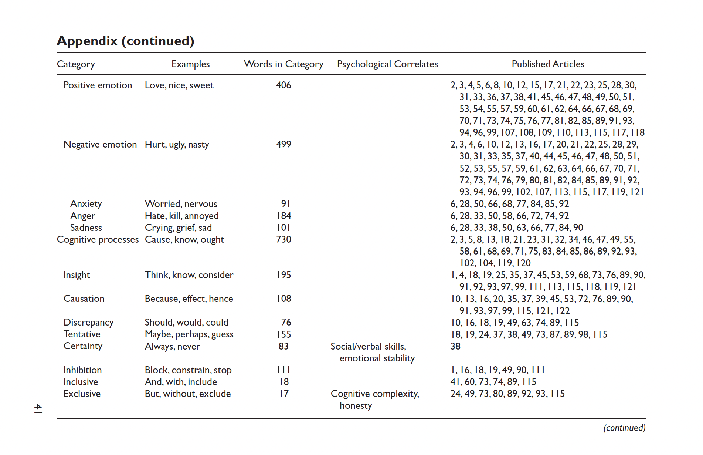
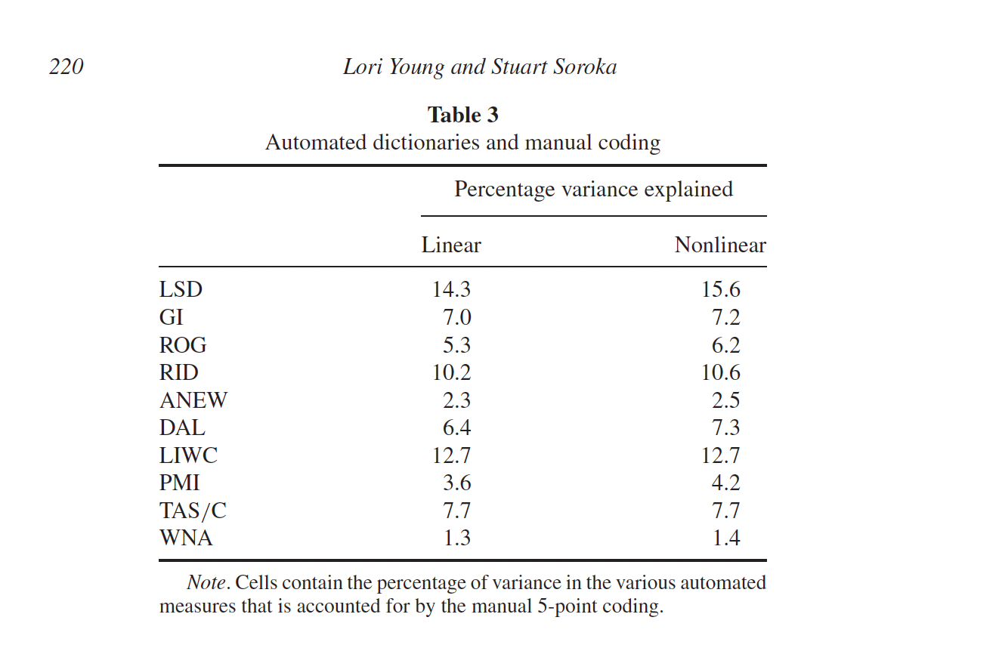
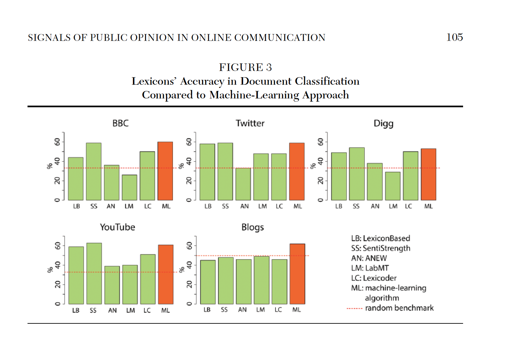
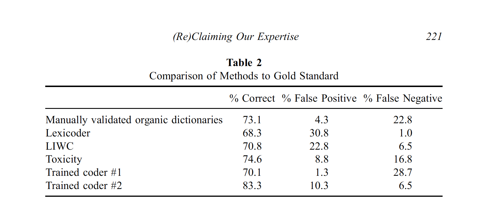
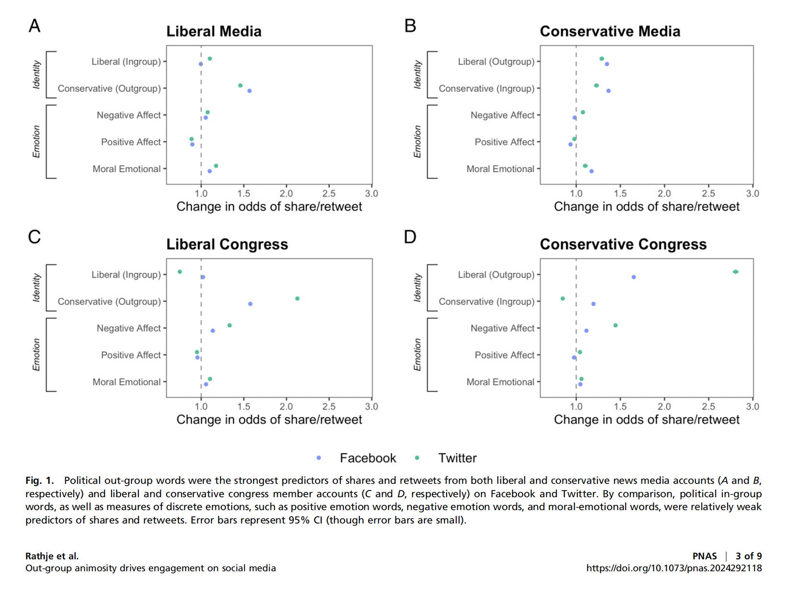
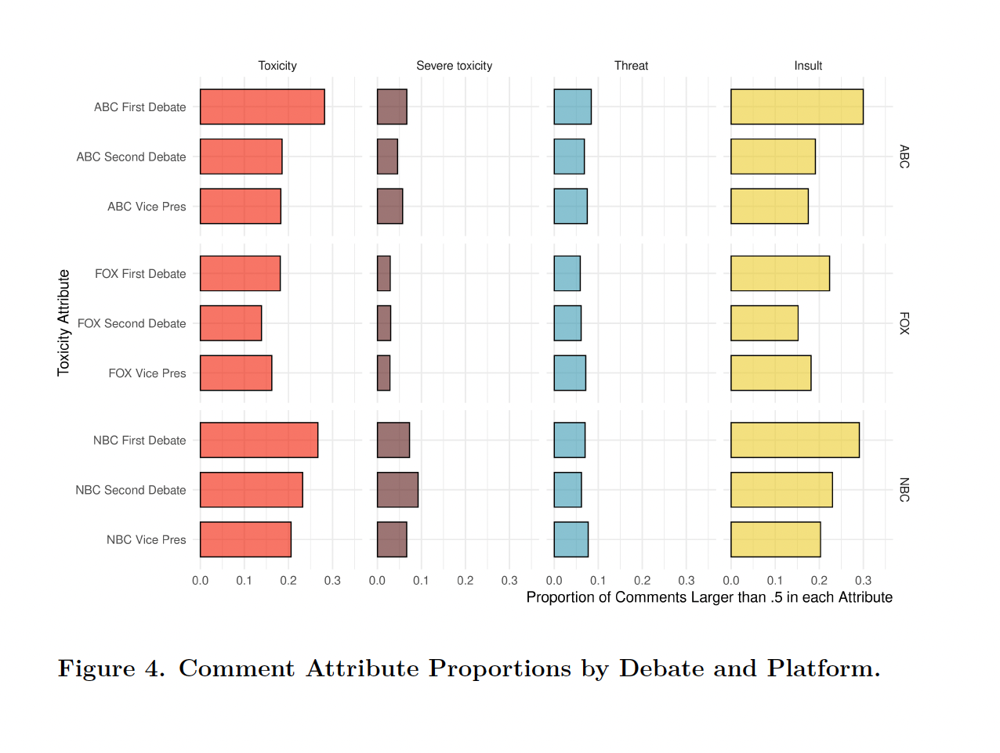
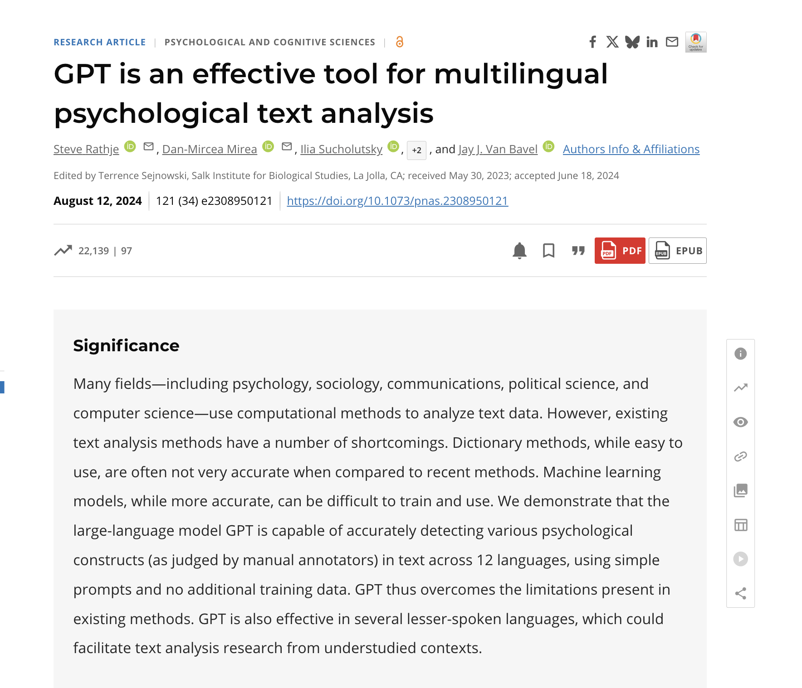

## Housekeeping

Your first problem set will be assigned today! Some important information:

-   You will receive and submit your assignment using Github!

    -   Github Clasroom: Creates automatically a repo for the assignment. You and I are owner of the repo.
    
    - Come to my office hours if you don't know how to work wirh GitHub

-   [Deadline]{.red}: EOD next Monday, September 29th.

-   Please use an .RMD/.QMD/.ipynb file to submit your assignment. 

-   [Any questions?]{.red}

# Coding:  Descriptive inference, comparing documents, Text Complexity

## Where are we?

After learning how to process and represent text as numbers, we started digging in on how to use text on a research pipeline.

:::: fragment
**Descriptive inference:**

::: incremental
-   Counting words (Ban's Paper)

-   Comparing document similarity using vector space model

-   Measures of lexical diversity and readability
:::
::::

## Plans for today

For the next two weeks, we will talk about [measurement]{.red} and **classification:**


:::: fragment

**Today:**

-   Dictionary Methods
    -   Discuss some well-known dictionaries
    
-   Off-the-Shelf Classifiers
    -   Perspective API
    -   Hugging Face (only see as a off-the-shelf machines, LMMs later in this course)
::::

:::: fragment
-   [Next week]{.red}: training our own machine learning models

::::

## Connecting Machine Learning with TAD

In the machine learning tradition, we are introduced to two core families of models:

::: fragment
-   [Unsupervised Models]{.red}: learning (hidden or latent) structure in [unlabeled]{.red} data.

    -   [Topic Models to cluster documents and words]{.midgray}
:::

::: fragment
-   [Supervised Models]{.red}: learning relationship between [inputs]{.red} and a [labeled set of outputs]{.red}.

    -   Sentiment Analysis, classify if a tweet contains misinformation, etc..
:::

::: fragment
#### In TAD, we mostly use unsupervised techniques for [discovery]{.red} and supervised for [measurement of concepts]{.red}.
:::

## Measurement

-   [Def:]{.red} Instantiation of concepts within our theory in order to facilitate quantification

::: fragment
> *Documents come from certain [classes]{.red} and how we can use statistical assumptions to [measure]{.red} these classes*
:::

## Principles of a Good Measurement (Ch. 15)

- 1. Measures should have clear goals

- 2. Source material should always be identified and ideally made public

- 3. Coding should be explainable and reproducible

- 4. Validate!

- 5. Limitations should be explored, documented, and communicated

- **Plus:** Develop the measure in a training set → Apply the measure in the test set

## Measurement/Supervised Learning Pipeline

::: incremental

-   **Step 0:** identify a dataset and a concept you would like to measure
    
    - [Sentiment of tweets about politics]{.midgray}


-   [Step 1:]{.red} label some examples of the concept of we want to measure

    -   [some tweets are positive, some are neutral and some are negative]{.midgray}

-   [Step 2:]{.red} train a statistical model on these set of labelled data using the [document-feature matrix]{.red} as input.

    -   [choose a model (transformation function) that gives higher out-of-sample accuracy]{.midgray}

-   [Step 3:]{.red} use the classifier - some f(x) - to predict unseen documents.
  
    -  [use the model to predict sentiment on new tweets]{.midgray}

-   [Step 4:]{.red} use the measure + metadata to learn something new about the world.

    - [This is where social science happens!]{.midgray}
:::

## Back to the Future Exercise

::::: columns
::: {.column width="50%"}
<iframe src="https://giphy.com/embed/fRm4hhcT7y3wEUgzlo" width="480" height="360" frameBorder="0" class="giphy-embed" allowFullScreen>

</iframe>

<p><a href="https://giphy.com/gifs/BTTF-back-to-the-future-bttf-three-fRm4hhcT7y3wEUgzlo">via GIPHY</a></p>
:::

::: {.column width="50%"}
Assume you can travel back twenty years ago, you want to run a simple sentiment analysis in a corpus of news articles.

-   **Which challenges would you face?**

-   **How could you solve it?**

-   **Please consider all four steps described before**
:::
:::::

# Dictionaries

## Overview of Dictionaries

::: incremental
-   Use a set of pre-defined words that allow us to classify documents automatically, quickly and accurately.

-   Instead of optimizing a transformation function using statistical assumption and seen data, in dictionaries we have a [pre-assumed recipe]{.red} for the transformation function.

-   A dictionary contains:

    -   a list of words that corresponds to each category
        -   [positive and negative for sentiment]{.midgray}
        -   [Sexism, homophobia, xenophobia, racism for hate speech]{.midgray}

-   Weights given to each word 
      
      - same for all words 
      - some continuous variation.
:::

## More specifically...

We have a set of [key words]{.red} with weights,

-   e.g. for sentiment analysis: **horrible** is scored as $-1$ and **beautiful** as $+1$

-   the relative rate of occurrence of these terms tells us about the overall tone or category that the document should be placed in.

::: fragment
For document $i$ and words $m=1,\ldots, M$ in the dictionary,

$$\text{tone of document $i$}= \sum^M_{m=1} \frac{s_m w_{im}}{N_i}$$

Where:

-   $s_m$ is the score of word $m$
-   $w_{im}$ is the number of occurrences of the $m_{th}$ dictionary word in the document $i$
-   $N_i$ is the total number of all dictionary words in the document
:::


## Example: Review Red Rising

>> Glowing reviews from me. A truly magnificent read with a plot ever so deep, characters that you grow incredibly fond of in books to follow, and writing that just flows carrying you through the page after page. Needless to say, I could not put it down and they only get better from book to book. I've just finished the third in the series and am beginning the forth. I'm absolutely hooked on this brilliant authors work. Long live the Reaper!! Howlers unite!

##

> <span style="color:green; font-weight:bold;">Glowing</span> reviews from me.  A truly <span style="color:green;font-weight:bold;">magnificent</span> read with a plot ever so <span style="color:green; font-weight:bold;">deep</span>, characters that you grow incredibly  <span style="color:green; font-weight:bold;">fond</span> of in books to follow, and writing that just flows carrying you through the page after page.  Needless to say, I could not put it down and they only get <span style="color:green; font-weight:bold;">better</span> from book to book. I am very <span style="color:red; font-weight:bold;">anxious</span> waiting for the next book  I've just finished the third in the series and am beginning the forth.  I'm absolutely <span style="color:green; font-weight:bold;">hooked</span> on this  <span style="color:green; font-weight:bold;">brilliant</span> authors work.  Long live the Reaper!! Howlers unite!

- positive words: 7, negative: 1; sentiment = $\frac{7*1 + 1*(-1)}{8} = 0.875$


## Advantages of dictionaries

::: incremental
-   Low cost and computationally efficient \~ [especially using a dictionary developed and validated by others]{.midgray}

-   A hybrid procedure between qualitative and quantitative models

-   Dictionary construction involves a lot of contextual interpretation and qualitative judgment

-   Transparency: no black-box model behind the classification task
:::

# Some well-known dictionaries

## Dict I: General Inquirer (Stone et al 1966)

-   It combines several dictionaries to make total of 182 categories:
    -   the "Harvard IV-4" dictionary: psychology, themes, topics
    -   the "Lasswell" dictionary, five categories based on the social cognition work of Semin and Fiedler
-   "self references", containing mostly pronouns;
-   "negatives", the largest category with 2291 entries

## Dict II: Linquistic Inquiry and Word Count

Created by Pennebaker et al --- see [http://www.liwc.net](%5Bhttp://www.liwc.net)

-   Large dictionary with around 4,500 words and words steams
-   90 categories
-   Categories are organized hierarchically
    -   [All anger words, by definition, will be categorized as negative emotion and overall emotion words.]{.midgray}
-   Words are in one or more categories
    -   [the word cried is part of five word categories: sadness, negative emotion, overall affect, verb, and past tense verb.]{.midgray}
-   You can [buy]{.red} it here: http://www.liwc.net/descriptiontable1.php

## Heavily used in academia!

```{r echo=FALSE, out.width = "80%"}
 
```

::: aside
[Pennebaker et al, 2009](https://journals.sagepub.com/doi/abs/10.1177/0261927x09351676)
:::

## Dict III: VADER - an open-source alternative to LIWC

**Valence Aware Dictionary and sEntiment Reasoner:**

-   Tuned for social media text; open source and free.

-   Capture polarity and intensity

    -   Sentiment Lexicon: this is a list of known words and their associated sentiment scores.
    -   Sentiment Intensity Scores: Each word in the lexicon is assigned a score that ranges from -4 (extremely negative) to +4 (extremely positive).
    -   Five Heuristic-based rules: exclamation points, caps lock, intensifiers, negation, tri-grams

## 

**Vader Heuristic rules to signal intensity or polarity shift:** 

- Punctuation: ! → increased intensity

-  Punctuation: ALL-CAPS → increased intensity

- Degree modifiers (intensifiers, i.e. ”extremely good”) → increased intensity

-  Conjunction “but” signals a shift in sentiment polarity

-  Tri-gram preceding a sentiment-laden lexical feature → catch nearly 90% of cases where negation flips the polarity of the text

    - “The food here isn’t really all that great”

-   Python and R libraries: <https://github.com/cjhutto/vaderSentiment>

-   Article: <https://ojs.aaai.org/index.php/ICWSM/article/view/14550/14399>

## Dict IV - Young & Saroka's Lexicoder Sentiment Dictionary

Create Lexicoder Sentiment dictionary specifically for political communication (i.e. sentiment in news coverage, legislative speech and other text)

-   Combines:

    -   General Inquirer;
    -   Roget's Thesaurus and
    -   Regressive Imagery Dictionary

-   Each words pertains to a single class

-   [Plus]{.red}

    -   Hand coding
    -   Keyword in context for disambiguation

## Performance

```{r echo=FALSE, out.width = "70%"}
 
```

::: aside
LSD results assign 74% to the positive category and just 12% to the negative category. Of the 495 articles that are categorized as negative by at least two coders, LSD results assign 53% to the negative category and 32% to the positive category \~ [69% of accuracy]{.red}
:::

## Dictionary VI: Moral Foundations Dictionary

- Moral foundations: dimensions of difference that explain human moral
reasoning

- Measures the proportions of virtue and vice words for each foundation:
    
    -  Care/Harm
    -  Fairness/Cheating
    -  Loyalty/Betrayal
    -  Authority/Subversion
    - Purity/Degradation

- Link to dictionary: <https://moralfoundations.org/other-materials/>

# Discussion: Advantages and Disadvantages of Dictionaries

## Advantages

We already discussed some of the advantages:

-   low-cost when working with open sourced dictionaries

    -   relatively easy to build/expand on new dictionaries

-   bridge qualitative and quantitative

-   easy to validate

    -   dictionaries are transparent and reliable.

-   transfer well across languages.

## Disadvantage: Context specific

```{r echo=FALSE, out.width = "70%"}
 
```

::: aside
Source: [Gonzalez-Bailon et al](https://journals.sagepub.com/doi/abs/10.1177/0002716215569192)
:::

## Disadvantage: Performance

```{r echo=FALSE, out.width = "80%"}
 
```

::: aside
[Muddiman et al, 2019 - Reclaiming our Expertise](https://www.tandfonline.com/doi/full/10.1080/10584609.2018.1517843)
:::


# Applications


## Rathje et. al 2020, PNAS, Out-group animosity

-  **RQ:**

- **Theory:**

- **Data:**

- **Method:**

- **Which year and where this paper was published?**

## Rathje et. al 2020, PNAS, Out-group animosity {visibility="hidden"}

-  **RQ**: What drives engagement on social media?

- **Theory**: Role of social media in exacerbating political polarization

- **Data**: Large datasets of tweets + Facebook posts news media accounts and US congressional members

- **Method:**

   - 1. Categorize posts using dictionaries of negative affect, positive affect, and moral-emotional language
   
  -  2. Fit regression models to examine how out-group/in-group/affective language predicted retweets and Facebook shares

:::

## Rathje et. al 2020, PNAS, Out-group animosity

> We used the R package [quanteda]{.red} to analyze Twitter and Facebook text. During text preprocessing, we removed punctuation, URLs, and numbers. To classify whether a specific post was referring to a liberal or a conservative, we adapted previously used dictionaries that referred to words associated with liberals or conservatives. Specifically, these dictionaries included 1) [a list of the top 100 most famous Democratic and Republican politicians]{.red} according to YouGov, along with their Twitter handles (or Facebook page names for the Facebook datasets) (e.g., "Trump," "Pete Buttigieg," "@realDonaldTrump"); 2) [a list of the current Democratic and Republican]{.red} (but not independent) US Congressional members (532 total) along with their Twitter and Facebook names (e.g., "Amy Klobuchar," "Tom Cotton"); and 3) [a list of about 10 terms]{.red} associated with Democratic (e.g., "liberal," "democrat," or "leftist") or Republican identity (e.g., "conservative," "republican," or "ring-wing").

## Rathje et. al 2020, PNAS, Out-group animosity

> We then assigned each tweet a count for words that matched our Republican and Democrat dictionaries (for instance, if a tweet mentioned two words in the "Republican" dictionary, it would receive a score of "2" in that category). We also used previously validated [dictionaries]{.red} that counted the number of [positive and negative affect]{.red} words per post and the number of [moral-emotional words]{.red} per post (LIWC).

## Rathje et. al 2020, PNAS, Out-group animosity

```{r echo=FALSE, out.width = "80%"}
 
```

## Supervised Learning vs. Dictionaries

**Dictionary Methods:**

- Advantage: Not corpus-specific, easy to apply to a new corpus
- Disadvantage: Performance on a new corpus is unknown (domain shift)

**Supervised Learning:**

- Generalizes dictionary methods
- Features associated with categories (and their relative weight) are learned from
the data
- By construction, ML will outperform dictionary methods in classification tasks (if the training sample is large enough)

## Off-the-shelf Deep Learning Models


-   [Definition:]{.red} Pre-trained models designed for general-purpose classification tasks
    -   In general those are models built on TONS of data and optimized for a particular task
-   [Key Features:]{.red}
    -   Ready to use
    -   Low to zero cost
    -   Deep ML architectures \~ High accuracy
    -   Can be re-trained for your specific task


## Off-the-shelf I: Perspective API

**Def:** Machine learning tool developed by Jigsaw (Google) to analyze text for harmful or toxic language:

- Trained on large datasets of annotated online comments
- Outputs scores between 0 and 1, representing the likelihood that a comment
falls into a specific category (e.g., toxicity)

:::fragment
**Why?**

-  Useful for analyzing public discourse, particularly around sensitive topics like policy or social issues
-  Helps moderate comments in online platforms
:::

:::fragment

**Limitations:**

-  Limited to specific tasks like toxicity detection
-  Operates as a black-box service with no access to underlying model or
fine-tuning
- Requires data to be sent to an external server, which can pose privacy concerns
:::


## Application: Ventura et. al. 2021

- **RQ:** Characterize streaming chats during political debates leading up to the 2020 U.S. presidential election

- **Theory:** From passive consumer to active co-creator; changing the (online) channel changes the viewing experience

- **Data/method:** Facebook livestream chats on NBC News, ABC News, and Fox
News during 2020 US Presidential debate

- **Outcomes:** Length, speed, toxicity of comments


##  Application: Ventura et. al. 2021

```{r echo=FALSE, out.width = "75%"}
 
```

::: aside
See article: [Ventura et al. 2021, Connective Effervescence and Streaming Chat](https://journalqd.org/article/view/2573)
:::

## Off-the-shelf models II: Transformers

Hugging Face’s Model Hub: centralized repository for sharing and discovering pre-trained models [https://huggingface.co]

```{r echo=FALSE, out.width = "80%"}
 
```

## Off-the-shelf models III: LLMs

GenAI Models (with zero-shot prompting) can also be used to replace dictionaries

```{r echo=FALSE, out.width = "60%"}
 
```

:::aside
Paper: <https://www.pnas.org/doi/10.1073/pnas.2308950121>
:::


# `r fontawesome::fa("laptop-code")` Coding!
