## Housekeeping

Today is your [deadline]{.red} for the problem set 1. Questions?

## Coding

## Replication {visibility="hidden"}

::: incremental
-   [Replications next week]{.red}

    -   Presentation (20 min each):
        -   Introduction;
        -   Methods;
        -   Results;
        -   Differences;
        -   Autopsy of the replication;
        -   Extensions
    -   Repository (by friday):
        -   Github Repo
            -   readme
            -   your presentation pdf
            -   code
            -   5pgs report
:::

## Where are we?

We started from [pre-processing text]{.red} as data, [representing]{.red} text as numbers, and [describing features]{.red} of the text.

Last week, we started measurement and classification:

::: fragment
-   Dictionary Methods
    -   Discuss some well-known dictionaries
-   Off-the-Shelf Classifiers
    -   Perspective API
    -   Hugging Face (only see as a off-the-shelf machines, LMMs later in this course)
-   **Today:** Supervised Learning
:::

## From dictionaries to supervised learning

How can we systematically classify text into meaningful categories (e.g., positive/negative, hate vs. non-hate speech, spam vs. non-spam)?

-   Goal: Learn a **function f** that maps text **inputs x** to category **outputs y**

-   **Dictionaries:** Mapping function is explicitly defined by the researcher using predefined word lists

-   **Supervised Classification**: Mapping function is **learned** from the data by training an algorithm to predict categories based on labeled documents

## What is Supervised Learning?

**Def:** machine learning algorithm type that requires **labeled input** data to understand the mapping function from the input to the output

::: fragment
**SUPERVISED:** The true labels y act as a “supervisor” for the learning process

-   Model predicts ˆy for each input x
-   Compare predictions ˆy to true labels y
-   Adjust model to minimize errors

**LEARNING:** the process by which a machine/model improves its performance on a specific task
:::

# Quick introduction to Machine Learning

## An Statistical Model

The aim of statistical models is to estimate the relationship between the outcome and some set of variables:

$$ y = f(X) + \epsilon$$

**Where:**

-   $y$ is the outcome/dependent/response variable

-   $X$ is a matrix of predictors/features/independent variables

-   $f()$ is some fixed but unknown function mapping X to y. The "signal" in the data

-   $\epsilon$ is some random error term. The "noise" in the data.

## Inference (Social Science) vs Prediction (Machine Learning)

Two reasons we want to estimate $f(\cdot)$:

-   **Inference**

    -   Goal is ***interpretation***

        -   *Which predictors are associated with the response?*
        -   *What is the relationship (parameters) between the response and the predictors?*
        -   *Is the relationship causal?*

    -   <font color = "darkred"> Key limitation</font>:

        -   using functional forms that are easy to interpret (e.g. lines) might be far away from the true function form of $f(X)$.

    -   <font color = "darkred">Classic Social Science Approach</font>:

        -   Example: Which socio and demographic features correlates with voting turnout? Education? Gender? Age?

::: fragment
$$ y_i = \beta_1*education_i + beta_2*gender_i + \sigma_i $$
:::

## Inference (Social Science) vs Prediction (Machine Learning)

-   **Prediction**

    -   Goal is to ***predict*** values of the outcome, $\hat{y}$

    -   $\hat{f}(X)$ is treated as a ***black box***

        -   model doesn't need to be interpretable as long as it provides an accurate prediction of $y$.

    -   <font color = "darkred"> Key limitation</font>:

        -   *Interpretation*: it is difficult to know which variables are doing the heavy lifting and the exact influence of $x$ on $y$.

    -   Example: giving a k number of features, and all possible interactions between them,how likely is each voter i to turnout?

    -   **This is the machine learning tradition/predictive modeling/AI**

::: fragment
$$ y_i = \hat{f}(X) + \sigma_i $$
:::

## Supervised Learning in TaD

Consider this task: "Predicting sentiment of news about the economy in the US".

**Inference or Prediction?**

::: fragment
| Component              | Definition | Example in This Case |
|------------------------|------------|----------------------|
| **Input Features (x)** |            |                      |
| **Label (y)**          |            |                      |
| **Prediction (ŷ)**     |            |                      |
:::

## 

| Component | Definition | Example in This Case |
|----|----|----|
| **Input Features (x)** | Textual data (e.g. DFM) | Sentiment scores from news |
| **Label (y)** | True category or outcome we want to predict | hand-coded sentiment on a small set of news |
| **Prediction (ŷ)** | Model’s estimated prediction | Predicted sentiment |

## Supervised Learning Pipeline

-   [Step 1:]{.red} Label some examples of the concept of we want to measure

-   [Step 2:]{.red} Train a statistical model on these set of label data using the [document-feature matrix]{.red} as input on a training dataset.

-   [Step 3:]{.red} Choose a model (transformation function) that gives higher out-of-sample accuracy

-   [Step 4:]{.red} use the classifier - some f(x) - to predict unseen documents.

## 

```{r echo=FALSE, out.width = "80%"}
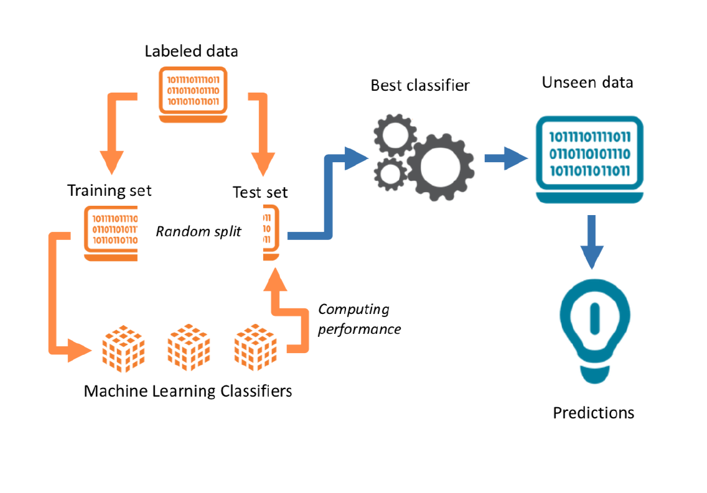 
```

# Start with your target: Building a training dataset.

## How to obtain a training labeled dataset?

::: incremental
-   **External Source of Annotation:** Someone else labelled the data for you

    -   Federalist papers
    -   Metadata from text
    -   Manifestos from Parties with well-developed dictionaries

-   **Expert annotation:**

    -   mostly undergrads \~ that you train to be experts

-   **Crowd-sourced coding:** digital labor markets

    -   [Wisdom of Crowds:]{.red} the idea that large groups of non-expert people are collectively smarter than individual experts when it comes to problem-solving
:::

## Crowdsourcing as a research tool for ML

<br> <br> <br>

> Crowdsourcing is now understood to mean using the Internet to distribute a [large package of small tasks]{.red} to a large number of [anonymous workers]{.red}, located around the world and offered small financial rewards per task. The method is widely used for data-processing tasks such as image classification, video annotation, data entry, optical character recognition, translation, recommendation, and proofreading

::: aside
Source: [Benoit et al, 2016](https://www.cambridge.org/core/journals/american-political-science-review/article/crowdsourced-text-analysis-reproducible-and-agile-production-of-political-data/EC674A9384A19CFA357BC2B525461AC3)
:::

## Benoit et al, 206: Crowdsourcing Political Texts

::: incremental
-   Expert annotation is expensive.

-   [Benoit, Conway, Lauderdale, Laver and Mikhaylov (2016)](https://www.cambridge.org/core/journals/american-political-science-review/article/crowdsourced-text-analysis-reproducible-and-agile-production-of-political-data/EC674A9384A19CFA357BC2B525461AC3) note that [classification jobs]{.red} could be given to a large number of relatively cheap [online workers]{.red}

-   Multiple workers \~ similar task \~ same stimuli \~ [wisdom of crowds!]{.red}

-   Representativeness of a broader population doesn't matter \~ not a populational quantity, it is just a measurement task

-   Their task: Manifestos \~ sentences \~ workers:

    -   social\|economic
        -   very-left vs very right

-   Reduce uncertainty by having more workers for each sentence
:::

## Comparing Experts and online workers

```{r echo=FALSE, out.width = "100%"}
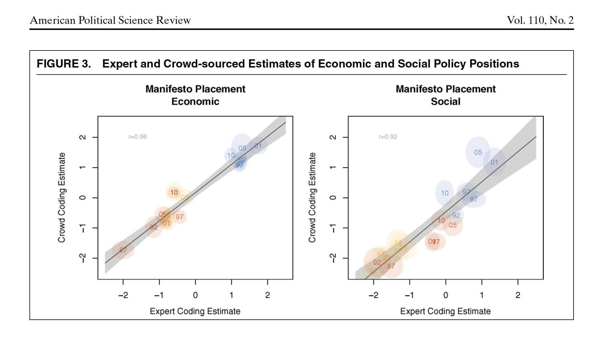 
```

## How many workers? {visibility="hidden"}

```{r echo=FALSE, out.width = "100%"}
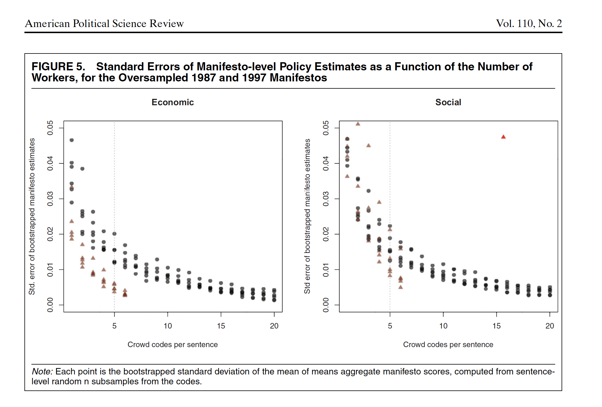 
```

## Example of Crowdsourcing for labels

```{r echo=FALSE, out.width = "75%"}
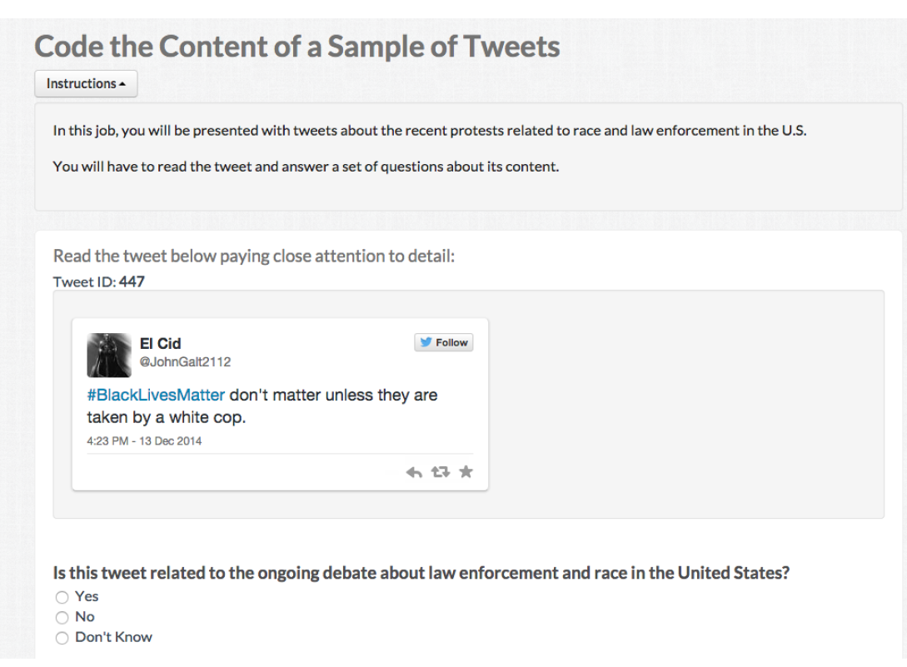 
```

::: aside
Source: Pablo Barbera's CSS Seminar
:::

# Training an statistical model.

## Classifier Selection

-   **Def:** A classifier is an statistical model that assigns data points to a range of categories or classes.

::: fragment
-   in text as data, often your DFM has [Features \> Documents]{.red}

    -   identification problems for statistical models
    -   overfitting the data with noise
:::

::: fragment
-   Bias-Variance Trade-off

    -   fit a overly complicated model \~ [leads to higher variance]{.red}
    -   fit a more flexible model \~ [leads to more bias]{.red}
:::

::: fragment
-   Many models:

    -   Naive Bayes, Regularized regressionm, SVM, k-nearest neighbors, tree-based methods, Ensemble methods + DL
:::

::: fragment
-   **Differences:** loss function they minimize, model assumptions, regularization control (balance bias vs. variance), computational complexity
:::

## Regularized OLS Regression

The simplest, but highly effective, way to build ML models in TaD is to use known model (OLS) + regularization to reduce dimensionality:

::: fragment
[**OLS Loss Function :**]{.red}

$$
RSS = \sum_{i=1}^{N} \left( y_i - \beta_0 - \sum_{j=1}^{J} \beta_j x_{ij} \right)^2 
$$
:::

## OLS + Penalty (Ridge)

$$
\text{RSS} = \sum_{i=1}^{N} \left( y_i - \beta_0 - \sum_{j=1}^{J} \beta_j x_{ij} \right)^2 + \lambda \sum_{j=1}^{J} \beta_j^2 \rightarrow \text{ridge regression}
$$

-   Penalizes large coefficients.

-   Shrinks all coefficients towards zero, but none are exactly zero.

## OLS + Penalty (Lasso)

$$
\text{RSS} = \sum_{i=1}^{N} \left( y_i - \beta_0 - \sum_{j=1}^{J} \beta_j x_{ij} \right)^2 + \lambda \sum_{j=1}^{J} |\beta_j| \rightarrow \text{lasso regression}
$$

-   Penalizes absolute size of coefficients.

-   Many coefficients shrink to exactly zero → automatic variable selection.

-   VERY USEFUL FOR SPARSE MATRIX!!

## Many Models

```{r echo=FALSE, out.width = "70%"}
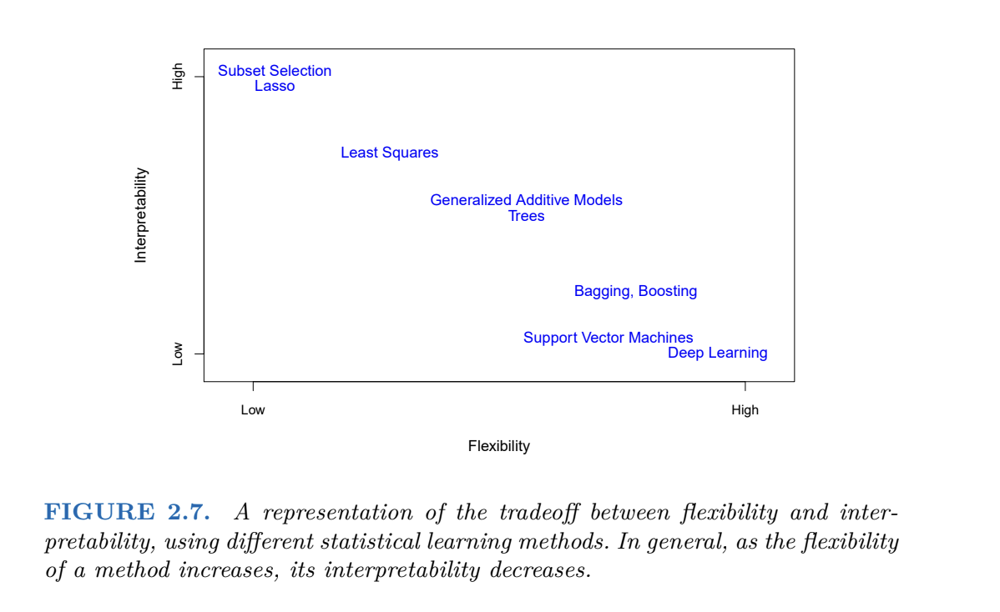 
```

-   Differences: loss function they minimize, model assumptions, regularization control (balance bias vs. variance), computational complexity

## How to select a model?

The purpose of training the model is to **capture signal** and **ignore noise**.

To do so:

-   Define a accuracy metric: reduce this metric as much as possible. Simplest form: how many errors I am making with the predictions?

-   Train-Test Split

    -   Split your data between training and test

    -   Training data: find the best model and tune the parameters of these models

    -   Test data: assess the accuracy of your model.

-   Select the model based on smaller **out of sample predictive accuracy**, using **UNSEEN** data.

# What can go wrong?

## Bias and Variance Trade-off

Expected prediction error for a data point:

$$
E\big[(\hat{y} - y)^2\big] = (\text{Bias}^2) + \text{Variance} + \text{Irreducible Error}
$$

::: fragment
**Bias:** Difference between the expected prediction of the model and the true value.

$$\text{Bias}(\hat{f}(x)) = E[\hat{f}(x)] - f(x)$$
:::

::: fragment
**Variance:** How much do the model’s predictions fluctuate for different training sets?

$$ \text{Var}(\hat{f}(x)) = E\Big[\big(\hat{f}(x) - E[\hat{f}(x)]\big)^2\Big]$$
:::

::: fragment
**Bias and Variance Tradeoff:**

-   Can fit a very complicated model to our training set perfectly

    -   **Bias ↓, Variance ↑**
:::

::: fragment
-   Can be more relaxed about the performance in the training set

    -   **Bias ↑, Variance ↓**
:::

## Bias and Variance Tradeoff

```{r echo=FALSE, out.width = "100%"}
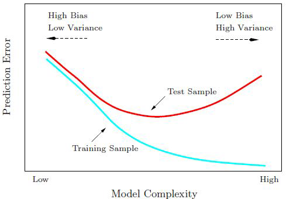 
```

## Train-Validation-Test

::: fragment
Training Set

-   Largest portion (60-80% of the data)
-   To train the model
:::

::: fragment
Validation Set

-   Smaller portion (10-20% of data)
-   Check different models
-   To tune hyperparameters and evaluate model during training
-   Parameters that we set before training begins (e.g. learning rate, number of neural networks layers, strength of regularization)
:::

::: fragment
Test Set - Smaller portion (10-20% of data) - To assess final model performance
:::

## Or Cross Validation

**Cross-validation:** resampling method that involves partitioning data into subsets, allowing us to train and test on different combinations

```{r echo=FALSE, out.width = "70%"}
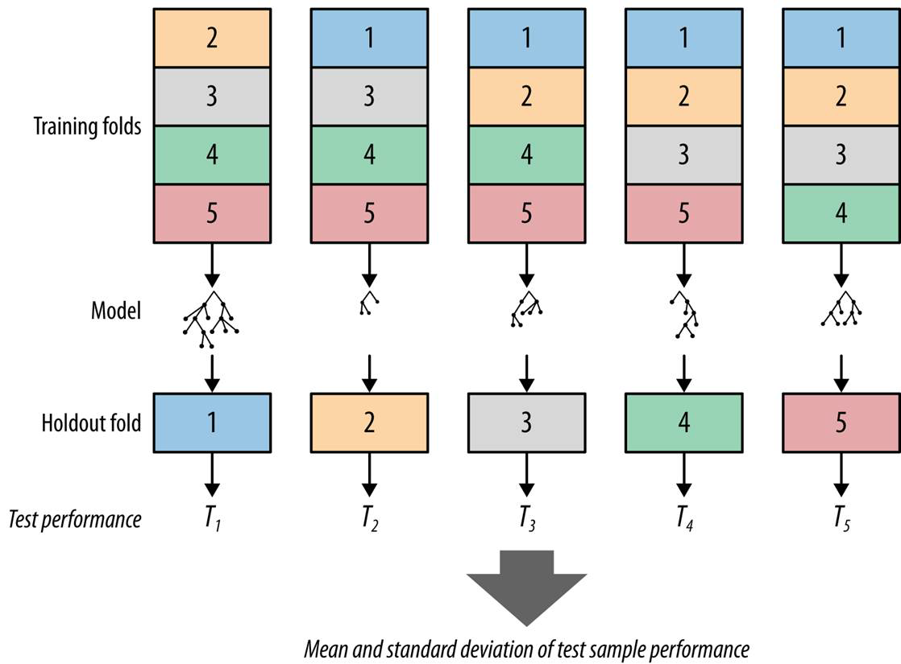 
```

## Summary: how to choose a classifier?

| Factor | Recommended Classifiers |
|----|----|
| **Task Type** | Classification: Logistic Regression, Random Forest, SVM <br> Regression: Linear Regression, Random Forest Regressor |
| **Data Size** | Small datasets: Logistic Regression, Naive Bayes <br> Large datasets: Neural Networks, Gradient Boosting |
| **Feature Characteristics** | Sparse features (e.g., text data): Naive Bayes, SVM <br> Non-linear relationships: Random Forest, Gradient Boosting |
| **Interpretability** | High interpretability: Logistic Regression, Decision Trees <br> Performance focus: Neural Networks, Gradient Boosting |
| **Computational Resources** | Low resources: Naive Bayes, Logistic Regression <br> High resources: Neural Networks, Gradient Boosting |

# Measures of Accuracy

## Evaluating the Performance

|            |       |     Predicted      |                    |       |
|------------|-------|:------------------:|:------------------:|------:|
|            |       |         J          |         ¬J         | Total |
| **Actual** | J     | a (True Positive)  | b (False Negative) |   a+b |
|            | ¬J    | c (False Positive) | d (True Negative)  |   c+d |
|            | Total |        a+c         |        b+d         |     N |

::: incremental
-   **Accuracy**: number correctly classified/total number of cases = (a+d)/(a+b+c+d)

-   **Precision** : number of TP / (number of TP+number of FP) = a/(a+c) .

    -   Fraction of the documents predicted to be J, that were in fact J.
    -   Think as a measure for the estimator (Very precise estimate)

-   **Recall**: (number of TP) / (number of TP + number of FN) = a /(a+b)

    -   Fraction of the documents that were in fact J, that method predicted were J.
    -   Think as a measure for the data (Covers most of the cases in the data)

-   **F** : 2 precision\*recall / precision+recall

    -   Harmonic mean of precision and recall.
:::

## Quizz

You are working for the FBI, looking for emails that pertain to terrorist attacks. Fortunately, such emails are very, very rare (0.0001% of all emails).

-   For such tasks, there’s a trade-off between precision and recall. Explain why.

-   We may be skeptical of using accuracy as a performance indicator in this case. Explain why.

::: notes
If the FBI uses a very strict filter (only flags emails that look very suspicious), precision will be high (almost everything flagged is truly relevant) but recall will be low (many relevant emails missed).

If the FBI uses a lenient filter (flags lots of emails), recall will be high (most relevant ones are caught), but precision will drop (many false alarms).

Because terrorist emails are extremely rare, improving one metric usually comes at the expense of the other.

Missing a terrorist email (false negative) is much worse than flagging many innocent ones (false positives).

Thus, the solution is to prioritize recall (don’t miss positives), even if precision is lower — then use human analysts to review flagged cases
:::

## Barbera et al, 2020, Guide for Supervised Models with Text

::::: columns
::: {.column width="50%"}
<iframe src="https://giphy.com/embed/z1yZD48IGFzYk" width="480" height="355" frameBorder="0" class="giphy-embed" allowFullScreen>

</iframe>

<p><a href="https://giphy.com/gifs/flintstones-z1yZD48IGFzYk">via GIPHY</a></p>
:::

::: {.column width="50%"}
<br> Task: Tone of New York Times coverage of the economy. Discusses:

-   How to build a corpus
-   Unit of analysis
-   Unique documents or More coders?
-   ML or Dictionaries?
:::
:::::

## How to build a corpus?

```{r echo=FALSE, out.width = "75%"}
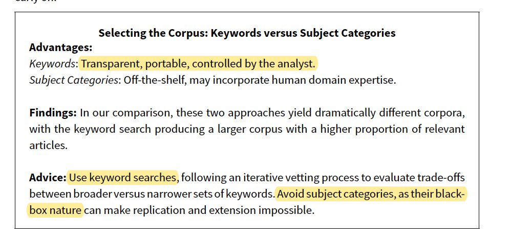 
```

## Unit of Analysis?

```{r echo=FALSE, out.width = "75%"}
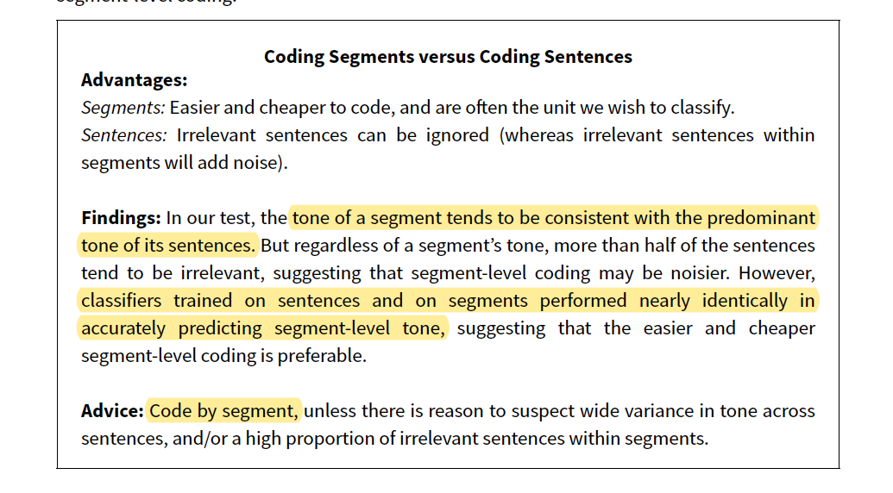 
```

## Unique documents or More coders?

```{r echo=FALSE, out.width = "75%"}
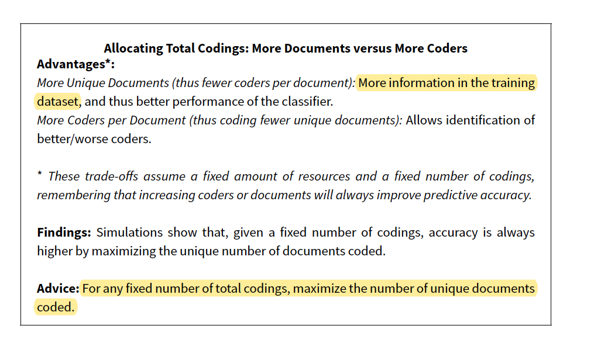 
```

## ML or Dictionaries?

```{r echo=FALSE, out.width = "75%"}
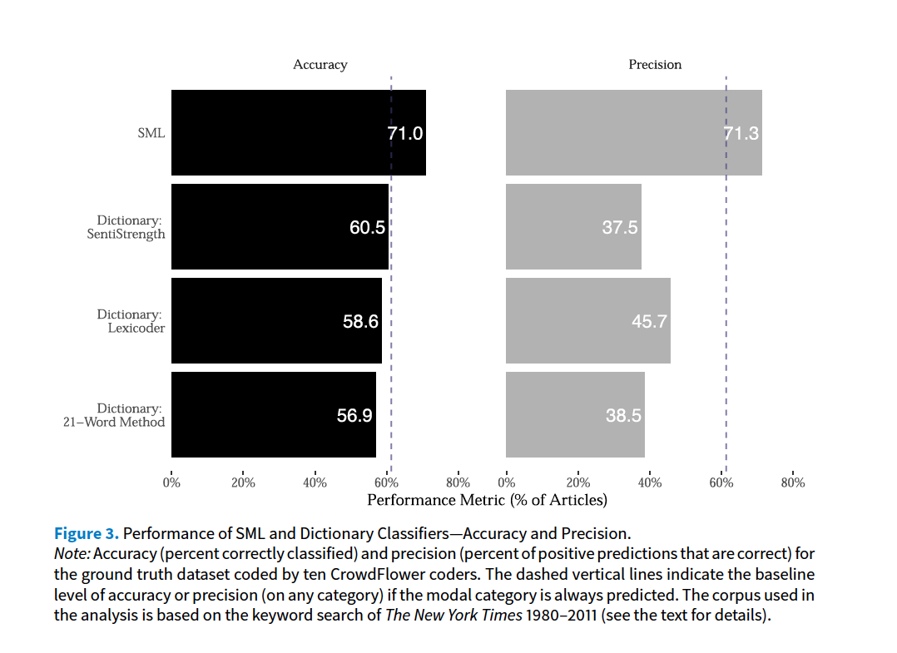 
```

# See you next week!
