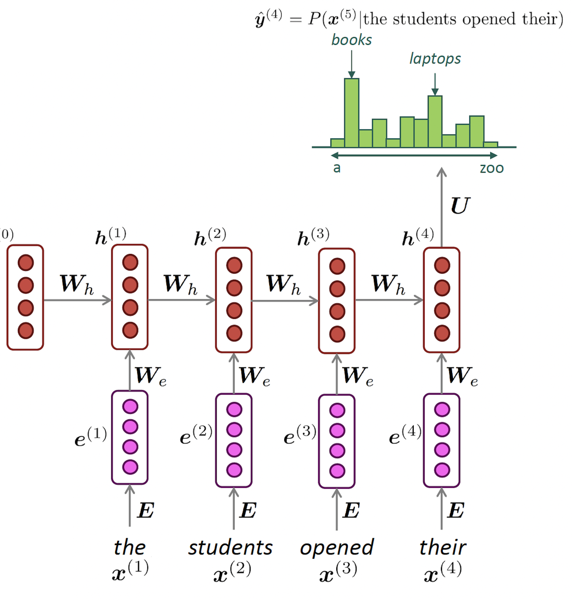
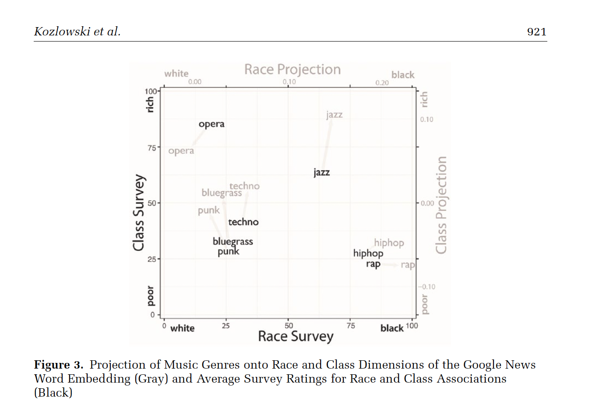
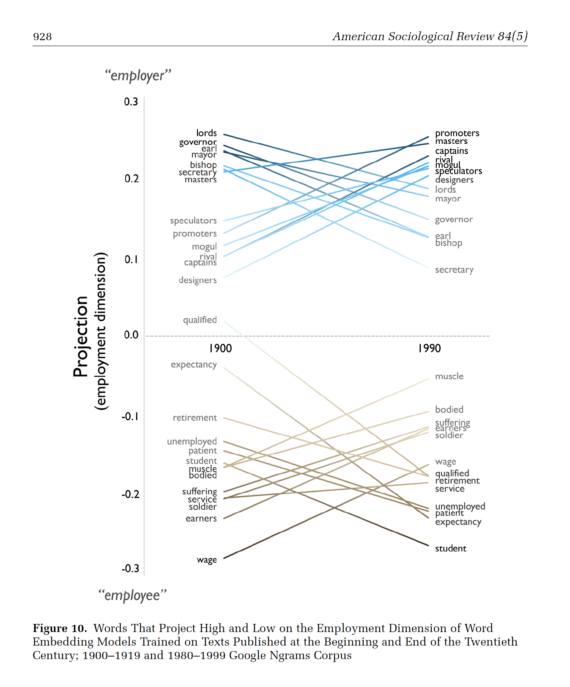
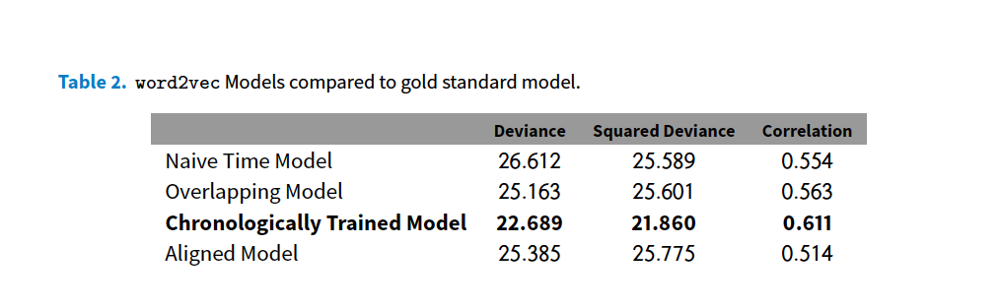
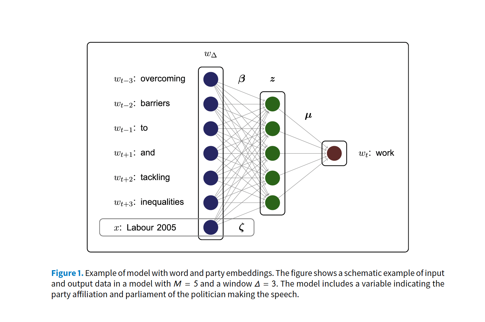
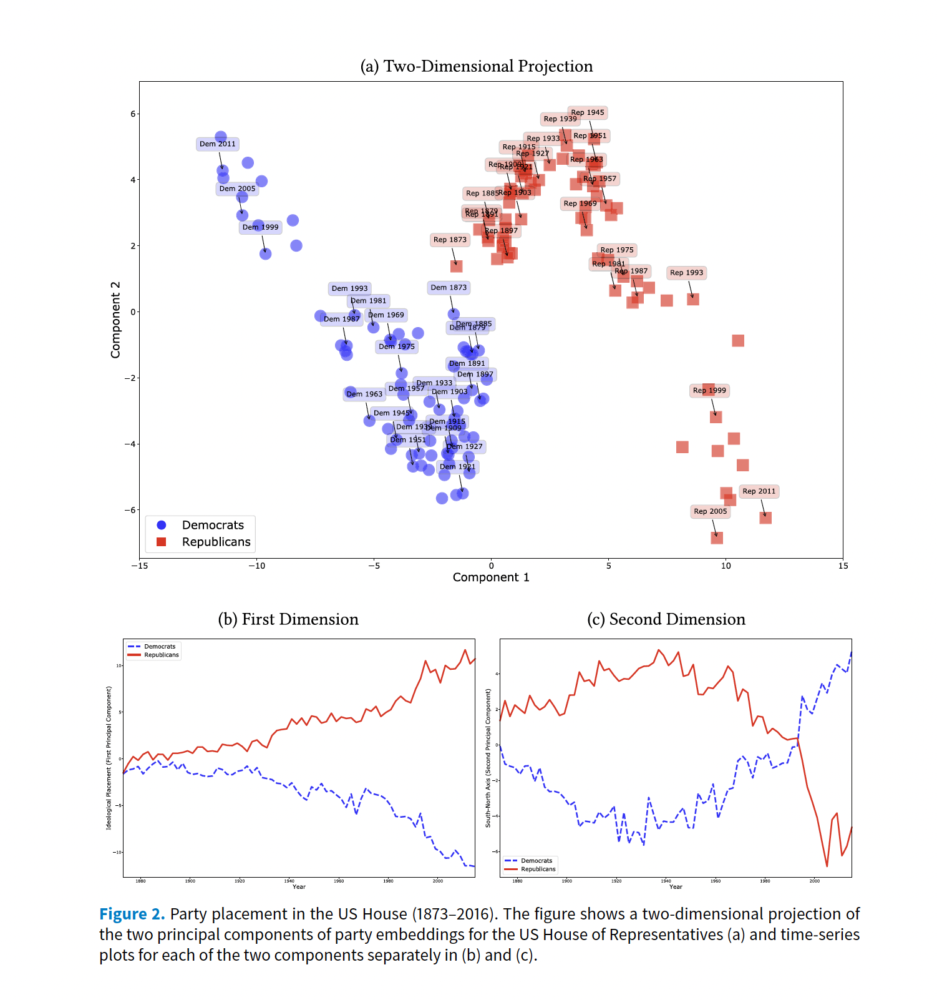
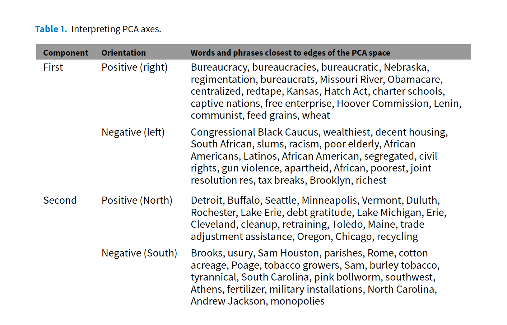
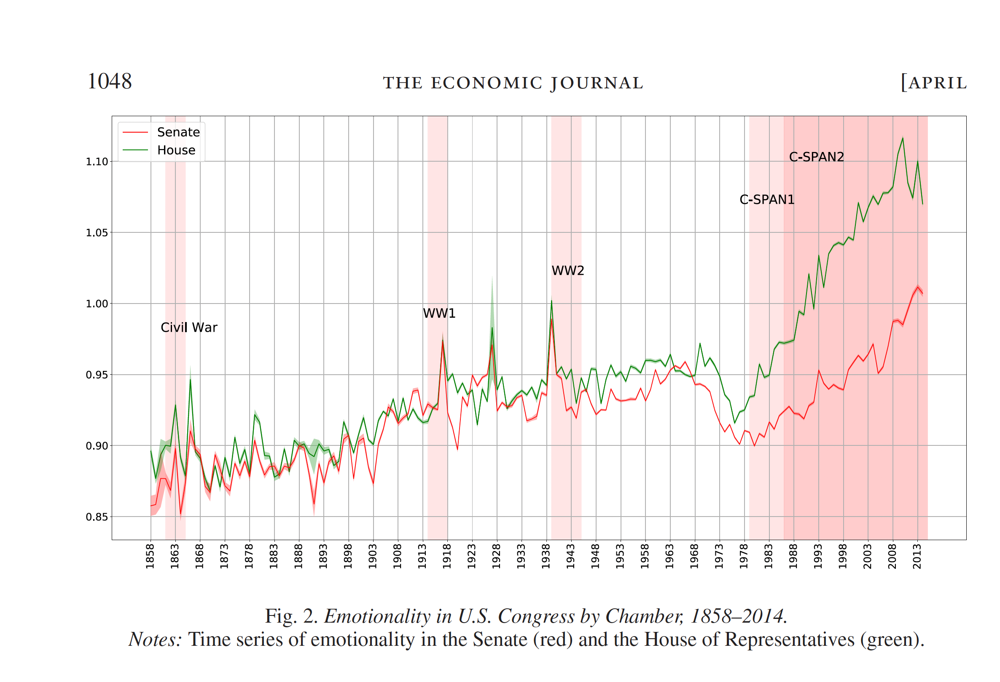
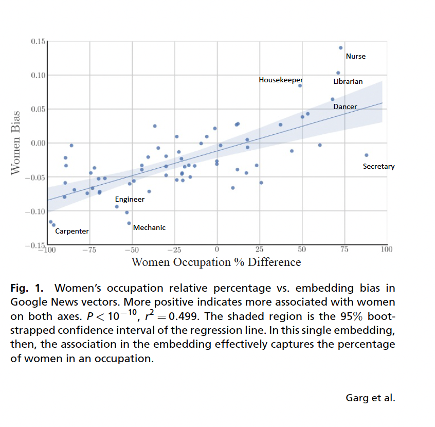
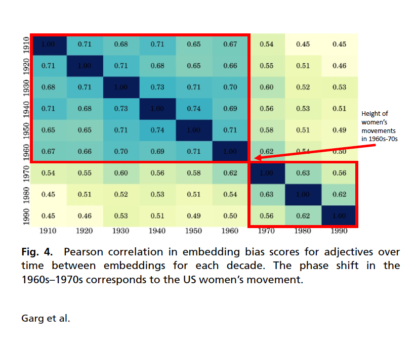

## Plans for Today:

-   Quick introduction to Word Embedding + Matrix Factorization

-   Coding

-   In class Exercise: Applied Readings


## Estimating Word Embeddings

### Approches:

::: nonincremental
::: fragment

-   [Neural Networks:]{.red} rely on the idea of **self-supervision**
    -   use unlabeled data and use words to predict sequence
    -   the famous **word2vec** algorithm
        -   Skipgram: predicts context words
        -   Continuous Bag of Words: predict center word
:::

::: fragment
-   [Count-based methods]{.red}: look at how often words co-occur with neighbors.
    -   Use this matrix, and use some factorization to retrieve vectors for the words
    -   Fast, not computationally intensive, but not the best representation, because it is not fully local
    -   This approach is somewhat implemented by the "GloVE" algorithm
:::
:::


## Recurrent Neural Networks 

```{r echo=FALSE, out.width = "50%"}
#| fig-align: "center"
 
```


:::aside
Source: [CS224N](https://web.stanford.edu/class/cs224n/index.html#schedule)
:::

## Transformers


```{r echo=FALSE, out.width = "100%"}
knitr::include_graphics("./week13_figs/transformers.png") 
```

:::aside
Source: [CS224N](https://web.stanford.edu/class/cs224n/index.html#schedule)
:::


# Word Embeddings via Count Based Methods (No Deep Learning)

## Count Based Approaches

Count-based methods rely on word co-occurrence to learn embeddings:


1. Compute Unigram Probabilities: Measure how often each word appears in the
corpus

2. Compute Word Co-occurrences: Count how often words appear together across
the entire corpus

3. Calculate PMI (Pointwise Mutual Information): Measures how much more often two words co-occur than expected by chance

::: fragment

$$
PMI(\text{word}_1, \text{word}_2) = \log \frac{P(\text{word}_1, \text{word}_2)}{P(\text{word}_1) \, P(\text{word}_2)}
$$
:::

##

4. Construct a Co-occurrence Matrix: Store PMI values in a large word-by-word
matrix

5. Apply Singular Value Decomposition (SVD): Reduce the matrix to extract
meaningful lower-dimensional word vectors

  - SVD is a matrix factorization technique used in linear algebra and data science
  - Reduces dimensionality by identifying important patterns in data: splits the matrix into fundamental patterns (singular vectors), ranked by importance (singular values)
  
       - Love this youtube video here: https://www.youtube.com/watch?v=vSczTbgc8Rc
   
- Glove algorithm is a variation of this approach. 
       
## Coding!

## Decisions when using embeddings, Rodriguez and Spirling, 2022{visibility="hidden"}

::::: columns
::: {.column width="60%"}
```{r echo=FALSE, out.width = "100%"}
knitr::include_graphics("./week9_figs/rodriguez.png") 
```
:::

::: {.column width="40%"}
<br> <br>

When using/training embeddings, we face four key decisions:

-   Window size

-   Number of dimensions for the embedding matrix

-   Pre-trained versus locally fit variants

-   Which algorithm to use?
:::
:::::

## Findings{visibility="hidden"}

```{r echo=FALSE, out.width = "100%", fig.align="center"}
knitr::include_graphics("./week7_figs/rodriguez.png") 
```

-   popular, easily available pretrained embeddings perform at a level close to---or surpassing---both human coders andmore complicated locally fit models.

-   GloVe pretrained word embeddings achieve on average---for the set of political queries---80% of human performance and are generally preferred to locally trained embeddings

-   Larger window size and embeddings are often preferred.

## Applications

Let's discuss now several applications of embeddings on social science papers. These paper show:

-   How to use embeddings to track semantic changes over time

-   How to use embeddings to measure emotion in political language.

-   How to use embeddings to measure gender and ethnic stereotypes

-   And a favorite of political scientists, how to use embeddings to measure ideology.

## In class exercise

1. Work in pairs 

2. Each pair will select one of the five applied papers for this week 

3. Prepare a presentation about this paper for your colleagues (30min)

4. Your presentation needs to answer three key questions: 

   - How are word embeddings used?
   
   - What substantive/applied insights are extracted from the embeddings approach?
   
   - Could this be done with non-embeddings methods (any of the things we saw before embeddings)? 
   
4. Every group will have 5 minutes to present


## Papers and pairs

- Rodman, E., 2020. A Timely Intervention: Tracking the Changing Meanings of Political Concepts with Word Vectors. Political Analysis, 28(1), pp.87-111.

- Gennaro, Gloria, and Elliott Ash. “Emotion and reason in political language.” The Economic Journal 132, no. 643 (2022): 1037-1059.

- Rheault, Ludovic, and Christopher Cochrane. “Word embeddings for the analysis of ideological placement in parliamentary corpora.” Political Analysis 28, no. 1 (2020): 112-133.

- Austin C. Kozlowski, Austin C., Matt Taddy, and James A. Evans. 2019. “The Geometry of Culture: Analyzing the Meanings of Class through Word Embeddings.” American Sociological Review 84, no. 5: 905–49.

- Garg, Nikhil, Londa Schiebinger, Dan Jurafsky and James Zou. 2018. “Word embeddings quantify 100 years of gender and ethnic stereotypes.” Proceedings of the National Academy of Sciences 115(16):E3635–E3644.


# Have fun!

## Capturing cultural dimensions with embeddings {visibility="hidden"}

> Austin C. Kozlowski, Austin C., Matt Taddy, and James A. Evans. 2019. "The Geometry of Culture: Analyzing the Meanings of Class through Word Embeddings." American Sociological Review 84, no. 5: 905--49. https://doi.org/10.1177/0003122419877135.

-   Word Embeddings can be use to capture cultural dimensions

-   Dimensions of word embedding vector space models closely correspond to meaningful "cultural dimensions," such as rich-poor, moral-immoral, and masculine-feminine.

-   a word vector's position on these dimensions reflects the word's respective cultural associations

## Your turn: How?{visibility="hidden"}

-   How are the cultural dimensions built?

-   How associations between words and dimensions are calculated?

-   How are the result validated?

## Results{visibility="hidden"}

```{r echo=FALSE, out.width = "100%", fig.align="center"}
 
```

## Results{visibility="hidden"}

```{r echo=FALSE, out.width = "100%", fig.align="center"}
 
```

## Semantic changes over time{visibility="hidden"}

> Rodman, E., 2020. A Timely Intervention: Tracking the Changing Meanings of Political Concepts with Word Vectors. Political Analysis, 28(1), pp.87-111.

-   Word Vectors allow us to capture semantic meaning

-   Interesting social science questions hinge on the recognition that meaning changes over time

-   How can we properly use word to vectors to track changes over time?

-   Three challenges:

    -   Arbitrary Cut Points
    -   Language Instability (same concept != words)
    -   Spatial Noncomparability (latent spaces are not constants)

-   Solutions:

    -   naive time series model (just cut)
    -   overlapping time series model (just cut and add a t-1)
    -   chronologically trained model (initialize with global parameters)
    -   aligned time series method (post-modelling adjustments)

## Results{visibility="hidden"}

```{r echo=FALSE, out.width = "100%", fig.align="center"}
 
```

## Your turn: How?{visibility="hidden"}

-   How does she uses word2vec?

-   What is there pipeline to build a golden set?

-   What is her outcome measure and how she builds it?

## Ideological Scaling{visibility="hidden"}

> Rheault, Ludovic, and Christopher Cochrane. "Word embeddings for the analysis of ideological placement in parliamentary corpora." Political Analysis 28, no. 1 (2020): 112-133.

-   Can word vectors be used to produce scaling estimates of ideological placement on political text?

    -   Yes, and word vectors are even better

        -   It captures semantics

        -   No need of training data (self-supervision)

## Your turn: How? With a little help.{visibility="hidden"}

::::: columns
::: {.column width="50%"}
```{r echo=FALSE, out.width = "100%"}
 
```
:::

::: {.column width="50%"}
-   Other than the a vector for the covariate, what are the other things this model gives you?

-   Can you get these vectors without having to re-estimate the model?
:::
:::::

## Results{visibility="hidden"}

::::: columns
::: {.column width="50%"}
```{r echo=FALSE, out.width = "100%"}
 
```
:::

::: {.column width="50%"}
```{r echo=FALSE, out.width = "100%"}
 
```
:::
:::::

## Measuring Emotion{visibility="hidden"}

> Gennaro, Gloria, and Elliott Ash. "Emotion and reason in political language." The Economic Journal 132, no. 643 (2022): 1037-1059.

```{r echo=FALSE, out.width = "90%"}
 
```

## You turn: How?{visibility="hidden"}

-   What are the seed words for emotion and cognition?

-   How are word vectors for speech aggregated?

-   How are word vectors for seed words aggregated?

-   How do the authors measure emotionality in text?

## Gender and ethnic stereotypes{visibility="hidden"}

> Garg, Nikhil, Londa Schiebinger, Dan Jurafsky and James Zou. 2018. "Word embeddings quantify 100 years of gender and ethnic stereotypes." Proceedings of the National Academy of Sciences 115(16):E3635--E3644.

-   Word Embeddings are trained in huge volumes of data

-   Training data contain stereotypes, for example, in gender and ethnic dimensions.

-   How can we use word vectors to understand these stereotypes?

## Your turn: how?{visibility="hidden"}

-   What are the measures of biases proposed by the author?

-   What the input here? And the variation over time?

## Results{visibility="hidden"}

::::: columns
::: {.column width="50%"}
```{r echo=FALSE, out.width = "100%"}
 
```
:::

::: {.column width="50%"}
```{r echo=FALSE, out.width = "100%"}
 
```
:::
:::::

# `r fontawesome::fa("laptop-code")` Coding!{visibility="hidden"}
