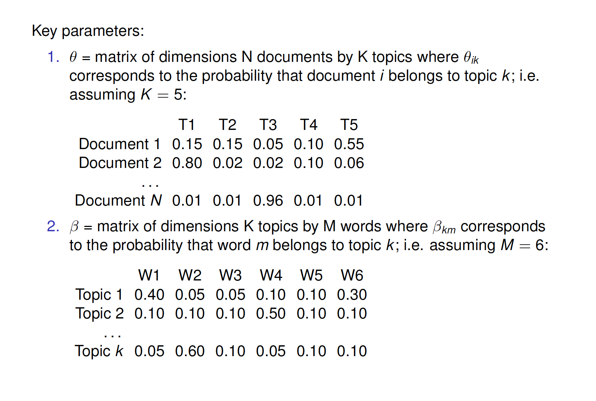
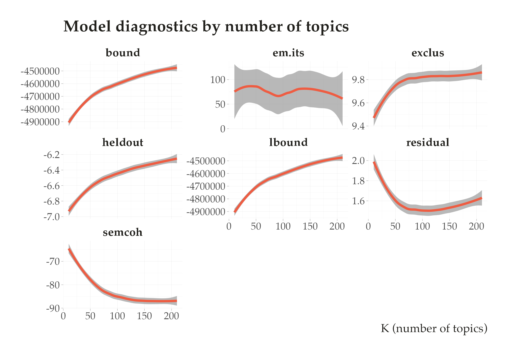
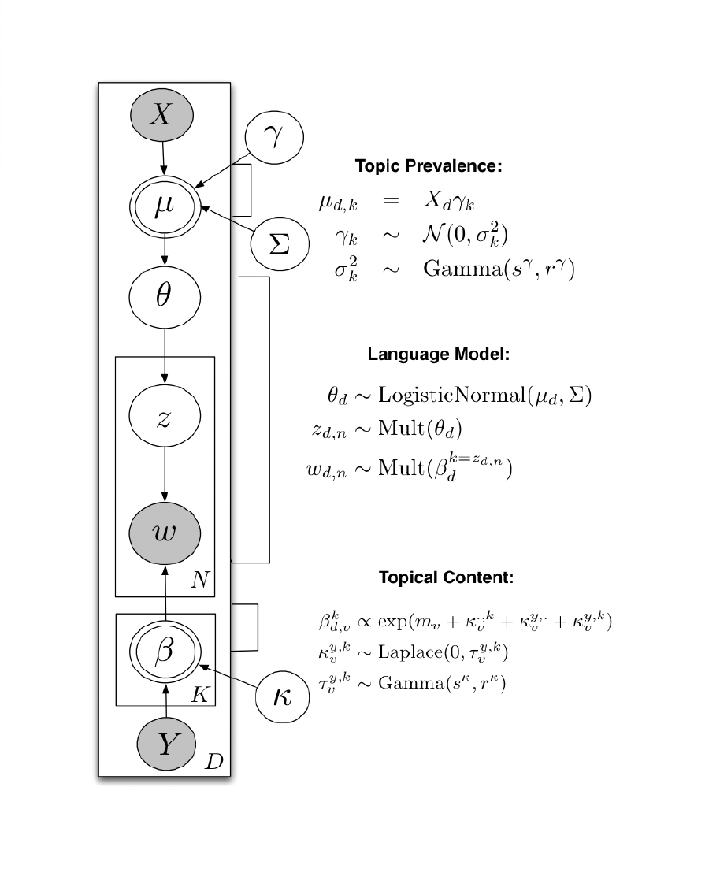
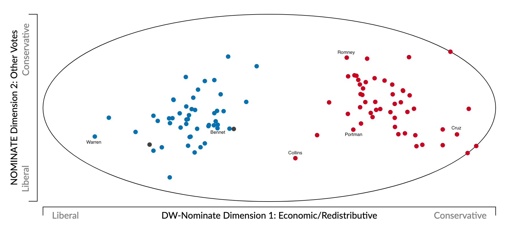
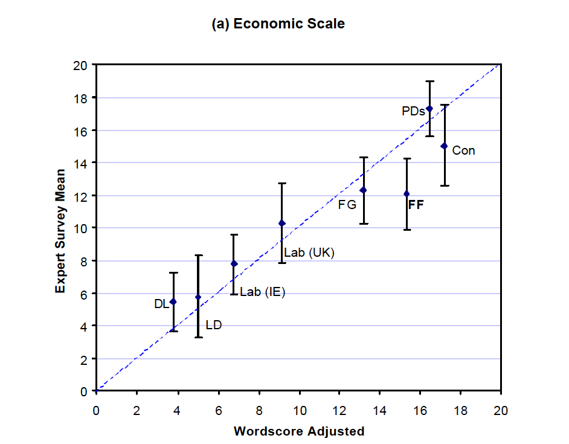
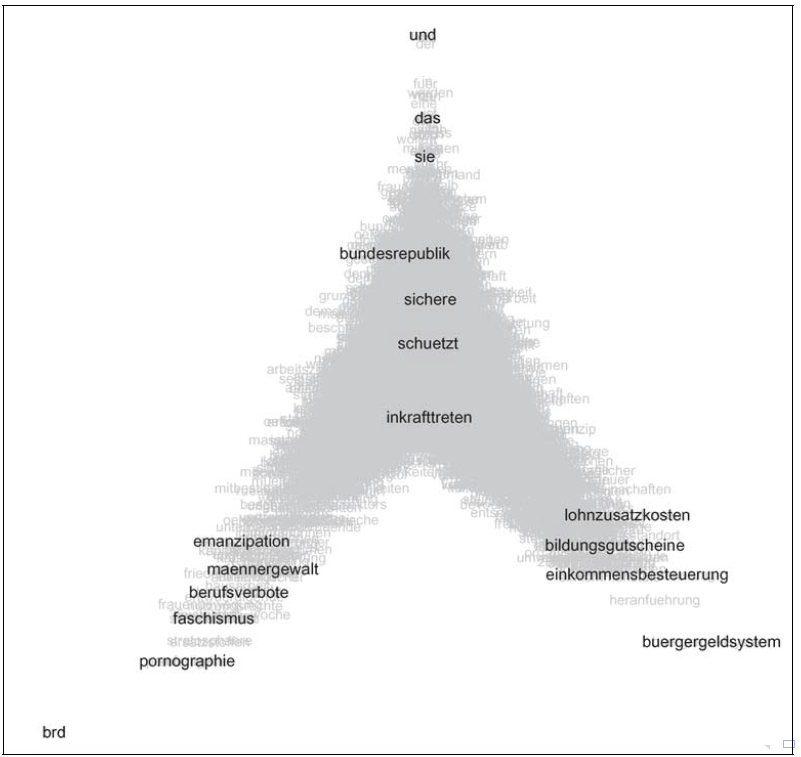
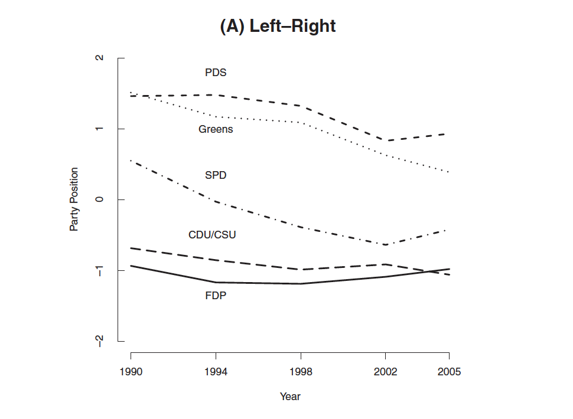
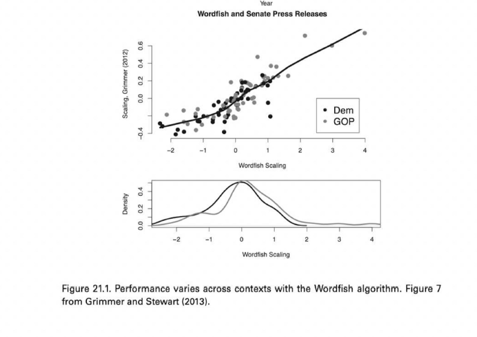

## Plans for Today:

-   Final Project + Mid-Semester Review

-   Finish Topic Models + Code

-   Overview of scaling models

-   Scaling models using text

    -   supervised models: wordscore

    -   unsupervised models: wordfish

## Final Project

| **Requirement**  | **Due**               | **Length**    | **Percentage** |
|------------------|-----------------------|---------------|----------------|
| Project Proposal | **EOD Friday Week 8** | 2 pages       | 5%             |
| Presentation     | Week 14               | 10-15 minutes | 10%            |
| Project Report   | Wednesday Week 15     | 10 pages      | 25%            |

For the project proposal:

-   you need to schedule a 30min with me at least a week before the due date.

-   For this meeting, I expect you to send me a draft of your ideas.

## Project Proposal

The project proposal asks that you sketch out a general 2 page (single-spaced; 12pt font) project proposal.

-   A high-level statement of the problem you intend to address or the analysis you aim to generate

-   The data source(s) you intend to use

-   Your plan to obtain that data

-   The text as data method you plan to use.

-   A definition for what “success” means with respect to your project.

# Mid-semester survey: [https://forms.gle/evAYeWPzgrzrWtpi9](https://forms.gle/evAYeWPzgrzrWtpi9)

# Review: Topic Models

## Intuition: Language Model

-   **Step 1: For each [document]{.red}:**

    -   Randomly choose a [distribution]{.red} over topics. That is, choose one of many multinomial distributions, each which mixes the topics in different proportions.

-   **Step 2: For each topic**

    -   Randomly choose a **distribution** of words, also from one of many multinomial distributions., each with mixes words in different proportions

-   **Step 3: Then, for every [word]{.red} in the document**

    -   Randomly choose a [topic]{.red} from the distribution over topics from step 1.
    -   Randomly choose a [word]{.red} from the distribution over the vocabulary that the topic implies.

## Mathematical Model: LDA Topic Model

To estimate the model, we need to assume some known mathematical distributions for this data generating process:

-   **For every topic:** Each topic k has a word distribution $\beta_k$ , drawn from a Dirichlet prior:

    -   $\beta_k \sim \text{Dirichlet}(\tau)$

-   **For every document:** Each document d has a topic distribution $\theta_d$ , drawn from a Dirichlet prior

    -   $\theta_d \sim \text{Dirichlet}(\alpha)$,

-   **For every word**:

    -   For each word wdn in document d, choose a topic $z_{dn}$ based on the document’s topic distribution, a topic $z_{dn} \sim \text{Multinomial}(\theta_d)$.
    -   Choose a word $w_{dn}$ from the topic’s word distribution: $w_{dn} \sim \text{Multinomial}(\beta_{z_{dn}})$

-   **where:**

    -   $\alpha$ and $\tau$ are hyperparameter of the Dirichlet priors
    -   $\beta_k$ is drawn from a Dirichlet for per-topic word distribution
    -   $\theta_d$ is drawn from a Dirichlet for the topic distribution for documents - $K$ topics
    -   $D$ documents in the corpus
    -   $dn$ word position in document $d$

## Parameters

```{r echo=FALSE, out.width = "80%", fig.align='center'}
 
```

## Choosing the number of topics

::: nonincremental
-   Choosing K is "one of the most difficult questions in unsupervised learning" (Grimmer and Stewart, 2013, p.19)

-   **Common approach**: decide based on cross-validated statistical measures of model fit or other measures of topic quality.

    - (Heldout) Log-likelihood: How well the model explains the observed data. Higher (closer to 0) is better
    - Semantic coherence: How often top words in a topic appear together, indicating topic interpretability.
    - Residuals: Checks how well the model explains the word co-occurrence patterns in the data.
    - Exclusivity: Measures distinctiveness of topics — how unique their top words are.
    
:::

## 

```{r echo=FALSE, out.width = "100%", fig.align='center'}
 
```

## Validation of topics

-   Working with topic models require a lot of back-and-forth and humans in the loop.

-   How to measure the quality of the topics?

:::: fragment
::: nonincremental
-   Crowdsourcing for:

    -   whether a topic has (human-identifiable) semantic coherence: [word intrusion]{.red}, asking subjects to identify a spurious word inserted into a topic
    -   whether the association between a document and a topic makes sense: [topic intrusion]{.red}, asking subjects to identify a topic that was not associated with the document by the model
    -   See [Ying et al, 2022, Political Analysis.](https://www.cambridge.org/core/journals/political-analysis/article/abs/topics-concepts-and-measurement-a-crowdsourced-procedure-for-validating-topics-as-measures/F28DC93AFD4C8DE63CC235BC6D684257)
:::

-   Contextual Knowledge, reading the topics, and showing it has face-validity.
::::

# Applications

## Barbera et al, American Political Science Review, 2020.

::: nonincremental
-   Data: tweets sent by US legislators, samples of the public, and media outlets.

-   LDA with K = 100 topics

-   Topic predictions are used to understand agenda-setting dynamics (who leads? who follows?)

-   Conclusion: Legislators are more likely to follow, than to lead, discussion of public issues,
:::

## Motolinia, American Political Science Review, 2021

::: nonincremental
-   Data: transcripts of legislative sessions in Mexican states
-   Correlated Topic model to identify "particularistic" legislation; i.e. laws with clear benefits to voters
-   Each topic is then classified into particularistic or not
-   Validation: correlation with spending
-   Use exogenous electoral reform that allowed legislators to be re-elected
:::

## Exercise

::: nonincremental
-   Take 5-min to read the methods sections of these papers

-   List to me some of the decisions the authors need to make to get the topic models to work.

-   Do you think these make sense? What would you do different?
:::

## Extensions: Many more beyond LDA

::: nonincremental
-   **Structural topic model:** allow (1) topic prevalence, (2) topic content to vary as a function of document-level covariates (e.g., how do topics vary over time or documents produced in 1990 talk about something differently than documents produced in 2020?); implemented in stm in R (Roberts, Stewart, Tingley, Benoit)

-   **Correlated topic model:** way to explore between-topic relationships (Blei and Lafferty, 2017); implemented in topicmodels in R; possibly somewhere in Python as well!

-   **Keyword-assisted topic model:** seed topic model with keywords to try to increase the face validity of topics to what you're trying to measure; implemented in keyATM in R (Eshima, Imai, Sasaki, 2019)

-   **BertTopic:** BERTopic is a topic modeling technique that leverages transformers and TF-IDF to create dense clusters of words.
:::

## STM: Adding Structure to the LDA

:::::: columns
::: {.column width="70%"}
```{r echo=FALSE, out.width = "80%"}
 
```
:::

:::: {.column width="30%"}
<br> <br> <br>

::: nonincremental
-   [Prevalence]{.red}: Prior on the mixture over topics is now document-specific, and can be a function of covariates.

-   [Content]{.red}: distribution over words is now document-specific and can be a function of covariates.

See [Roberts et al 2014](https://scholar.harvard.edu/files/dtingley/files/topicmodelsopenendedexperiments.pdf)
:::
::::
::::::

# Coding


# Scaling policy positions with Text

##

:::nonincremental

**Many substantive questions in policy and politics depends on estimating ideological preferences**:

-   Is polarization increasing over time?
    -   are parties moving together over time?
-   Do governments/coalitions last longer conditional on:
    -   how homogeneous coalition is?
    -   distance between coalition and congress ideal points?
    -   distance between coalition and median voter?
-   Does ideology affect policy decisions?
    -   Economic cycles and elections?
    -   Globalization and the social welfare state?
-   Does motivated reasoning affects beliefs/sharing of online misinformation?

Many more examples ....
:::

## WNominate 

```{r echo=FALSE, out.width = "100%"}
 
```


## Scaling with without computational text analysis

:::nonincremental

:::fragment
- Surveys 
     
     - Ask elites or regular voters about policy preference, and scale them in some sort of political continuum. Methods as: factor analysis, singula value decomposition, PCA, etc...
:::

:::fragment
- Behavioral data (for example, roll-call voting):
    
    -   Politicians vote on proposals (or judges make decisions) that are close to their ideal points
         -   Use statistical methods (mostly matrix factorization) to estimate orthogonal dimensions ~ Nominate Scores
:::

:::fragment

- Content Analysis using Text
   
    - Manually label content of political manifestos (Comparative Manifestos Project) and place them in ideological scales
:::
:::

## Scaling models with computational text analysis

In the past 20 years, computational text analysis has been widely used for building scaling models.

-   Advantages: fast, reliable, deals with large volumes of text, and easy to translate to other domains/language.

-   **Wordscore:** supervised approach, mimic naive bayes models, start with reference, and score virgin texts.

-   **Wordfish:** unsupervised approach, learn word occurrence from the documents using a ideal-points model.

## Wordscore (Laver, Benoit, Garry, 2003, APSR)

- **Def:**  supervised approach, similar to naive bayes models, learn association between words and reference text, and score virgin text.

::: fragment
[Step 1]{.red}: Begin with a reference set (training set) of texts that have known positions.

-   Get speeches by AOC , give it -1 score.
-   Get speeches by MTG, give it a +1 score.

:::

::: fragment
[Step 2]{.red}: Generate word scores from these reference texts

-   Pretty much like the naive bayes, but the class becomes a number (-1 or +1)
:::

::: fragment
[Step 3]{.red}: Score the virgin texts (test set) of texts using those word scores

-   scale virgin score to the same original metric (-1 to +1)

:::

## WordScore Calculation

::: fragment
#### Learning Words

$$ P_{wr} = \frac{F_{wr}}{\sum_r F_{wr}}$$ - $P_{wr}$: Given a set of reference texts, the probability that an occurrence of word $w$ implies that we are reading text $r$ is

-   $F_{wr}$: Frequency of word $w$ in reference text $r$
:::

::: fragment
#### Scoring Words

$$S_{wd} = \sum_r (P_{wr} \cdot A_{rd}) $$

-   $S_{wd}$: Score of word $w$ in dimension $d$

-   $A_{rd}$: Pre-defined position of reference text $r$ in dimension $d$

-   $A_{rd}$ will be -1 for AOC and +1 for MGT documents, for example.
:::

## Scoring virgin texts

$$ S_{vd} = \sum_w (F_{wv} · S_{wd}) $$ - $S_{vd}$ weighted average of the scores by word frequency.

## Example

Republican manifesto uses \`wall' 830 times in 1000 words, while Democrat use it only 160 times. Assume 1 for republican and -1 for democrat

$$P_{wr} = 830/(830+160)$$

$$P_{wl} =  160/(830+160) $$
 $$ S_w = 0.83*1 + -1*.16 = 0.66$$

-   Virgin text 1 mentions wall 200 times in 1000 words \~ $0.2 * 0.66 = 0.132$

-   Virgin text 2 mentions wall 1 times in 1000 words \~ $0.001 * 0:66 = 0.0066$

- Repeat for all words!

## Results

```{r echo=FALSE, out.width = "100%"}
 
```

## Wordfish (Slapin and Proksch, 2008, AJPS)

Same assumptions as in **Wordscore** ([word usage provides information about policy placement]{.midgray}), but in an [unsupervised setting]{.red} and with [fully specified language model]{.red}.

::: fragment
#### The count of word $j$ from party $i$ , in year $t$:

$$ y_{ijt}   \sim  Pois(\lambda)$$

$$ \lambda_{ijt}=\exp({\alpha_{it} + \psi_j + \beta_j\times\omega_{it}}) $$

-   $\alpha_{it}$: fixed effect(s) for party $i$ in time $t$ \~ deal with parties that write too much

-   $\psi_j$: word fixed effect: some parties just use certain words more (e.g. their own name)

-   $\beta_j$: [word specific weights]{.red} (discrimination parameter, adds more information than simple usage)

-   $\omega_{it}$ estimate of [party's position]{.red} in a given year.
:::

## Estimation

$$ \lambda_{ijt}=\exp({\alpha_{it} + \psi_j + \beta_j\times\omega_{it}}) $$

Nothing on RHS is known: everything needs to be estimated.

-   Use Expectation Maximization (EM) algorithm (same as we could use for topic models):

    -   Initialize values based on counts of words and length of party manifestors a in the data

    -   E-Step: run a poisson regression holding word parameters fixed (word verbose and word discrimination), and estimating the party parameters (party verbose and party position) based on counts of each word j in document it

    -   M-Step: run a Poisson regression holding party parameters fixed, and estimating the word parameters based on counts of each word j in document it

    -   Iterate until convergence

-   Other option: Bayesian Estimation with Gibbs sampling.

## Results I

```{r echo=FALSE, out.width = "100%"}
 
```

## Results II

```{r echo=FALSE, out.width = "100%"}
 
```

## Assumption

All scaling models (either supervised or unsupervised) make a strong assumption of **ideological dominance assumption**

  > the primary distinguishing feature of the language of the political actors is ideology.
  
  
- When the assumption holds: the model will reliably capture ideological differences  

- When the assumption doesn't hold: the models will capture other dimension that separates language use, not exactly policy scaling. 

## Grimmer vs Wordfish

```{r echo=FALSE, out.width = "100%"}
 
```

