# 
<div style="text-align: center;">
  
</div>


## Transformers: Summary

**Definition:** a Neural Network with a specific structure that includes a mechanism called **self-attention**. 

**Publication:** first introduced in the paper [Attention is All You Need](https://arxiv.org/pdf/1706.03762) by a group of researchers from Google Brain.

**Usage:** Core architecture behind most recent developments of Natural Language Processing, such as recent LLMs:


```{r echo=FALSE, out.width = "100%", fig.align='center'}
knitr::include_graphics("transformers_chrono.svg") 
```

::: aside
source: https://huggingface.co/learn/llm-course/chapter1/4
:::

## Terminology

- **Transformers:** Neural architectures built around multihead self-attention

- **RNN:** Non-transformers, Recurrent Neural Network, processes sequences sequentially, inputs static embeddings, outputs probability over vocabulary

- **LSTM:** Non-Transformers, Long Short-Term Memory network, an enhanced RNN with gating mechanisms.

- **Bert:** Encoder only Transformer, pretrained on unlabeled text to predict masked tokens in a sentence, ~ 300M parameters. Other similar models: RoBERTa, DiBERTa, XLMRoBERTa, among others

- **LLMs:** Large Language Models. Language models (next word prediction) based on Transformer, often Decoder only models

- **GPT-x:** A decoder-only autoregressive transformer, owned by OPENAI. GPT-3 has ~ 175 billion parameters

- **LLama:** also decoder model, owned by META, trying to keep up with OpenAI


## NLP Tasks leading to Transformers

The development of Transformers comes from tasks based on next word prediction (as the word embeddings algorithms we saw). These are at the foundation two core NLP applications: 

- **Language Modeling**: Predicts the next token using prior sequence

- **Machine Translation**: translate text from one language to another by learning the representation of input text, and predicting words on the translated language. 

## A Tour: From Embeddings to Transformers

Between Embbedings and Transformers, the field of NLP  used a variety of DL architectures to tasks related to Machine Translations and Language Modeling. Let's briefly understand them so that we can see the transformative impact of Transformers

1. Fixed Window Neural Networks

2. RNN

3. LSTM


## Fixed Window Neural Language Model

:::: {.columns}

::: {.column width="50%"}
**output distribution**

$$\hat{y} = \mathrm{softmax}(U h + b_2) \in \mathbb{R}^{|V|}$$

**hidden layer**

$$h = f(W e + b_1)$$

**concatenated word embeddings**


$$e = [e^{(1)}; e^{(2)}; e^{(3)}; e^{(4)}]$$

**words / one-hot vectors**

$$x^{(1)}, x^{(2)}, x^{(3)}, x^{(4)}$$


:::

::: {.column width="50%"}

```{r echo=FALSE, out.width = "100%"}
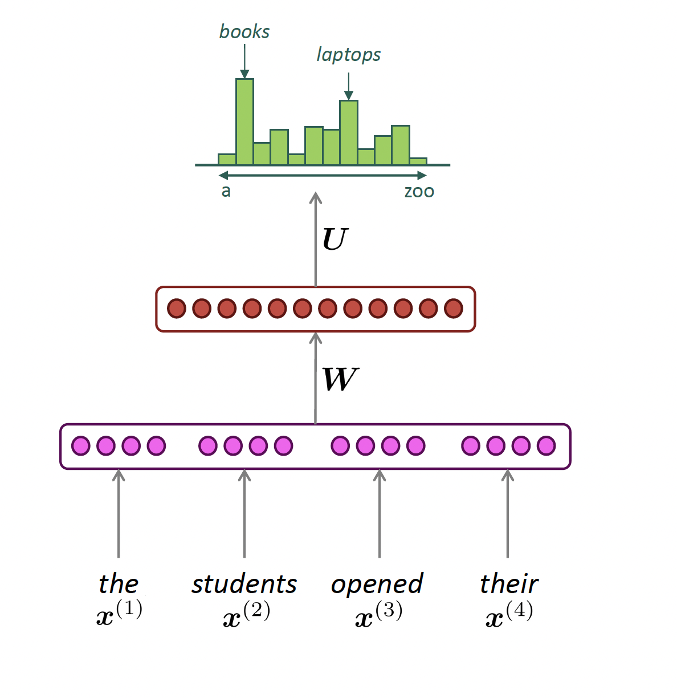 
```

:::
::::

:::aside

Source: [CS224N](https://web.stanford.edu/class/cs224n/index.html#schedule)

:::
## Reccurrant Neural Network (RNN)

**Def:** Neural network architecture that processes sentences sequentially with hidden states that carry over-time information. 

:::: {.columns}

::: {.column width="50%"}
**output distribution**

$$\hat{y}^{(t)} = \mathrm{softmax}\left(U h^{(t)} + b_2\right) \in \mathbb{R}^{|V|}$$

**hidden states**

$$h^{(t)} = \sigma\left(W_h h^{(t-1)} + W_e e^{(t)} + b_1\right)$$


$$h^{(0)} \text{ is the initial hidden state}$$

**word embeddings**


$$ e^{(t)} = E x^{(t)} $$

**words / one-hot vectors**

$$x^{(t)} \in \mathbb{R}^{|V|}$$


:::

::: {.column width="50%"}

```{r echo=FALSE, out.width = "100%"}
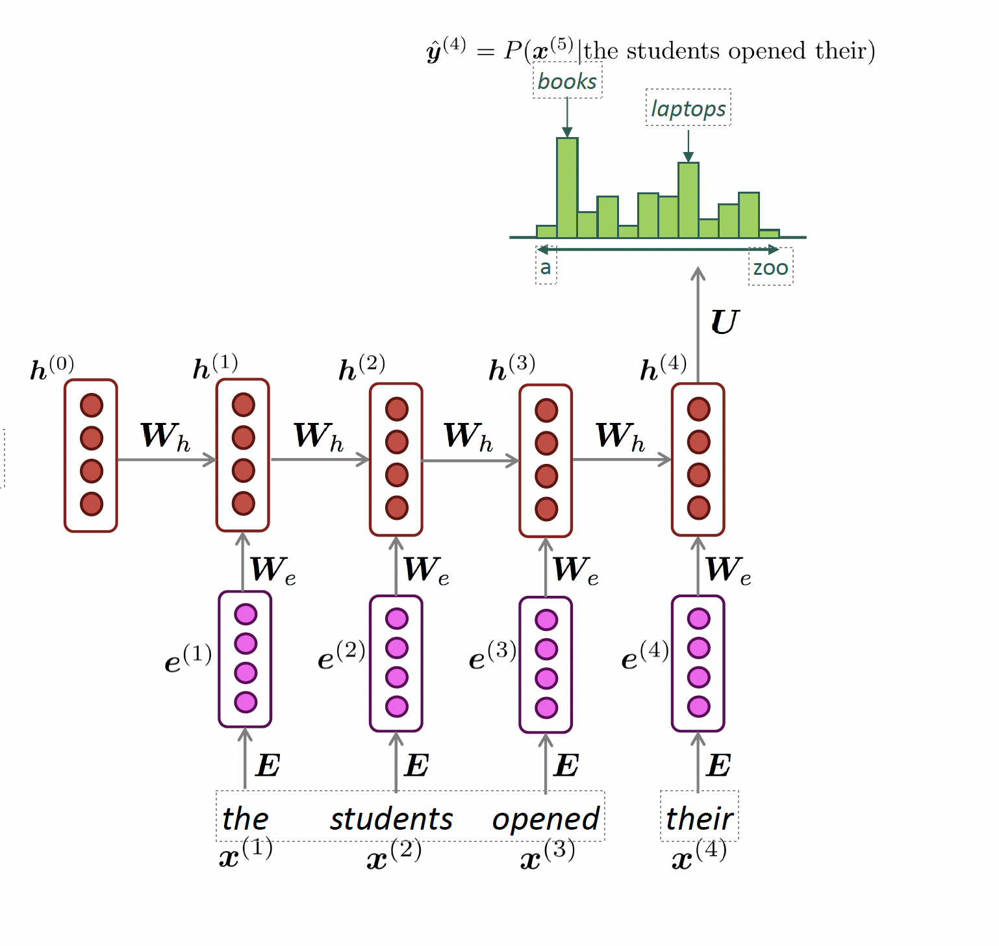 
```

:::
::::

:::aside

Source: [CS224N](https://web.stanford.edu/class/cs224n/index.html#schedule)

:::


## LSTM

**Def:** A RNN with gated cells. Each gated cell has several matrix multiplication + non-linearity variations, and allows each hidden state to store, update, and forget information from previous steps. 

```{r echo=FALSE, out.width = "100%"}
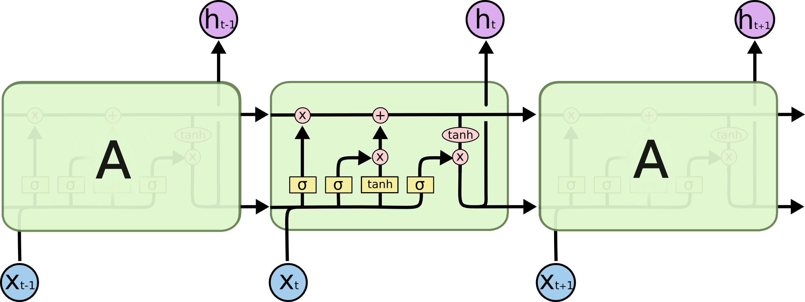 
```


:::aside

Source: https://colah.github.io/posts/2015-08-Understanding-LSTMs/

:::

## Challenges with pre-transformers models

- Bottleneck problem: RNNs are unrolled from left-to-right. Hard to capture long-term dependency

- Nearby words are often more important because they are incorporated more recently

- Gradients are unstable (vanishing or exploding) because they depend on continuous chain rules for the calculation
   
- Non-parallelizable: RNNs handles text sequentially, so you cannot really speed things up with GPUs


## Notable aspects of Transformers

We will go over four notable aspects of Transformers: 

- **Encoder x Decoder:** separates learning embeddings from input (encoding) to text generation (decoding)

- **Attention + Contextual Knowledge:** the REAL DEAL. Allows words to focus on the most relevant words of a particular sequence. Different vectors for "tower", "eiffel tower" or "beer tower". Or the teddy bear examples from Darren and Puran

- **Parallelization:** All tokens are processed simultaneously rather than sequentially. This means we can process words in parallel via GPUs!!

- **Training via Masked Attention** Masked inputs to train bi-directional models


## Original Transformer Architecture 

```{r echo=FALSE, out.width = "100%"}
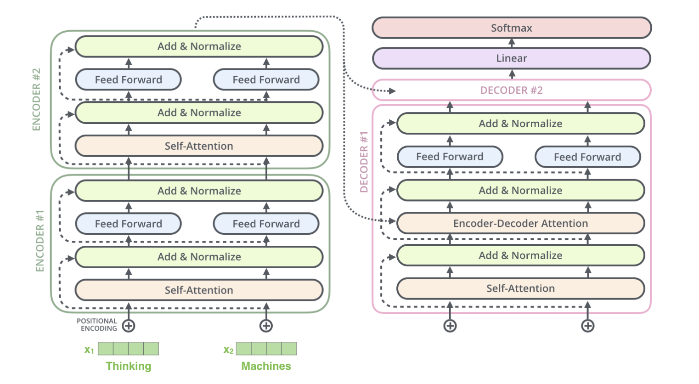 
```

# Feature 1: Encoder and Decoder {background="#364D72"}

## Encoder and Decoder

The original transformer is primarily composed of two blocks:

- **Encoder (left):** The encoder receives an input and builds a representation of it (its features). 

    - Encodes words via self-attention mechanism, and by itself. 
    
    - Every token in every sequence gets an embedding. These are dynamic embeddings, they change their direction when tokens are used in different contexts.

- **Decoder (right):** The decoder uses the encoder’s representation (features) along with other inputs to generate a target sequence. 

    - Text generation: it spells out for you an probability for next word sequence


## Multiple Encoder Blocks

```{r echo=FALSE, out.width = "100%", fig.align="center"}
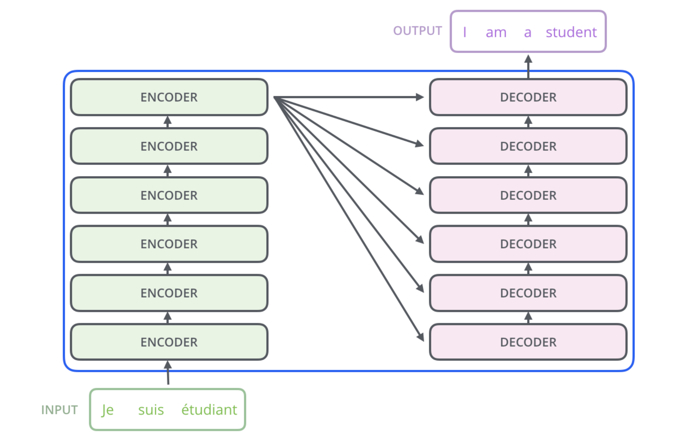 
```

## Looking Inside of an Encoder Block

```{r echo=FALSE, out.width = "100%", fig.align="center"}
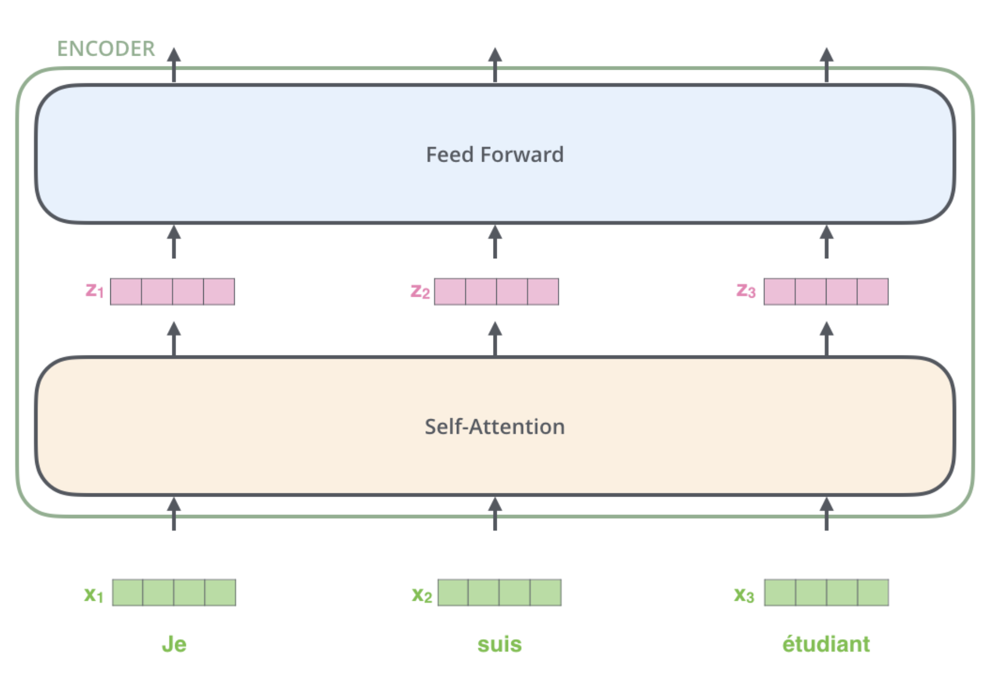 
```

# Feature 2: Self-Attention {background="#364D72"}

## Self-Attention: Definition

**Def:** the mechanism in the transformer that weighs and combines the
representations of context words in the token encoding

- Word2vec:  the representation of a word’s meaning is always the same vector irrespective of the context

   - the vector for 'bear' is the same, no matter if it refers to a 'teddy bear',a 'black bear", or a the show "the bear". 

- Transformers can build contextual representations of word meaning (**contextual embeddings**) by encoding the meaning of contextual words into the token representation. 

- The encoder will input a **static embedding** for each token, but output a **contextual embedding** for the token in the sentence

## Self-Attention: Intuition

- Consider these sentences: 

  - “The chicken didn’t cross the road because **it** was too tired.”

  - “The chicken didn’t cross the road because **it** was too wide.”

- “It” refers to different nouns in each sentence.

- If we read the sentences from left to right, we get: The chicken didn’t cross the road because it.... ?

- At this point, we don’t know what “it” is referring to.

- One of the fundamental limitations of RNNs was that you must walk
through the sequence one word at a time. Self-attention solves many of these issues!

## Self-Attention Hypothetical example

Attention estimates each word’s representation via information from embeddings from contextual words. 

```{r echo=FALSE, out.width = "100%", fig.align="center"}
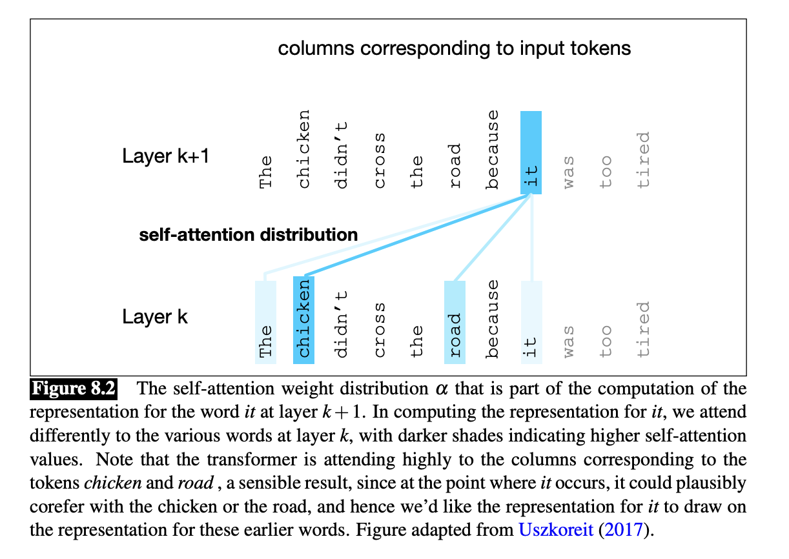 
```

## Self-Attention: Simple Example

Assume  $\mathbf{w}_{1:n}$ be a sequence of words in vocabulary, as a one-hot encoding. 

**Step 1:** For each word $w_i$, let's start with a static embedding using a look-up:

$$
x_i = E w_i,
$$

With E having the dimensions d (embedding size) and V (vocabulary size)


##

**Step 2:** Each word embedding is transformed using three weight matrices: Q, K, V:

$$
q_i = Q x_i \quad \text{(queries)}
$$

$$
k_i = K x_i \quad \text{(keys)}
$$

$$
v_i = V x_i \quad \text{(values)}
$$

##

**Step3**: Compute pairwise similarities and normalize with softmax. Similarity between query \(q_i\) and key \(k_j\) as a simple dot product

$$
e_{ij} = q_i^{\top} k_j
$$

**Attention weights:**

$$
\alpha_{ij} = 
\frac{\exp(e_{ij})}{\sum_{j'} \exp(e_{ij'})}
$$

##

**Step 4**: Compute output as weighted sum of values

$$
o_i = \sum_j \alpha_{ij} v_j
$$

## Self-Attention on Transformers

$$
\text{Attention}(Q, K, V)
    = \mathrm{softmax}\left(
        \frac{QK^\top}{\sqrt{d_k}}
      \right)V
$$


## Illustrated Transformers: Basic Parameters

```{r echo=FALSE, out.width = "100%", fig.align="center"}
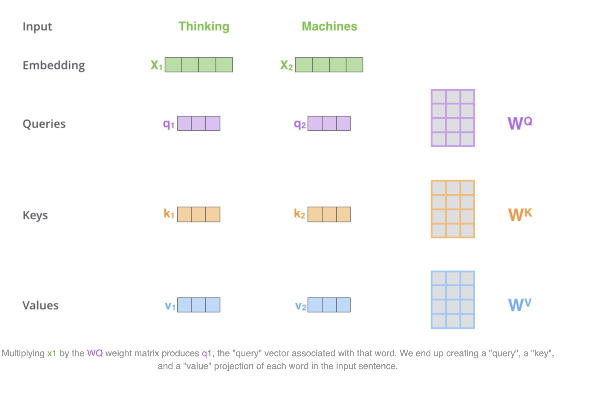 
```

:::aside
source:https://jalammar.github.io/illustrated-transformer/
:::


## Illustrated Transformers: Attention Score

```{r echo=FALSE, out.width = "100%", fig.align="center"}
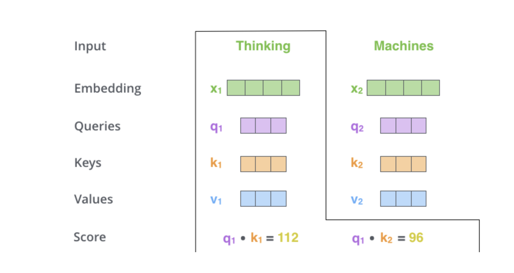 
```

:::aside
source:https://jalammar.github.io/illustrated-transformer/
:::


## Illustrated Transformers: Softmax Transformation

```{r echo=FALSE, out.width = "100%", fig.align="center"}
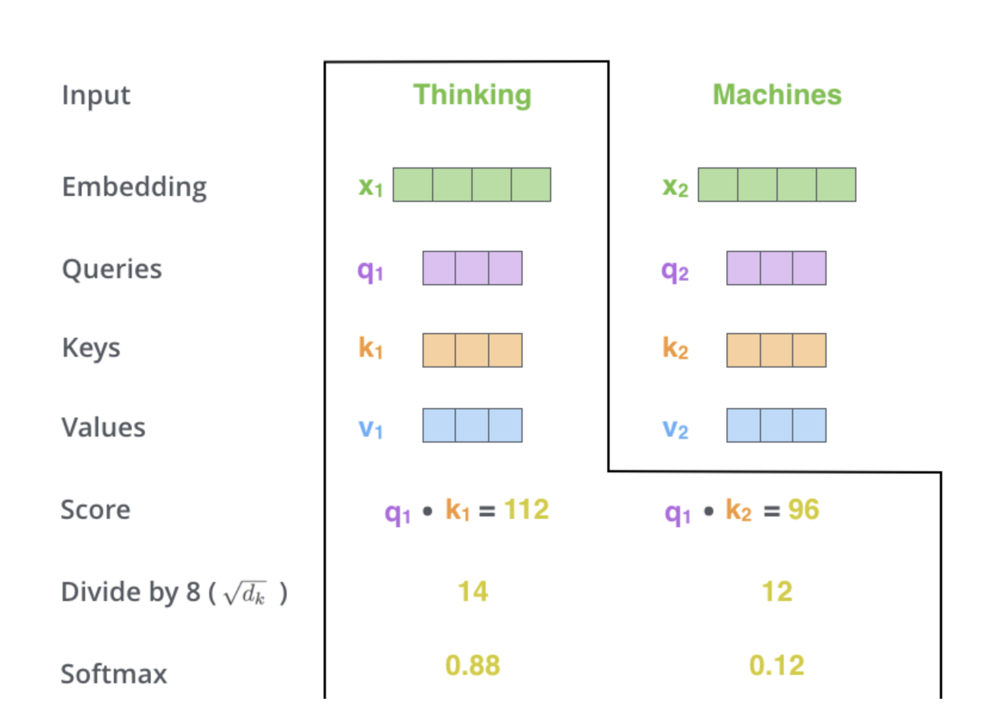 
```


:::aside
source:https://jalammar.github.io/illustrated-transformer/
:::


## Illustrated Transformers: Weights

```{r echo=FALSE, out.width = "80%", fig.align="center"}
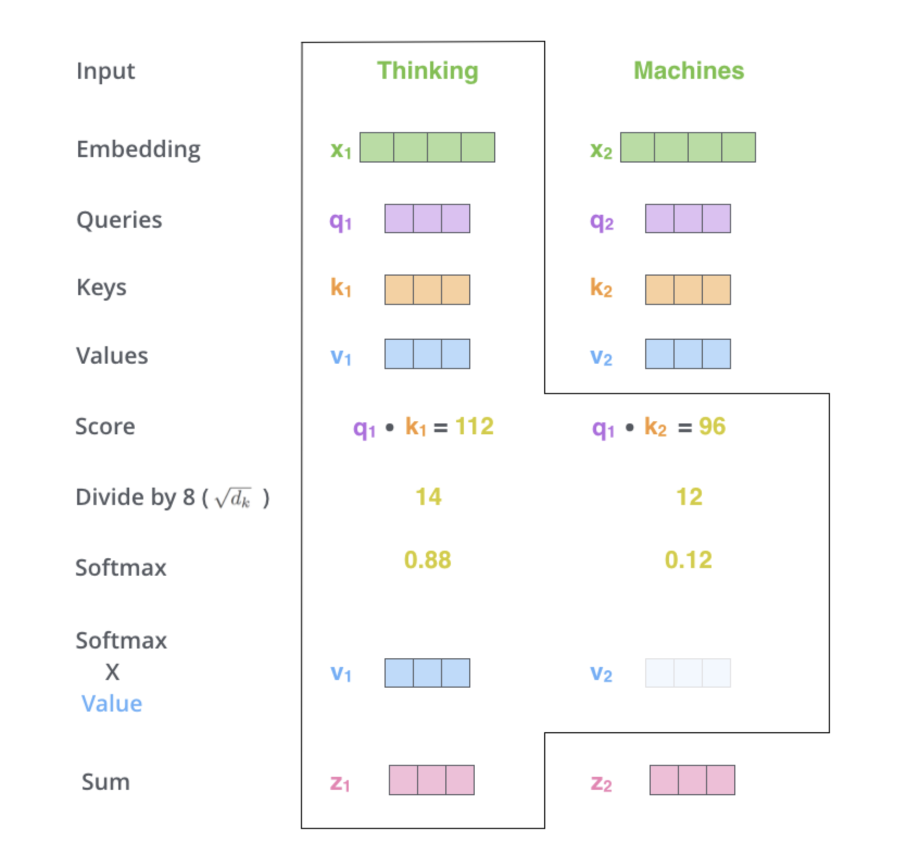 
```


:::aside
source:https://jalammar.github.io/illustrated-transformer/
:::


## Let's check again the transformers block

```{r echo=FALSE, out.width = "100%"}
 
```


## More details on the Transformers Block

- **Multi-Head Attention:** repeat the self-attention multiple times in the same block.

- **Many Encoder Blocks:** one encoder feeds the output token into many other blocs

- **Feed Forward NN:** after every self-attention, there is a feed forward neural network to allow non-linearities to be modelled

- **Positional Encoding:** position of the token in the sequence in embedded as a learneable parameters

- **Layer normalization:** A normalization technique that stabilizes training and gradient calculation


# Feature 3: Parallelization {background="#364D72"}

## Parallelization

- The attention calculation occurs for every token $i$ with respects to all other tokens $j$ in the sequence. 

- No sequence dependence across the tokens, as in the RNN. 

- As a consequence: these operations are parallelizable. 

- That's why everyone is fighting for GPUs!!

# Feature 4: Training and Masked Attention {background="#364D72"}

## Pretraining a Transformer Language Model

Goal: Learn to predict the next word from context.

1. Start with a large corpus of unlabeled text

2. For each token $w_t$ , the model predicts $w_{t+1}$

3. The model uses self-attention to create a contextualized representation of $w_1, ... , w_t$

4. Prediction is compared to the actual $w_{t+1}$ using cross-entropy loss

5. Use gradient descent to minimize this loss


## Unmasked Self-Attention (Encoder)

Transformers are trained in next-word prediction... But this affects only the decoder part of the model!

- Encoder: each token in the self-attention can attend to all other tokens simultaneously within the same input sequence.

- This is called: bidirectional attention. It helps the encoder build rich contextual representations. 


  
## Masked Attention (Decoder)

- In our previous examples of self-attention,  each query  attend to all preceding and subsequent outputs

- But sometimes we don’t want to do that—we want the model to only learn from the preceding input
 
  - Especially important if we are training generative models (DECODER MODELS)
  
-  We can use masked attention, where the model is only allowed to attend to previous inputs


##

```{r echo=FALSE, out.width = "100%"}
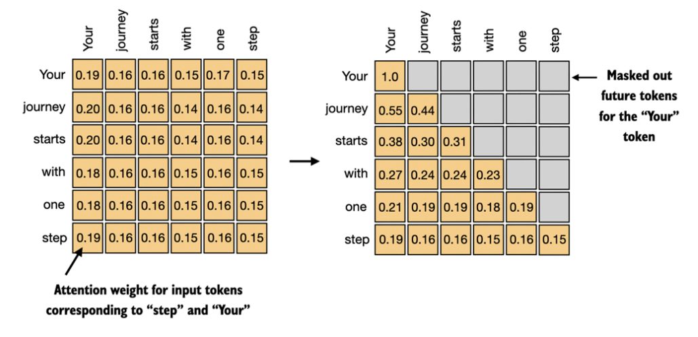 
```

:::aside
source: https://generativeai.pub/attention-in-transformer-simple-diagram-explanation-9124c94611dc
:::
# Different uses of Transformers 
  
## A final note on Transformers

Modern large language models (LLMs) are all based on transformers. There are encoder-only models (e.g., BERT), decoder-only models (e.g.,
GPT), and encoder-decoder models (e.g., T5)

- Encoder-only: BERT (all variants: BERT-base, BERT-large), RoBERTa, DistilBERT, others...

- Decoder-only: GPT, LLaMa, Mistral, most other LLMs

- Encoder-Decoder:T5, Bart, 

## Encoder Only (works great for classification!)

- These models convert an input sequence of text into a numerical
representation 

- These models show state-of-art performance on tasks like text classification and named entity recognition (see Timoneda and Vallejo's paper). 

-  Uses full (or bidirectional) self-attention

## Bert Schematic

To use encoder model in text classification, you add a new classification head to the model 

:::nonincremental
- **Classification head:** a neural network on top of sentence embedding, represented by [CLS] token... but it could be really just the mean of all tokens. 

:::

```{r echo=FALSE, out.width = "100%", fig.align="center"}
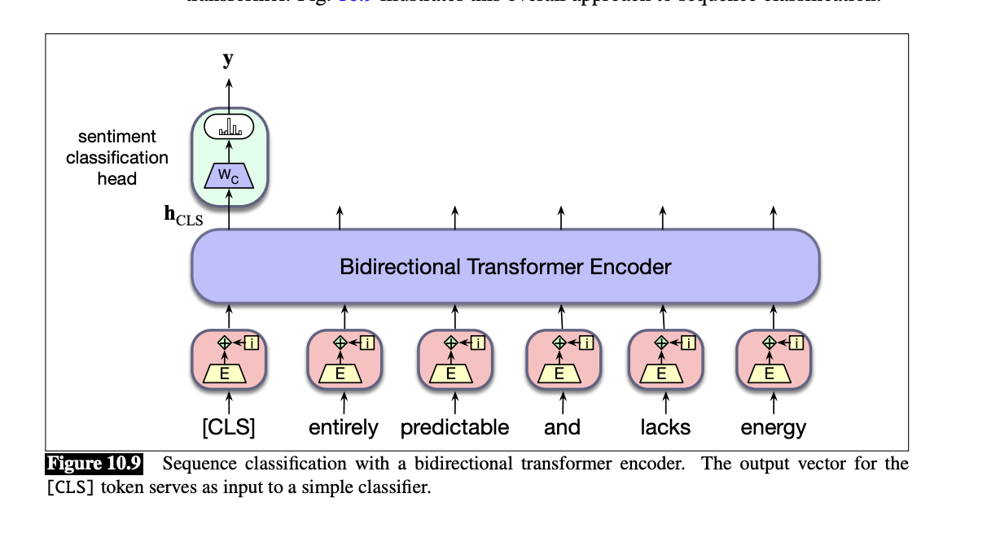 
```

:::aside
source: [SLP Chapter 10](https://stanford.edu/~jurafsky/slp3/10.pdf)
:::
# Coding