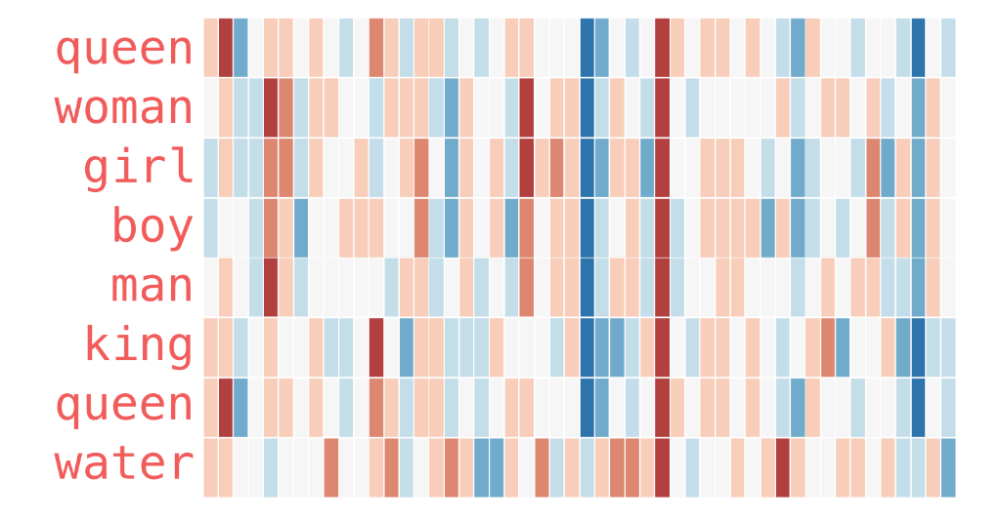
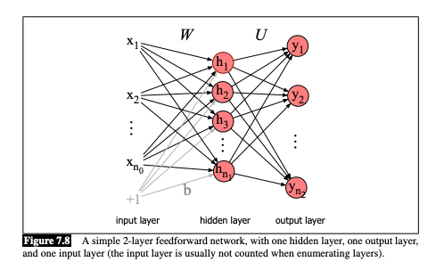
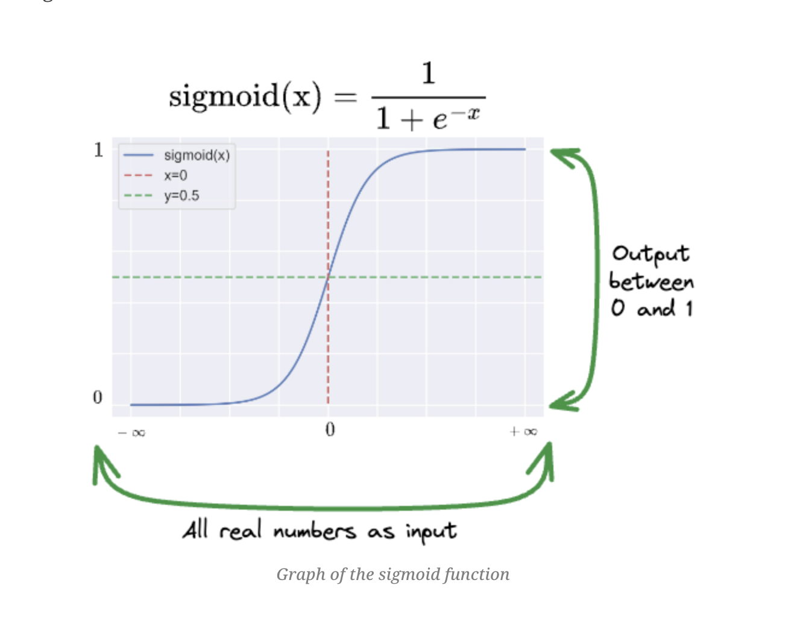
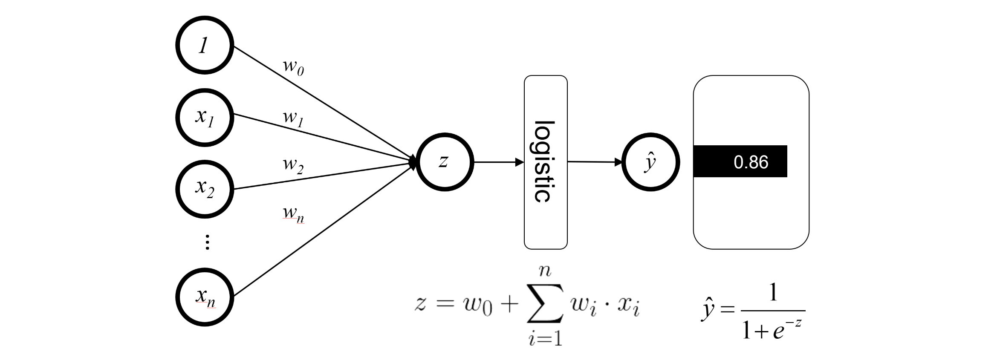
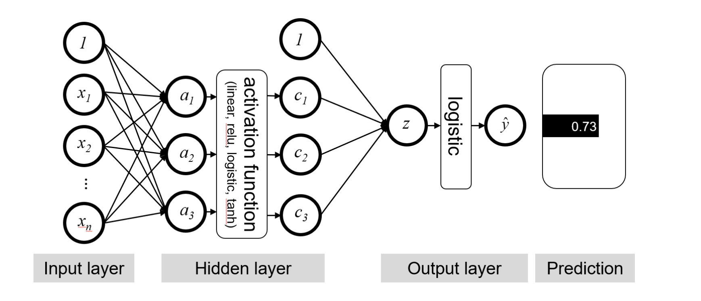
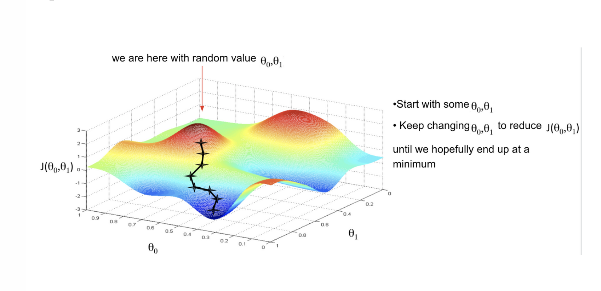

## Plans for Today

-   Mid-semester survey

-   Overview of where we are going

-   Introduction to Deep Learning

# Mid-Semester Survey:

## Start doing

> Recording a video going through the code we're going over in class that day

> Explaining more about the assignments

> Move the coding exercise to the same day

> Explain more about the code

> While coding in class is helpful, I'd appreciate a slightly deeper dive into concepts.

> maybe advice going through coding material before or after class. because doing it on the class is too time consuming

## Stop Doing

> going through the code in class

> I don't think we need to devote as much time to coding

> Maybe just have us read the paper that will be covered in the upcoming class,

> the morning-3-hour-class, lol

> I personally don't find the textbook very helpful

> I would spend less time on the earlier methods that aren't really used anymore

## Continue Doing

> I appreciate the readings a lot and I wish we had more time dedicated to talking through them. (LET ME KNOW WHICH! HELP TO DO THAT)

> Everything is nice in PPOL 6801 (THANK YOU!)

> Going over the R code in class! I like the half code, half lecture style.

> Overall, I think the class is pretty well curated!

## Most useful material

-   Problem sets with 54%!

## Where we are going...

-   We are living through a fast pacing transformation on the use of text-as-data

-   The most recent changes come from the so called Large Langue Models, and their increasing capability of generating human-like text.

-   This revolution was enabled by:

    -   Increasing accessibility to data

    -   Better ways to represent word

    -   Use of deep learning architectures to model text.

## Neural Networks - Transformers (2017)

```{r echo=FALSE, out.width = "100%"}
knitr::include_graphics("./week13_figs/transformers.png") 
```

# 

For us to understand this figure, **we should first:**

-   Grasp the basic concepts of how a neural network model operates

-   Understand the idea of dense representation of words (word vectors) vs Sparse Representation (DFMs)

-   Understand attention mechanisms

-   Get to transformers

## Our plans for the next few weeks

-   **today:** introduction to deep learning

-   **next:** word embeddings

-   **next, next**: applications of word embeddings

-   **next, next, next**: break for your replication

-   **next, next, next,next**: Transformers (attention is all you need)

-   **next, next, next, next, next:** LLMs

# Text Representation: From Sparse to Dense Vectors

## Vector Space Model

To represent documents as numbers, we learned about the [vector space model representation]{.red}:

-   A document $D_i$ is represented as a collection of features $W$ (words, tokens, n-grams..)

-   Each feature $w_i$ can be place in a real line, then a document $D_i$ is a point in a $W$ dimensional space

::: fragment
Imagine the sentence below: *"If that is a joke, I love it. If not, can't wait to unpack that with you later."*

-   **Sorted Vocabulary** =(a, can't, i, if, is, it, joke, later, love, not, that, to, unpack, wait, with, you")

-   **Feature Representation** = (1, 1, 1, 2, 1, 1, 1, 1, 1, 1, 2, 1, 1, 1, 1, 1)

-   Features will typically be the n-gram (mostly unigram) [frequencies]{.red} of the tokens in the document, or some [function]{.red} of those frequencies
:::

::: fragment
Now each document is now a vector (vector space model)

-   stacking these vectors will give you our workhose representation for text: [**Document Feature Matrix**]{.red}
:::

## Documents

Document 1 = "yes yes yes no no no"

Document 2 = "yes yes yes yes yes yes" :::

```{r echo=FALSE, fig.align="center",fig.width=8}
# Load necessary libraries
pacman::p_load(ggplot, tidyverse)

# Define a simple vocabulary of two words

# Sample texts using only words from the vocabulary
document1 <- c("yes", "yes", "yes", "no", "no", "no")
document2 <- c("no", "no", "no", "no", "no", "no")

# Convert the documents to a dataframe to a data frame for ggplot
df <- tibble(document1, document2) %>% 
       pivot_longer(cols=contains("document"), names_to = "document", values_to = "word") %>%
       group_by(document, word) %>%
       count() %>%
       pivot_wider(names_from=word, values_from=n, values_fill = 0)

# Plot the documents in 2D space using ggplot
ggplot(df, aes(x = no, y = yes, label = document)) +
  geom_label(nudge_y =.5) +
  geom_segment(aes(x = 0, y = 0, xend = 3, yend = 3), 
               arrow = arrow(), 
               size=1, color="navy") +
  geom_segment(aes(x = 0, y = 0, xend = 6, yend = 0),  
               arrow = arrow(), 
               size=1, color="navy") +
  xlim(0, 7) +
  xlab("Frequency of 'yes'") +
  ylab("Frequency of 'no'") +
  ggtitle("Vector Representation of Texts") +
  theme_minimal()
```

## Visualizing Vector Space Model

In the vector space, we can use geometry to build well-defined comparison measures between the documents

```{r echo=FALSE, fig.align="center",fig.width=8}

# Plot the documents in 2D space using ggplot
ggplot(df, aes(x = no, y = yes, label = document)) +
  geom_point(size=2) +
  geom_segment(aes(x = 0, y = 0, xend = 3, yend = 3), 
               arrow = arrow(), 
               size=1, color="navy", alpha=.2) +
  geom_segment(aes(x = 0, y = 0, xend = 6, yend = 0),  
               arrow = arrow(), 
               size=1, color="navy", alpha=.3) +
 geom_segment(aes(x = 3, y = 3, xend = 6, yend = 0),  
               linetype=2, 
               size=1, color="tomato", alpha=1) +
annotate(geom="label", x=5, y=1, label="Distance",
              color="black")  +
  xlim(0, 7) +
  xlab("Frequency of 'yes'") +
  ylab("Frequency of 'no'") +
  ggtitle("Vector Representation of Texts") +
  theme_minimal()
```

## Vector Space Model vs Representation Learning

The vector space model is super useful, and has been used in many many many applications in computational linguistics and social science applications of text-as-data. Including:

-   Descriptive statistics of documents (count words, text-similarity, complexity, etc..)

-   Supervised Machine Learning Models for Text Classification (DFM becomes the input of the models)

-   Unsupervised Machine Learning (Topic Models & Clustering)

## 

**But**... Embedded in this model, there is the idea we represent [words]{.red} as a [one-hot encoding]{.red}.

-   "cat": \[0,0, 0, 0, 0, 0, 1, 0, ....., V\] , on a V dimensional vector
-   "dog": \[0,0, 0, 0, 0, 0, 0, 1, ...., V\], on a V dimensional vector

::: fragment
**What these vectors look like?**

-   really sparse

-   those vectors are orthogonal

-   no natural notion of similarity
:::

# How can we embed some notion of similarity in the way we represent words?

## Distributional Semantics

> "you shall know a word by the company it keeps." J. R. Firth 1957

[Distributional semantics]{.red}: words that are used in the same contexts tend to be similar in their meaning.

::: incremental
-   How can we use this insight to build a word representation?

    -   Move from sparse representation to dense representation

    -   Represent words as vectors of numbers with high number of dimensions

    -   Each feature on this vectors embeds some information from the word (gender? noun? sentiment? stance?)

    -   Learn this representation from unlabeled data.
:::

## Sparse vs Dense Vectors

:::: noincremental
**One-hot encoding / Sparse Representation:**

-   cat = $\begin{bmatrix} 0,0, 0, 0, 0, 0, 1, 0, 0 \end{bmatrix}$

-   dog = $\begin{bmatrix} 0,0, 0, 0, 0, 1, 0, 0, 0 \end{bmatrix}$

::: fragment
**Word Embedding / Dense Representation:**

-   cat = $\begin{bmatrix} 0.25, -0.75, 0.90, 0.12, -0.50, 0.33, 0.66, -0.88, 0.10, -0.45 \end{bmatrix}$

-   dog = $\begin{bmatrix} 0.25, 1.75, 0.90, 0.12, -0.50, 0.33, 0.66, -0.88, 0.10, -0.45 \end{bmatrix}$
:::
::::

## With colors and real word vectors

```{r echo=FALSE, out.width = "70%"}
 
```

Source: [Illustrated Word2Vec](https://jalammar.github.io/illustrated-word2vec/)

## Word Embeddings

-   **Encoding similarity:** vectors are not ortogonal anymore!

-   **Automatic Generalization:** learn about one word allow us to automatically learn about related words

-   **Encodes Meaning:** by learning the context, I can learn what a word means.

-   **As a consequence:**

    -   Word Embeddings improves by ORDERS OF MAGNITUDE several Text-as-Data Tasks.

    -   Allows to deal with unseen words.

    -   Form the core idea of state-of-the-art models, such as LLMs.

## Deep Learning for Text Analysis

```{r echo=FALSE, out.width = "70%"}
 
```

# Introduction to Deep Learning

## Basics of Machine Learning

**Deep Learning** is a subfield of machine learning based on using neural networks models to learn.

As in any other statistical model, the goal of machine learning is to use data to learn about some output.

$$ y = f(X) + \epsilon$$

-   **Where:**

-   $y$ is the outcome/dependent/response variable

-   $X$ is a matrix of predictors/features/independent variables

-   $f()$ is some fixed but unknown function mapping X to y. The "signal" in the data

-   $\epsilon$ is some random error term. The "noise" in the data.

## Linear models (OLS)

The simplest model we can use is an linear model (the classic OLS regression)

$$ y = b_0 + WX + \epsilon$$

-   Where:

    -   $W$ is a vector of dimension p,
    -   $X$ is the feature vector of dimension p
    -   $b$ is a bias term (intercept)

## Using Matrix Algebra

$$\mathbf{W} = \begin{bmatrix} w_1 & w_2 & \dots & w_p\end{bmatrix}$$

$$\mathbf{X} = \begin{bmatrix} X_1 \\ X_2 \\ X_3 \\ \vdots \\ X_p \end{bmatrix}$$

With matrix multiplication:

$$\mathbf{W} \mathbf{X} + b = w_1 X_1 + w_2 X_2 + \dots + w_p X_p + b$$

## Logistic Regression

If we want to model some type of non-linearity, necessary for example when our outcome is binary, we can add a transformation function to make things non-linear:

$$ y = \sigma (b_0 + WX + \epsilon)$$

Where:

$$ \sigma(b_0 + WX + \epsilon) = \frac{1}{1 + \exp(-b_0 + WX + \epsilon)}$$

## 

```{r echo=FALSE, out.width = "100%"}
 
```

## Logistic Regression as a Neural Network

Assume we have a simple model of voting. We want to predict if individual $i$ will vote ($y=1$), and we will use four socio demographic factors to make this prediction.

Classic statistical approach with logistic regression:

$$ \hat{P(Y_i=1|X)} = \sigma(b_0 + WX + \epsilon) $$

We use MLE (Maximum Likelihood estimation) to find the parameters $W$ and $b_0$. We assume:

$$ Y_i \sim \text{Bernoulli}(\pi_i) $$

The likelihood function for $n$ independent observations is:

$$L(W, b_0) = \prod_{i=1}^{n} \pi_i^{y_i} (1 - \pi_i)^{1 - y_i}.$$

## The Famous: Cross-entropy loss functions

Take the log to make things easier:

$$-\ell(W, b_0) = - \sum_{i=1}^{n} \Big[ y_i \log(\pi_i) + (1 - y_i)\log(1 - \pi_i) \Big]$$

Where $\pi_i$ = $\sigma(b_0 + WX + \epsilon)$

To solve this analytically:

-   take the derivative of $\ell$ with respects to the parameter

-   set this equation to zero.

-   most times this solution will not exist, so we will use numerical approaches

## Neural Network Graphical Representation

```{r echo=FALSE, out.width = "100%"}
 
```

::: aside
Source: https://carpentries-incubator.github.io/ml4bio-workshop/05-logit-ann/index.html
:::

## Deep Neural Networks

A **Deep Neural Network** is equivalent to stacking multiple logistic regressions vertically and repeat this process multiple times across many layers.

As a Matrix, instead of:

$$\mathbf{W}_{previous} = \begin{bmatrix} w_1 & w_2 & \dots & w_p\end{bmatrix}$$

We use this set of parameters:

$$
\mathbf{W} = \begin{bmatrix} w_{11} & w_{12} & w_{13} & \dots & w_{1p} \\
                               w_{21} & w_{22} & w_{23} & \dots & w_{2p} \\
                               w_{31} & w_{32} & w_{33} & \dots & w_{3p} \\
                               \vdots & \vdots & \vdots & \vdots & \vdots \\
                               w_{k1} & w_{k2} & w_{k3} & \dots & w_{kp}
                \end{bmatrix}
$$

## 

Then, every line becomes a different logistic regression

$$\mathbf{WX} = \begin{bmatrix}  \sigma(w_{11} X_1 + w_{12} X_2 + \dots + w_{1p}X_p) \\ \sigma(w_{21} X_1 + w_{22} X_2 + \dots + w_{2p}X_p) \\ \sigma(w_{31} X_1 + w_{32} X_2 + \dots + w_{3p}X_p )\\ \vdots \\ \sigma(w_{k1} X_1 + w_{k2} X_2 + \dots + w_{kp}X_p) \end{bmatrix}$$ We then combine all of those with another set of parameters:

$$
\begin{align*}
    \mathbf{HA} &= h1 \cdot \sigma(w_{11} X_1 + w_{12} X_2 + \dots + w_{1p}X_p)\\
                &+ h_2\cdot \sigma(w_{21} X_1 + w_{22} X_2 + \dots + w_{2p}X_p)\\
                &+ h_3 \cdot \sigma (w_{31} X_1 + w_{32} X_2 + \dots + w_{3p}X_p)\\
                &+ \dots + h_k + \sigma(w_{k1} X_1 + w_{k2} X_2 + \dots + w_{kp}X_p)
\end{align*}
$$

## Feed Forward on a Deep Neural Network

```{r echo=FALSE, out.width = "100%"}
 
```

## Key Components

-   Input: p features (the original data) of an observation are linearly transformed into k1 features using a weight matrix of size k1×p

-   Embedding Matrices: Parameters you multiply your data by.

-   Neurons: Number of dimensions on your embedding matrices

-   Hidden Layer: the transformation that consists of the linear transformation and an activation function

-   Output Layer: the transformation that consists of the linear transformation and then (usually) a sigmoid (or some other activation function) to produce the final output predictions

## 

```{r echo=FALSE, out.width = "100%"}
knitr::include_graphics("./figs/nlp_nn.png") 
```

## Let's take a step back!

Weights matrices are just parameters... the $\beta_s$ of our regression models.

-   There are too MANY of them!! Neural Networks are a black box!

-   But... they also serve as way to project covariates (or words!) in a dense dimensional space.

-   Remember:

    -   **One-hot encoding / Sparse Representation:**

        -   cat = $\begin{bmatrix} 0,0, 0, 0, 0, 0, 1, 0, 0 \end{bmatrix}$

        -   dog = $\begin{bmatrix} 0,0, 0, 0, 0, 1, 0, 0, 0 \end{bmatrix}$

    -   **Word Embedding / Dense Representation:**

        -   cat = $\begin{bmatrix} 0.25, -0.75, 0.90, 0.12, -0.50, 0.33, 0.66, -0.88, 0.10, -0.45 \end{bmatrix}$

        -   dog = $\begin{bmatrix} 0.25, 1.75, 0.90, 0.12, -0.50, 0.33, 0.66, -0.88, 0.10, -0.45 \end{bmatrix}$

## Deep Neural Network for Textual Data

```{r echo=FALSE, out.width = "100%"}
knitr::include_graphics("./figs/nlp_nn.png") 
```

## Estimation: How do get good parameters?

To estimate the parameters, we will use a algorithm called gradient descent.

As in any other estimation approaches, we start with a loss function.

-   Loss function: used to measure how well or poorly a model is making predictions

    -   The model makes a guess (prediction)

    -   The loss function compares the guess to the correct answer (the actual data)

    -   It then calculates the number that represents how “off” the answer was, which is the loss

-   The goal in training a model is to minimize this loss

## Examples

**Linear Regression: MSE**

$$\text{RSS} = \sum_{i=1}^{n} (y_i - \widehat{y}_i)^2 $$

**Logistic Regression: Negative Log Likelihood of a Bernoulli distribution**

$$L(\beta) = -\sum_{i=1}^{n} \left( y_i \log(\widehat{y}_i) + (1-y_i)\log(1 - \widehat{y}_i) \right)$$

**Fully-Connected Neural Network (Classification, Binary): Binary Cross Entropy**

$$L(\mathbf{W}) = -\frac{1}{n}\sum_{i=1}^{n} \left( y_i \log(\widehat{y}_i) + (1-y_i)\log(1 - \widehat{y}_i) \right)$$

## Quizz

**Logistic Regression: Negative Log Likelihood of a Bernoulli distribution**

$$L(\beta) = -\sum_{i=1}^{n} \left( y_i \log(\widehat{y}_i) + (1-y_i)\log(1 - \widehat{y}_i) \right)$$

1 - What happens when your label y = 1, and your model outputs 1 as the predicted value?

2 - What happens when your label y = 1, and your model outputs 0.02 as the predicted value?

## Visualizing the loss

```{r echo=FALSE, out.width = "100%"}
 
```

## Updating parameters

-   Define a loss function

-   Gradient Descent Algorithm:

    -   Initialize weights randomly

    -   Feed Forward: Matrix Multiplication + Activation function

    -   Get the loss for this iteration

    -   Compute gradient (partial derivatives): $\frac{\partial J(\mathbf{W})}{\partial \mathbf{W}}$

    -   Update weights: $W_{new}: W_{old} -\eta \cdot \frac{\partial J(\mathbf{W})}{\partial \mathbf{W}}$

    -   Loop until convergence:

# Let's do some coding!
