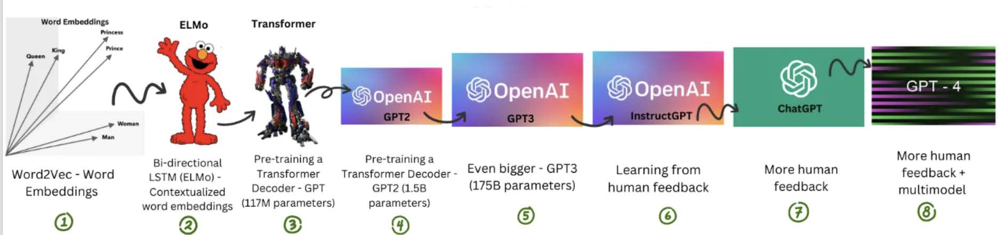
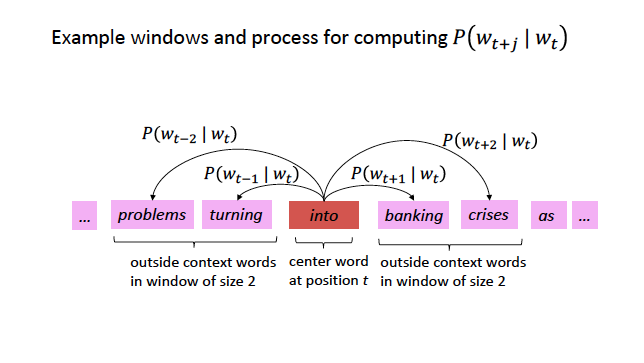
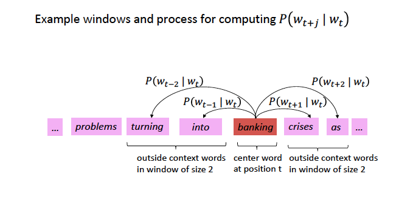
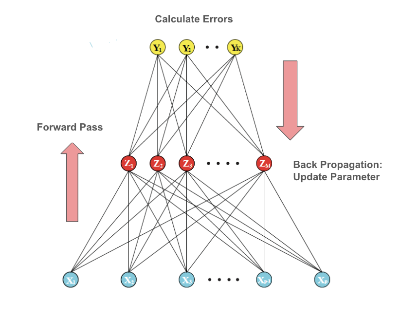
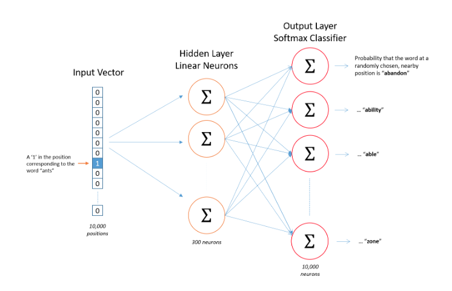
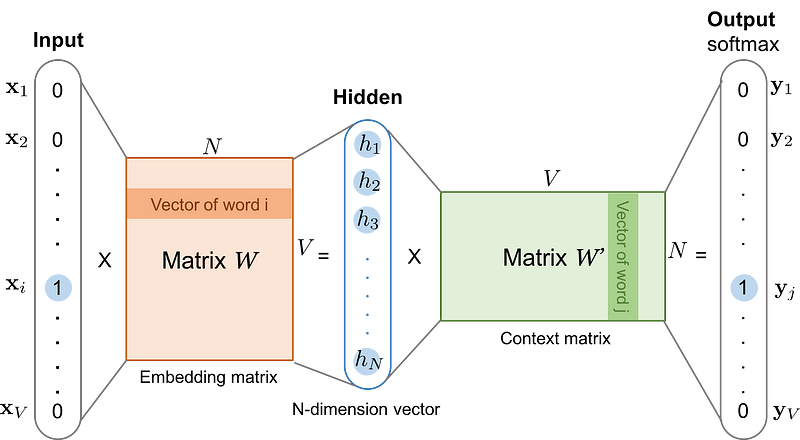
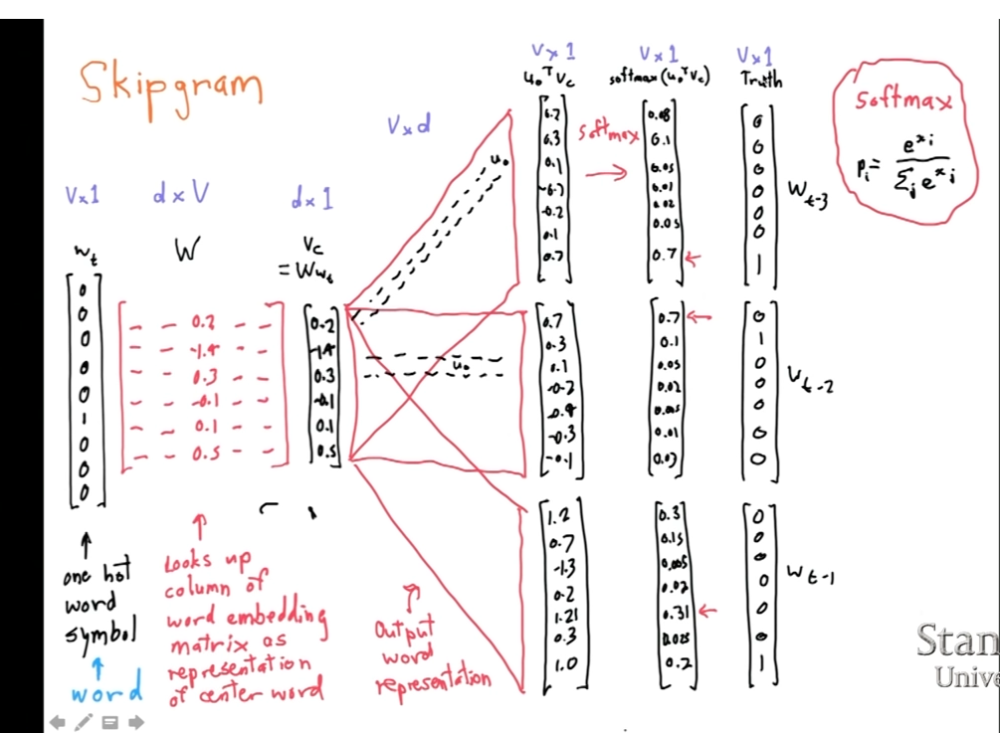
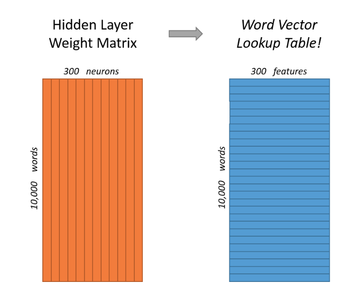
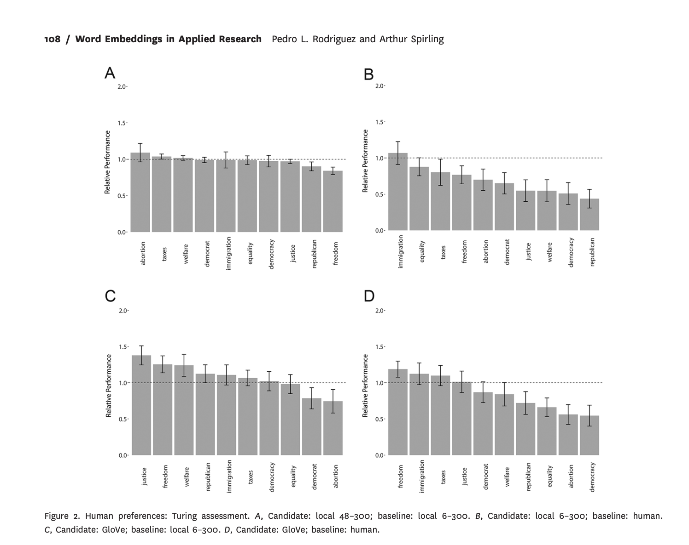

## Plans for Today

:::nonincremental
- Logistics: Replication

-   Word Embeddings

    -   Semantics, Distributional Hypothesis, Moving from Sparse to Dense Vectors

    -   Word2Vec Algorithm

        -   Mathematical Model

        -   Estimate with Neural Networks

        -   Estimate using Co-Occurance matrices

-  In class exercise: How to select good embeddings?

- Next week: 

   - Coding 
   
   - In class exercise about the readings (please do the readings!!)
:::

# Replication

## Week 10: Presentation (This is all in the syllabus!)

:::nonincremental
You will do a presentation of your replication in two week. 

- Each group will have about 20 minutes (15 presentation + 5 Q&A)

- You presentation should have the following sections: 
        
   -   Introduction: introduction summarizing the article.
      
   -   Methods: data used in the article
        
   -   Results: the results you were able to replicate
      
   -   Differences: any differences between your results and the authors'
        
   -   Autopsy of the replication: what did work and what did not work
      
   -   Extension: what would you do differently if you were to write this article today? Where would you innovate?
:::

## EOW: Replication Repository

By Friday EOD of the replication week, you should share with me and all your colleagues (share on the slack channel) your replication report. The replication report should be:

:::nonincremental

-   a GitHub repo with a well-detailed readme. See a model here: <https://github.com/TiagoVentura/winning_plosone>

-   your presentation as a pdf
        
-   the code used in the replication as a notebook (Markdown or Jupyter)
        
-   a report with a maximum of 5 pages (it is fine if you do less than that) summarizing the replication process, with emphasis on four sections of your presentation: Results, Differences, Autopsy, and Extension.
:::

# Word Embeddings

## Vector Space Model

In the vector space model, we learned:

-   A document $D_i$ is represented as a collection of features $W$ (words, tokens, n-grams..)

-   Each feature $w_i$ can be place in a real line, then a document $D_i$ is a point in a $W$ dimensional space.

::: fragment
Embedded in this model, there is the idea we represent [words]{.red} as a [one-hot encoding]{.red}.

-   "cat": \[0,0, 0, 0, 0, 0, 1, 0, ....., V\] , on a V dimensional vector
-   "dog": \[0,0, 0, 0, 0, 0, 0, 1, ...., V\], on a V dimensional vector
:::

# How can we embed some notion of meaning in the way we represent words?

## Distributional Semantics

> "you shall know a word by the company it keeps." J. R. Firth 1957

[Distributional semantics]{.red}: words that are used in the same contexts tend to be similar in their meaning.

::: incremental
- **How can we use this insight to build a word representation?**

    -   Learn this representation from the unlabeled data.
    
    -   Move from sparse representation to dense representation

    -   Represent words as vectors of numbers with high number of dimensions

    -   Each feature on this vectors embeds some information from the word

:::


## Why Word Embeddings?

**Encoding similarity:** vectors are not orthogonal anymore!

**Encodes Meaning:** by learning the context, I can somewhat learn what a word means.

**Automatic Generalization:** learn about one word allow us to automatically learn about related words

**As a consequence:**

-   Word Embeddings improves several NLP/Text-as-Data Tasks.

-   Allows to deal with unseen words.

-   Form the core idea of state-of-the-art models, such as LLMs.


## 

```{r echo=FALSE, out.width = "70%"}
 
```

## Estimating Word Embeddings

### Approches:

::: nonincremental
::: fragment

-   [Neural Networks:]{.red} rely on the idea of **self-supervision**
    -   use unlabeled data and use words to predict sequence
    -   the famous **word2vec** algorithm
        -   Skipgram: predicts context words
        -   Continuous Bag of Words: predict center word
:::

::: fragment
-   [Count-based methods]{.red}: look at how often words co-occur with neighbors.
    -   Use this matrix, and use some factorization to retrieve vectors for the words
    -   Fast, not computationally intensive, but not the best representation, because it is not fully local
    -   This approach is somewhat implemented by the "GloVE" algorithm
:::
:::


## Word2Vec: a framework for learning word vectors (Mikolov et al. 2013)

Developed in 2013 by Tomas Mikolov and colleagues at Google

- Popular embedding method; fast to train, with pre-trained embeddings available
online
-  Trained on large text corpora such as Google News (100 billion words), Wikipedia,
and other massive datasets

- Captures semantic information by learning how words appear in similar contexts

-  Represents word meaning based on surrounding words (context)

## Word2Vec:Core Idea

-   We have a large corpus ("body") of text: a long list of words

-   Every word in a fixed vocabulary is represented by a vector

-   Go through each position t in the text, which has a center word $c$ and context ("outside") words $t$

-   Use the similarity of the word vectors for $c$ and $t$ to calculate the probability of of t given c (or vice versa)

-   Keep adjusting the word vectors to maximize this probability

    -   Neural Network + Gradient Descent


## Skipgram Example: Self-Supervision (Big Idea!)

```{r echo=FALSE, out.width = "70%"}
 
```

Source: [CS224N](https://web.stanford.edu/class/cs224n/index.html#schedule)

## Skigram Example: Self-Supervision

```{r echo=FALSE, out.width = "70%"}
 
```

Source: [CS224N](https://web.stanford.edu/class/cs224n/index.html#schedule)

## Encoding Similarity

To estimate the model, we first need to formalize the probability function we want to estimate.

::: fragment
#### This is similar to a [logistic regression]{.red}
:::

::: fragment
-   **In logistic regression: probability of a event occur given data X and parameters $\beta$**:

    $$ P(y=1| X, \beta ) = X * \beta  + \epsilon $$

    -   $X * \beta$ is not a proper probability function, so we make it to proper probability by using a logit transformation.

    -   $P(y=1|X, \beta ) = \frac{exp(XB)}{1 + exp(XB)}$
:::

::: fragment
-   Use transformation inside of a bernouilli distribution, get the likelihood function, and find the parameters using maximum likelihood estimation:

    $$L(\beta)  = \prod_{i=1}^n \bigl[\sigma(X_i^\top \beta)\bigr]^{y_i}
                            \bigl[1 - \sigma(X_i^\top \beta)\bigr]^{1 - y_i} $$
:::

## $P(w_t|w_{t-1})$

This is the probability we want to estimate. To do so, we need to add parameters to it:

-   $P(w_t|w_{t-1})$ represents how similar these words are.
    -   [The jump:]{.red} if we assume words are vectors, we can estimate their similarities:
    -   $P(w_t|w_{t-1}) = u_c \cdot u_t$
        -   $u_c \cdot u_t$
        -   dot product between vectors ($x_1*y_1 + x_2*y_2 .... x_n*y_n$)
        -   measures similarity using vector projection
        -   $u_c$: center vector
        -   $u_t$: target/neighbor vectors
-   $u_c \cdot u_t$ is also not a proper probability distribution. So we will use a softmax transformation.

::: fragment
$$P(w_t|w_{t-1}) = \frac{exp(u_c \cdot u_t)}{{\sum_{w}^V exp(u_c*u_w)}}$$
-   mathematically, this is the logistic transformation (sigmoid) for multiple classes.

:::


## Softmax Transformation

$$P(w_t|w_{t-1}) = \frac{exp(u_c \cdot u_t)}{{\sum_{w}^V exp(u_c*u_w)}}$$

-   Dot product compares similarity between vectors

-   numerator: center vs target vectors

-   exponentiation makes everything positive

-   Denominator: normalize over entire vocabulary to give probability distribution

-   What is the meaning of softmax?

    -   max: assign high values to be 1

    -   soft: still assigns some probability to smaller values

    -   generalization of the logit \~ multinomial logistic function.


## Neural Networks{visibility="hidden"}

```{r echo=FALSE, out.width = "70%"}
 
```

## Skipgram Architecture

```{r echo=FALSE, out.width = "70%"}
 
```

## 

```{r echo=FALSE, out.width = "100%"}
 
```

## Training Word2Vec Step 1: learn the word embedding

**Step 1: Compute Hidden Layer Representation**

- Input: A one-hot vector X where only the center word c has a value of 1, all
others are 0 (size 1 x V)
- Goal: Convert this into a dense vector of size D, where D is much smaller than the vocabulary size

- The word embedding matrix W has size V × D, where:
   
   -  V = vocabulary size (each row represents a word)
   -  D = embedding dimension (each column represents a dimension)

- Multiplication XW:
    - h = XW = (1 × V) × (V × D) = (1 × D)

- This selects the i-th row of W, which is the word embedding for c


## Example

Let's practice with a vocabulary of size 5, a embedding with 3 dimensions, and the task is to predict ONLY the next word.

**Step 1: v\_{1,5} \* W\_{5,3} = C\_{1,3}**

:::nonincremental
-   Where W is the embedding for center words
:::
$$ 
\mathbf{v} = 
\begin{bmatrix}
0 \\
0 \\
1 \\
0 \\
0
\end{bmatrix} 
$$

$$ 
\mathbf{W} =
\begin{bmatrix}
.1 & .3 & -.23 \\
.2 & -.06 & -.26 \\
.3 & -.16& -.13 \\
.5 & .26 & -.03 \\
.6 & -.46 & -.53
\end{bmatrix}
$$

$$v_T*W = C = \begin{bmatrix}.3 & -.16& -.13 \end{bmatrix} $$


## Training Word2Vec Step 2: Compute Output Probabilities

**Step 2 Goal: Predict which words are likely to appear near the center word**

- The hidden representation h = VtW is multiplied by a second weight matrix W′ (initialized randomly)

- This produces a |V|-dimensional vector of unnormalized scores (logits), one for each word in the vocabulary. THIS IS A MEASURE FOR SIMILARITY FOR FREE!!

- Compute the output scores (DOT Product between center and all other words!!!):

     - u = hW′ 

-  Apply the softmax function to convert logits into probabilities:

-  The output probabilities indicate how likely each word is to appear in the context of the center word c

## Example: Dot Product between vectors

**Step 2:** $C_{1,3} * W2_{3,5} = P_{1,5}$

-   Where $W_2$ is the embedding for context/target words

::: fragment
$$ C_{1,3} * W'_{3,5} = P_{1,5} $$

$$ \begin{bmatrix}.3 & -.16& -.13 \end{bmatrix} * 
\begin{bmatrix}
.1 & .3 & -.23 & .3  & .5 \\
.2 & -.06 & -.26 & .3  & .5 \\
.3 & -.16& -.13 * .3  & .5\\
\end{bmatrix} $$

$$
P_{1,5}= \begin{bmatrix} -0.041  &  0.1204 & -0.02233 & -0.023   & 0.07  \end{bmatrix}
$$
:::

## Take the softmax

$$
P(w_t|w_{t-1}) = \frac{exp(0.041)}{{exp(-0.041)  +  exp(0.1204) + exp(-0.02233) + exp(-0.023)   + exp(0.07)}}
$$

-   After that, you calculate the loss function with the negative likelihood (because you know which word you are predicting)

-   Use the loss to perform gradient descent and update the parameters

## Word2Vec Skipgram: Loss function

For each position $t$, predict context words within a window of fixed size $m$, given center word $w$.

**Likelihood Function with Probabilities**

$$
L= 
\prod_{t=1}^{T} \ 
\prod_{\substack{-m \leq j \leq m \\ j \neq 0}} 
P(w_{t+j}|w_t)
$$

**Likelihood Function**

$$
L= 
\prod_{t=1}^{T} \ 
\prod_{\substack{-m \leq j \leq m \\ j \neq 0}} 
\frac{\exp\left( \mathbf{u}_{w_{t+j}}^\top \mathbf{v}_{w_t} \right)}
{\sum_{w \in V} \exp\left( \mathbf{u}_w^\top \mathbf{v}_{w_t} \right)}
$$
**Log-Likelihood**

$$
\log L= 
\sum_{t=1}^{T} \ 
\sum_{\substack{-m \leq j \leq m \\ j \neq 0}} 
\log \left( 
\frac{\exp\left( \mathbf{u}_{w_{t+j}}^\top \mathbf{v}_{w_t} \right)}
{\sum_{w \in V} \exp\left( \mathbf{u}_w^\top \mathbf{v}_{w_t} \right)}
\right)
$$

## Understanding the Loss Function

**Negative Log-Likelihood**

$$
\log L = 
\sum_{t=1}^{T} \ 
\sum_{\substack{-m \leq j \leq m \\ j \neq 0}} 
\left[
- \mathbf{u}_{w_{t+j}}^\top \mathbf{v}_{w_t}
+ \log \sum_{w \in V} \exp\left( \mathbf{u}_w^\top \mathbf{v}_{w_t} \right)
\right]
$$
**First term:** Rewards for assigning high probability to the correct word.

**Second Term:** Penalty for assigning high probabilities to other wrong words

## Real Skipgram Algorithm

```{r echo=FALSE, out.width = "80%"}
 
```

## Word Embeddings Matrices

```{r echo=FALSE, out.width = "70%"}
 
```


## Skip-gram vs. CBOW: Neural Network Process

:::nonincremental

**Step 1: Input**

   - SG: Take a single word as input
   - CBOW: Take multiple words (context) as input

**Step 2: Embedding Representation**

- SG: Map it to its embedding vector (hidden layer weights)
- CBOW: Average their embeddings (combining hidden layer weights)

**Step 3: Prediction**

- SG: Predict multiple context words from this embedding.
- CBOW: Predict the target word using this averaged representation

**Step 4: Loss Computation**

- SG: Use softmax or negative sampling to compute loss.
- CBOW: Compute loss with softmax or negative sampling
:::

## Training Embeddings

Embeddings need quite a lot of text to train: e.g. want to disambiguate meanings from contexts. You can download [pre-trained]{.red}, or get the code and [train locally]{.red}

-   [Word2Vec]{.red} is trained on the Google News dataset (∼ 100B words, 2013)

-   [GloVe]{.red} are trained on different things: Wikipedia (2014) + Gigaword (6B words), Common Crawl, Twitter. And uses a mix of co-occurence matrix + local estimation instead of Neural Networks (More about that later today)

-   [fastext]{.red} from facebook


## Word Embeddings Quiz

::: incremental
-   Explain these three concepts: [Self-Supervision]{.red}, [Distributional Hypothesis]{.red}, [Dense Representation]{.red}.
And put these three concepts together to explain how word vectors can capture meaning of words.

-   What are the two main strategies to estimate word embeddings? One is named Glove, and the other is named Word2Vec

-   Are word embeddings still a bag-of-word representation model?

-   Are word2vec algorithms unsupervised or supervised learning?


:::

# Applications

## Word Embeddings Decisions

When using/training embeddings, we face some key decisions:

- Dimensionality: dimensions of the word vectors (50, 100, 300)

- Window Size: how big of a window you want around the center word (5-10 good
balance)

- Minimum Count: how many times a word has to appear in the corpus for it to
be assigned a vector (5 default in Word2Vec; for small, 1-3)

- Model Type: Word2Vec (skip-gram or continuous bag-of-words), Glove vs Word2Vec, Fully Global with Matrix Factorization

- Number of Iterations: number of iterations (epochs) over the corpus (5
common default; 10-20 useful for smaller datasets)


## Decisions when using embeddings, Rodriguez and Spirling, 2022

::::: columns
::: {.column width="100%"}
```{r echo=FALSE, out.width = "70%"}
 
```
:::
:::::

Consider: Window size, Number of dimensions for the embedding matrix, Pre-trained vs locally fit variants, which algorithm to use between Glove and Word2Vect


## In class exercise

Work in 5 groups, to answer: 

a) How do the authors evaluate performance (Turing Test)

b) Responses for each: 

   - Window size
   - Number of dimensions
   - Pre-Trained (Glove) vs Local Models
   - Glove vs Word2Vec
   
   
c) Share your screen to show the graph with this result and explain it. 


## Findings {visibility="hidden"}

```{r echo=FALSE, out.width = "100%", fig.align="center"}
 
```

-   popular, easily available pretrained embeddings perform at a level close to---or surpassing---both human coders and more complicated locally fit models.

-   GloVe pretrained word embeddings achieve on average---for the set of political queries---80% of human performance and are generally preferred to locally trained embeddings

-   Larger window size and embeddings are often preferred.


# Word Embeddings via Count Based Methods (No Deep Learning)

## Count Based Approaches

Count-based methods rely on word co-occurrence to learn embeddings:


1. Compute Unigram Probabilities: Measure how often each word appears in the
corpus

2. Compute Word Co-occurrences: Count how often words appear together across
the entire corpus

3. Calculate PMI (Pointwise Mutual Information): Measures how much more often two words co-occur than expected by chance

::: fragment

$$
PMI(\text{word}_1, \text{word}_2) = \log \frac{P(\text{word}_1, \text{word}_2)}{P(\text{word}_1) \, P(\text{word}_2)}
$$
:::

##

4. Construct a Co-occurrence Matrix: Store PMI values in a large word-by-word
matrix

5. Apply Singular Value Decomposition (SVD): Reduce the matrix to extract
meaningful lower-dimensional word vectors

  - SVD is a matrix factorization technique used in linear algebra and data science
  - Reduces dimensionality by identifying important patterns in data: splits the matrix into fundamental patterns (singular vectors), ranked by importance (singular values)
  
       - Love this youtube video here: https://www.youtube.com/watch?v=vSczTbgc8Rc
   
- Glove algorithm is a variation of this approach. 
       
       
# See you next week!       